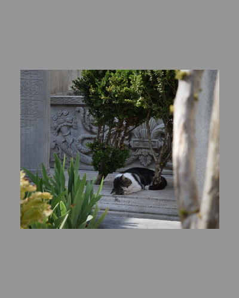
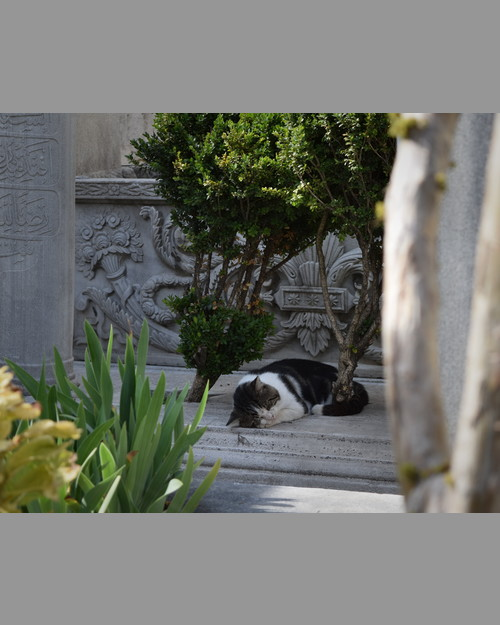
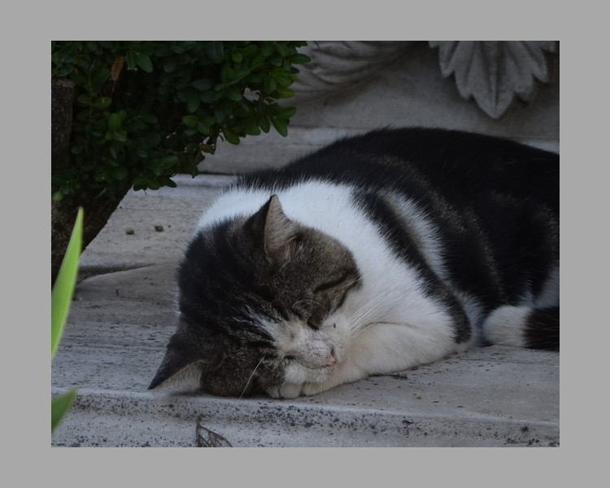
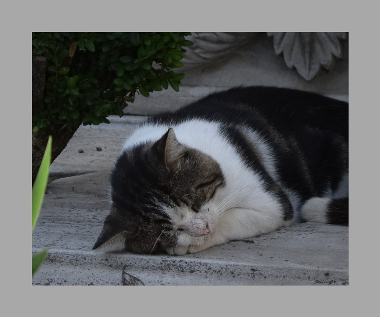
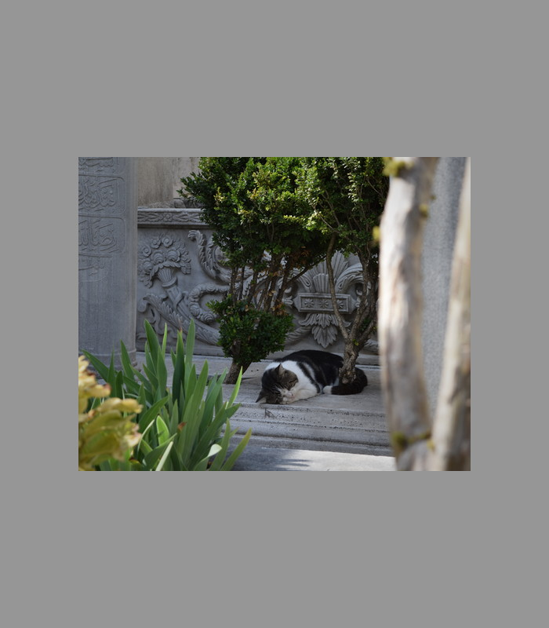
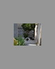

The framing tool can be used to add simple borders to the exported image. It
can also be used to pad the image to specific dimensions (e.g. for uploading to
social media).

**As of writing, the framing tool's changes are not visible in the editor
preview. The result is only visible after exporting. This will be fixed in a
future release of RawTherapee**.

## Parameters

There are three groups of parameters for framing:

- Framing method
- Border sizing
- Border color

### Framing Method

The framing method controls how the framed output image is sized.

#### Standard

Add a border around the image. The image size is not restricted and no
adjustments are made to [Resize](resize) parameters.

#### Bounding Box

Add a border around the image. If the framed dimensions (i.e. including image
and borders) exceeds the bounding box, the image (measured including borders)
will be shrunk to fit the bounding box.

- Framing Method: Bounding Box (500x400) (4:5 Portrait)
- Sizing: Relative @ Auto 10%
- Resize Dimensions: 500x400
- Adjusted Resize Dimensions: 267x213
- Output Dimensions: 320x400

#### Fixed Frame

Fills a fixed-size frame with the border and places the image in the center of
the frame. The image may be shrunk to fit the fixed frame dimensions and any
border sizing requirements.

- Framing Method: Fixed Frame (400x500)
- Sizing: Relative @ Auto 10%
- Resize Dimensions: 500x400
- Adjusted Dimensions: 333x267
- Output Dimensions: 400x500

#### Additional Framing Method Parameters

Depending on the selected method, there are additional parameters available.

##### Aspect Ratio

Specify the aspect ratio of the frame in **Standard** and **Bounding Box**
framing methods. If the border sizing constraint is too small to meet the
aspect ratio (i.e image would be cut off), then the minimum borders needed to
meet the aspect ratio is used. The aspect ratio of the post-[resize](resize)
image can be used by selecting the "As Image" option.

##### Orientation

Specify the orientation of the frame aspect ratio. The orientation of the
post-[resize](resize) image can be used by selecting the "As Image" option.

##### Framed Width/Height

Specify the bounding box of the frame in pixels for the **Bounding Box**
framing method.

Specify the fixed frame dimensions in pixels for the **Fixed Frame** method.

##### Allow Upscaling to Frame

In the **Fixed Frame** and **Bounding Box** framing methods, if the image is
smaller than the maximum allowed size, upscale the image to its max size.

### Border Sizing

There are three methods for computing the size of the frame border.

#### Relative

Specify the border size based on a percentage of the selected edge. The scaling
ratio is applied to both edge dimensions.

##### Basis

- Auto
  - Choose whichever side is the limiting side for small border sizes based on
    aspect ratios.
- Width/Height
  - Choose the width/height as the reference length.
- Long/Short Edge
  - Choose the longer/shorter edge as the reference length.

If the basis side border is too small for the requested aspect ratio, the
minimum possible value will be used.

- Framing Method: Standard (4:5 Portrait)
- Sizing: Relative @ Height 10%
- Resize Dimensions: 500x400
- Output Dimensions: 500x625

##### Limit Minimum Size

If enabled, ensures a minimum pixel border size for horizontal/vertical borders
as specified.

#### Uniform Relative

Adds a uniform border that is the same size horizontally and vertically. The
minimum width and height are automatically updated to match each other.

The following images shows the difference between **Relative** and **Uniform
Relative** sizing.

- Framing Method: Standard
- Sizing: Relative @ Auto 10%
- Resize Dimensions: 625x500
- Output Dimensions: 750x600

- Framing Method: Standard
- Sizing: Uniform Relative @ Auto 10%
- Resize Dimensions: 625x500
- Output Dimensions: 750x625

#### Absolute

Specify the horizontal/vertical border size in pixels. The total impact on
exported image size is 2x border size.

- Framing Method: Standard
- Sizing: Absolute @ W=100 H=200
- Resize Dimensions: 500x400
- Output Dimensions: 700x800

The aspect ratio and orientation options are ignored in this mode.

## Limitations

The framing tool shares resizing limitations with the [Resize](resize) tool.

- Downscaling limit is 32x32 px
  - Occurs if the border size requirements are too high
  - If the crop size is under 32x32, no downscaling is performed even if needed
    to fit the frame.
- Upscaling limit is 16x crop size

Below is an example of what happens when the downscaling limit is reached.

- Framing Method: Fixed Frame (80x100)
- Sizing: Absolute @ W=100 H=200
- Resize Dimensions: 500x400
- Adjusted Resize Dimensions: 40x32
- Output Dimensions: 80x100

## Processing Pipeline

If framing requires resizing the image, the [Resize](resize) tool's parameters
will be adjusted during processing. This prevents data loss from multiple
resizing operations. Similarly, [post-resize sharpening](resize/#post-resize-sharpening)
will only be applied to the adjusted image once.

Framing borders are drawn after the image is in the output colorspace.
