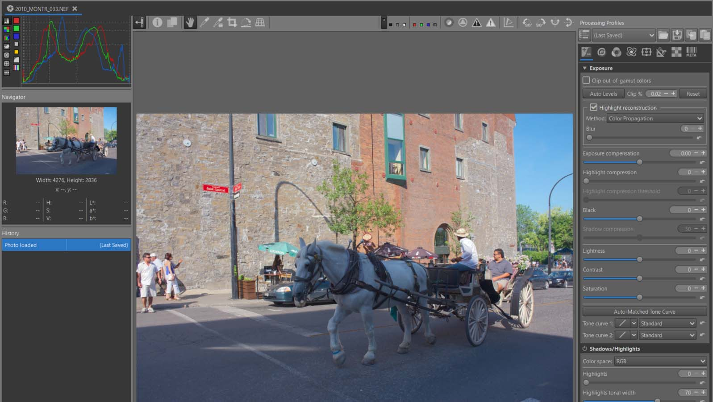

Gamut Compression is a tool that allows you to compress highly chromatic camera-source colorimetric data into a smaller gamut.

Negative out-of-gamut pixel values are problematic for working on images and should be avoided if possible.
Blue LEDs are perceived as highly colorful and colors found in beetles, flowers and hummingbirds are often over saturated.

This is not a gamut conversion : converting from one gamut to another changes the values of the pixels. However it does not actually change the colorimetric meaning of the pixel data. You could say that by converting between gamuts, you are changing the frame of reference with respect to the same colors. After compression, the working profile is restored.

Set the gamut limits using the appropriate workspace. For example:
* The display gamut (sRGB, DCI P3,...).
* The gamut of an output file for use by another software (Rec 2020, Beta near Pointers's Gamut...).
* Workspaces marked with an asterisk (*) have pre-calculated threshold values ​​for Cyan, Magenta, and Yellow. Note that these values ​​are approximate and correspond to a Working profile set to Rec2020. For challenging images (LED, sunset, etc.), manual adjustment is necessary; be mindful of potential artifacts.

[Aces gamut compress](https://github.com/jedypod/gamut-compress)
[Aces Gaumut Compression - Specification](https://docs.acescentral.com/rgc/specification/)

**Generalized Hyperbolic Stretch - GHS & Michelis-Menten MM**
GHS and MM can also be considered a gamut compressor (see Selective Editing Equalization & Pre-Tone Mappin >  for more details on this tool's capabilities).

For example GHS : the system acts as a gamut compressor (a bit like 'Gamut Compression', but for the 3 RGB channels) and 'fits' the data into the gamut. Adjusting the (White Point linear) (for example, reducing it) will limit the maximum value. Adjusting the ‘Stretch Factor (D)’ and ‘Local Intensity (b)’ will allow you to focus on the area of ​​the image to be enhanced. If necessary to refine the colorimetry, you can use ‘Abstract profiles’ in particular the 'Custom (CIExy diagram)' part, 'Refine colors', Illuminants.

[GHS]({})

<figure>

<figcaption>gamtcomp.jpg</figcaption>
</figure>

## Interface
### Threshold
controls the percentage of the outer gamut that will be affected. A value of 0.8 will compress out of gamut values into the outer 20% of the gamut. The inner 80% of the gamut core will not be affected. You can adjust the colors separately: for example if you want to protect magenta and yellow a little more than cyan, you could set the threshold a bit higher for cyan.

The thresholds are relative to the Target Compression Gamut.
Some workspaces are marked with an asterisk (*). In this case, the threshold values ​​are pre-calculated. Note that these values ​​are approximate and correspond to a Working profile set to Rec2020. For challenging images (LED, sunset, etc.), manual adjustment is necessary; be mindful of potential artifacts.

### Maximum Distance Limit
is the distance outside of the gamut boundary that will be compressed to fit the gamut boundary. For example, a value of 1.2 will compress distance values of 1.2 to a value of 1.0.

Individual controls are given for each color component. They are named cyan magenta and yellow because they actually control the maximum distance from the edge of the triangle (primaries related to the CIExy diagram - Pointer's Gamut), not the corner. For example, boosting the value of the cyan distance limit will increase the distance from which values are mapped to the edge between the blue and green corners of the triangle.

The distance limits also control the RGB ratios of the compressed values, which affect the apparent hue.
The distances are relative to the Target Compression Gamut. If the checkboxes for the Cyan, Magenta, and Yellow sliders are enabled, then an automatic value is suggested. Manual adjustments may be required.

### Labels at the bottom of the window

**Maximum achromatic value** 
Displays the highest measured value of the 3 RGB (achromatic) channels. This value helps to understand :
* The state of the image and the reciprocal influence of : a) the Working and Target Gamut Compression profiles; b) 'Highlight reconstruction'.
* Whether the ‘White point’ needs to be refined - see ‘Generalized Hyperbolic Stretch’ (GHS)  for example.

Effect of values:
* Very high values, for example greater than 5 or even 10 and more, often indicate the use of an LED or halogen illuminant (with Color Propagation) and a significant color-gamut overshoot. Try 'GHS > Auto Black point and White point', 'White Balance > Blue/Red Equalizer', 'Abstract Profile > Primaries and Illuminant'
* High values between 2 and 4 are often linked to an excessive light source (sun, etc.) or incorrect exposure settings that have resulted in out-of-range values on the sensor. Try using 'Highlight reconstruction > Color Propagation'.
* Low values, less than 1, often indicate poorly adjusted white and black points i.e.‘White point (linear WP)’ and ‘Black point (linear BP)’ : see for example GHS.

Notes:
* Using values ​​higher than 'Maximum distance limits' for the three 'Maximum achromatic value' sliders offers little benefit.
* Using low values ​​for the three Threshold sliders (whether combined or not with low values ​​for the Power slider, can lead to significant desaturation and color shifts.\n\nThere is a link, but not a correlation, between this value and the three Maximum Distance Limits.

**R:xxx G:yyy B:zzz  && Estimated Cyan:xx Magenta:yy Yellow:zz**
Displays the maximum values ​​for the three channels (achromatic): Red, Green, and Blue.

Provides an estimate accurate to within 15% of the Cyan, Magenta, and Yellow values. This estimate should provide useful information for better adjusting the Maximum Distance Limits which should be set greater than 1.
If the checkboxes for the Cyan, Magenta, and Yellow sliders in 'Maximum Distance Limits' are enabled, then an automatic value is suggested. Manual adjustments may be required.

**Roloof - Power**
Power: Controls the aggressiveness of the compression curve.

Higher power values result in more compressed values distributed closer to the gamut boundary. This will increase the "color purity" or "saturation" once the image has been rendered through a display transform.

Higher values have a smoother transition.

### Empirical adjustments Threshold

The default settings (from Aces) are for a theoretical conversion between the ACES AP0 workspace and an ACES P1 target. 

On the other hand, these settings are relevant for cinema cameras. Of course, it's a matter of compromise.

What about for a still camera, such as a Nikon Z9 or Canon EOS R5 Mark II, etc.? What are the lighting sources at the time of shooting? LEDs, for example, can introduce very large out-of-gamut values—by a factor of 1 to 10.

What are we trying to achieve? Are we aiming to create a TIFF file for later use, or to adapt the image to a viewing screen, which itself has its own characteristics (SDR, HDR, peak luminance, etc.)?

Taking Colorchecker24 as a reference is, I think, an imperfect choice although I understand it as a possible model, because the colors of the Colorchecker24 are generally in sRGB, so if the user has a Rec2020 monitor... we're missing out...But we could discuss it endlessly.

In the case of RawTherapee, the default Working Profile is Rec2020. Using numerous photos, I conducted various tests to provide the user with *"approximate values"* ​​based on the 'Target compression gamut'. These are indicative values, nothing more. It's up to you to adapt these values ​​to your own use, perception, and tastes.

Target compression gamut : **Rec2020**
- Threshold Cyan : 0.815
- Threshold Magenta: 0.803
- Threshold Yellow: 0.880

Target compression gamut : **Prophoto**
- Threshold Cyan : 0.815
- Threshold Magenta: 0.803
- Threshold Yellow: 0.880

Target compression gamut : **Adobe RGB**
- Threshold Cyan : 0.790
- Threshold Magenta: 0.820
- Threshold Yellow: 0.850

Target compression gamut : **ACES AP1**
- Threshold Cyan : 0.815
- Threshold Magenta: 0.803
- Threshold Yellow: 0.880

Target compression gamut : **sRGB**
- Threshold Cyan : 0.510
- Threshold Magenta: 0.820
- Threshold Yellow: 0.820

Target compression gamut : **DCI-P3 Theater**
- Threshold Cyan : 0.680
- Threshold Magenta: 0.890
- Threshold Yellow: 0.900

Target compression gamut : **Beta - near Pointers's Gamut**
- Threshold Cyan : 0.900
- Threshold Magenta: 0.950
- Threshold Yellow: 0.950