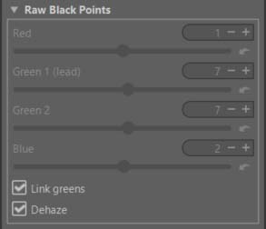

It is unlikely you will ever need to use the Raw Black Points tool other
than for diagnostic purposes.

These sliders allow you to add offsets to the raw channel values in case
the values used in the program are incorrect. You would know that they
are incorrect if the colors of your image were severely wrong, for
example you would see dark green instead of black, or the whole image
would have a very strong magenta color cast. Cameras with a
[Bayer filter](https://en.wikipedia.org/wiki/Bayer_filter) have two green
channels, that is why there are two green sliders which are linked by
default. Sometimes the two green channels are of different sensitivity,
so you can unlink the two green sliders and adjust them individually.

# DeHaze
<figure>

<figcaption>rawblack-dehaze.jpg</figcaption>
</figure>

I (jdc) only added “Dehaze” checkbox in Raw black point (Bayer and X-trans), and of course the whole process to update the sliders. (improccoordinator, rtengine, etc.).

I quote Ingo’s text to introduce this new concept

I made some tries with a very simple method to remove haze (and uniform lens flare) from raw files. Well, at least partly. It’s a good starting point to add the already existing dehaze tool in RT.

The method is super simple. It just calculates the mininum value from each raw channel and subtracts that value from the corresponding channel.

The idea behind this approach is:

If there is a region in the scene, which does not reflect enough light to the camera sensor, to be recorded by the sensor, then, if there is a sensor value > 0, this value must be caused by haze or flare and not by the scene.

Having this situation and assuming the haze or flare is somehow evenly distributed, we can just subtract it, and surprisingly, it works very well for long distance landscape shots, where there is a lot of haze between camera and subject, and maybe also a lot of flare (internal lens reflections) by using a long focal length which are more prone to internal reflections.

Of course we can not use this method for every image.

1. It does not work on high-iso files where the minimum value is always around zero because of noise
2. it does not work on underexposed files for the same reason

I just works for the conditions I described above.
 ## Comments
When you select the 'Dehaze' checkbox:
* either the sliders remain at zero, in which case the algorithm has no effect.
* or the sliders display values ​​other than zero. In this case, examine the behavior of the histogram and the image. The sliders are grayed out to prevent you from accidentally manipulating these complex settings. If you notice a deterioration in quality, disable the checkbox, and return the sliders to zero. If you are confident you can control the settings, you can fine-tune them by disabling the checkbox.