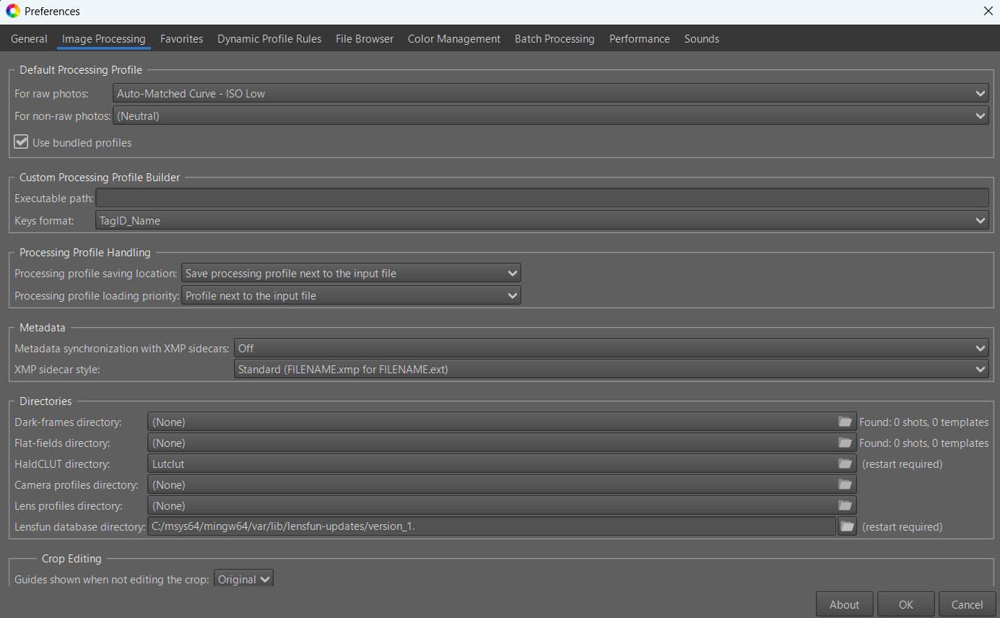
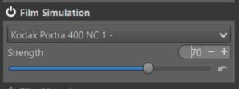
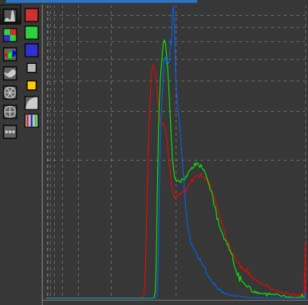
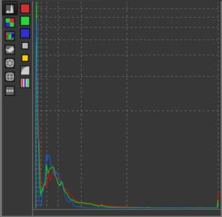
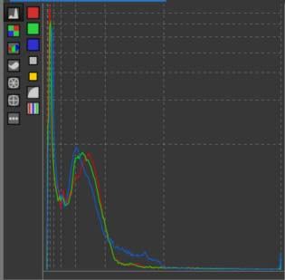
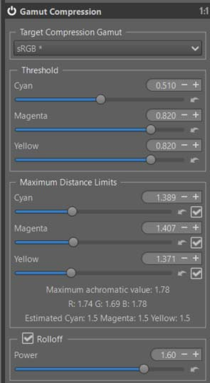
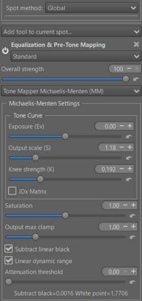
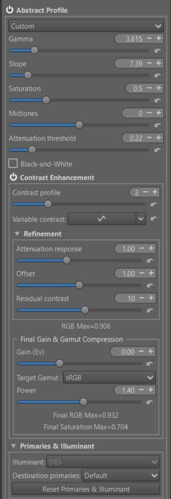
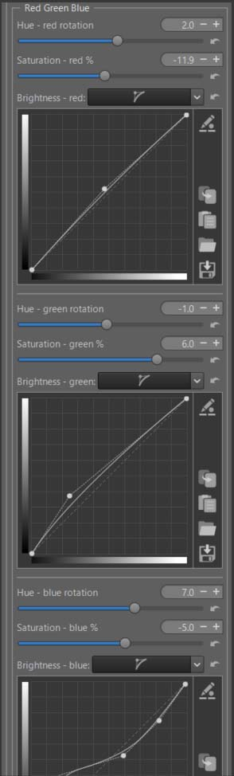
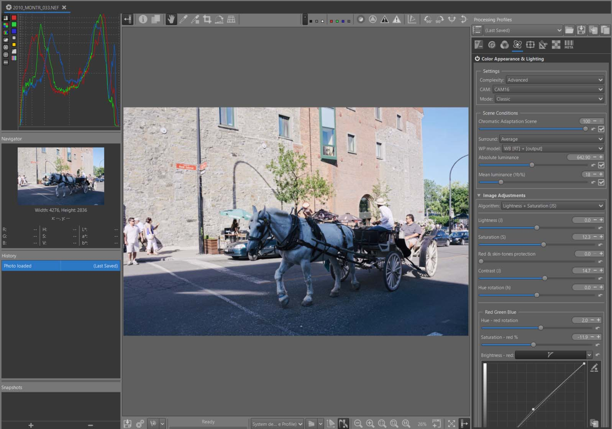

## Introduction

When I look and listen to other open-source software around me, all anyone talks about is "..X". As we say in French ‘ça tombe comme à Gravelotte’.
There are few (if any) references to "..X" in RT, and I don't think that will change (at least not on my end). I'm not saying these aren't good methods (they are), but:
+ there's something equivalent in RT, even if the concepts and vocabulary are different.
+ some tools require implementation work (code modification, downloading and configuring libraries, etc.) that isn't accessible to everyone. These 'custom' tools are certainly relevant, but they only allow exchanges between users who have installed them (and what about updates?). Since its creation, RT has maintained compatibility with previous versions (which is often a drawback) and is delivered as a complete package. Everyone receives the same distributed package, thus ensuring compatibility over time and between users. So, in summary, yes to these tools if they can be fully integrated into the overall code.
+ Note that the color gamut of printed materials, whether CMYK or RGB, is 'small' (often smaller than sRGB, especially in shadows...). So, simulation is possible, but...

This tutorial is not intended to say that other tools are bad, nor to provide a comprehensive overview of colorimetry, but to highlight the latest recently implemented changes.

There are many methods on the market for creating (nostalgia) the colours and appearance of black and white, colour and slide films.
+ The latest ones are based on Dynamic Spectral LUTs '..x', which are not easily portable from one user to another.
+ The ones I developed in 2006 with the help of Profile Maker 5.0 (Greta MacBeth), which generates 6 LUTs for each film: 3 for R, G, B colors and 3 for TRCs. It would be too much work to do.
+ The one that has been present for many years in Rawtherapee (Film Simulation) [Film simulation](/film_simulation) is based on HaldCLUT. They are very efficient, but the drawback is that they are 'fixed', meaning that you cannot adjust the reds, blues, or greens to your personal taste, whether it be rotation, saturation or brightness. [HaldCLUT.zip](http://rawtherapee.com/shared/). Simply download and extract the zip file to the folder of your choice and specify this folder in Preferences.

<figure>

<figcaption>Preferences - HaldCLUT</figcaption>
</figure>

+ I chose to improve this last approach with the new 'Red Green Blue' option in Color Appearance & Lighting, which in fact gives you an addition of at least the equivalent of 9 dynamic LUTs.
+ In this tutorial, I arbitrarily chose Kodak Portra 400 NC 1 film.
<figure>

<figcaption>Film Simulation</figcaption>
</figure>

 [Some principles](/tutorials/#in-summary-some-principles)

 [Recommendations](/tutorials/#recommendations)

 [Specific tools used](/tutorials/#specific-tools-used)

 [Alternatives](/tutorials/#alternatives)

**In summary:**

1) Color Appearance & Lighting : by allowing hue rotation (slider) , saturation (slider), brightness (curve) variation for each R, G, and B channel.
2) Michaelis-Menten (MM) : through use and adjustments of settings, whose default values ​​have become 'neutral'.
3) Abstract profile : a) by using the visualization of maximum R,G,B data or RGB saturation, to guide the action; b) by giving the possibility to act on the 'Gain (Ev)' at the output, as well as a possible compression of the gamut before the output process(es).
4) And of course, others tools.

**Educational objectives**
* Demonstrate the use of the new ‘Color Appearance & Lighting tools’ (CIECAM), for: a) To finely control colors in terms of hue, saturation, and brightness for each of the R, G, and B channels, entirely within the second CIECAM process - Image adjustments - in order to adapt the color gamut to specific needs (sky, sun, shadows, flowers, etc.)

* Demonstrate the usefulness of the new indicators in 'Abstract profile' and the 'Gain (Ev)' and 'Gamut compression' settings in the final phase of the RT process, just before output.

* Show the possible association of 1), 3) - and to a lesser degree 2) - above, with the tool already in place in RT (Film simulation - HaldCLUT) to complement it with corrections of hue, saturation, brightness and contrast, while finely controlling the gamut.

Image selection:

Raw file : (Creative Common Attribution-share Alike 4.0)
  [Raw File - Blue Horse](https://drive.google.com/file/d/1rRcFYYihDjW0ZHadA9S0nNyt3vwxG1Yu/view?usp=drive_link)

- pp3 file 3: [Blue Horse pp3](2010montr-film3.pp3 "2010montr-film.pp3")

### Some remarks on histograms and Image

If the image in 'neutral' mode already shows green dots scattered across the screen, then the processing will be difficult.

If the histogram looks like this, there is at the very least a problem with the black point adjustment
<figure>

<figcaption>Histogram Black point</figcaption>
</figure>

If the histogram shows this second aspect, we are probably dealing with a high dynamic range image, where it will be difficult to find a balance between shadows and highlights. This is the domain of "tone mappers".
<figure>

<figcaption>Histogram high dynamic range</figcaption>
</figure>

Fortunately, not all images are like that, and the histogram in 'neutral' mode is usually quite well distributed. For example for ‘The Blue Horse’. However, even in this case, we see that the blue channel 'overflows'...We risk having problems with the gamut.
<figure>

<figcaption>Histogram Blue Horse</figcaption>
</figure>

## Start of treatment

+ Set to Neutral.
+ Highlight reconstruction – Color Propagation (Exposure Tab) - disable ‘Clip out-of-gamut colors’. At this stage, we don't yet know if this selection is useful. It allows us to find the maximum linear value of the white point. Depending on the values ​​found later in Michaelis-Menten (Selective Editing) or in Gamut Compression (Color Tab) , you may or may not want to disable it.
+ The values found for ‘Maximum achromatic value’ in Gamut Compression (Color Tab), are strongly influenced by the settings chosen for 'Clip out-of-gamut colors' and 'Highlight reconstruction'. In this case (‘The Blue Horse’), I preferred to keep 'Highlight reconstruction > Color propagation' enabled and uncheck ‘Clip out-of-gamut colors'
+ Capture Sharpening (Raw Tab) - Enabled - You'll notice that "Contrast threshold" isn't set to zero. You can leave the default settings. The image doesn't appear to be noisy, so don't change anything for the two sliders (Presharpening denoise, Postsharpening denoise);
+ Raw Black Points (Raw Tab) - Activate 'Dehaze'. Since the sliders remain at zero, it likely indicates an incorrect black point setting due to haze; you can deactivate it.
+ White Balance > Automatic & Refinement > Temperature correlation: The illuminant _a priori_, is of the Daylight type; this automatic setting should be the most suitable.

## Gamut Compression
<figure>

<figcaption>Gamut Compression</figcaption>
</figure>

Check if the histogram changes when you enable or disable it. Of course, choose the same 'Target compression Gamut' as the 'Soft proofing'. If it does change, the automatic settings should be fine. Look at the ‘Power’ incidence (the higher it is, the purer the compressed colors will be). Try slightly adjusting the values ​​of the three 'Threshold' sliders and/or ‘Maximum Distance Limits’. But most importantly, look at the values ​​of the three RGB channels, which in this image are each around 1.7. This means these values ​​are beyond the default profile and need to be adjusted. Hence the need for a 'Tone mapper' (here, Michaelis-Menten). As a reminder, we do not convert the data to the Target Compression Gamut (TCG), but we compress it in such a way that the critical data is inside the TCG, while remaining in the Working profile.

## Pre-tone mapper : Michaelis-Menten
<figure>

<figcaption>Michaelis-Menten</figcaption>
</figure>

+ Ensure that Subtract lines black and Linear dynamic range are enabled.
+ You can see that these values ​​are respectively at 0.0016 and 1.7706. This means that significant compression has been performed to 'fit' into Rec2020.
+ Note that I did not act on 'Exposure (Ev)' but on Output scale (S) and Knee strength (K).

[Michaelis-Menten](/local_adjustments/#michaelis-menten---mm---origin)

## Abstract Profile

<figure>

<figcaption>Abstract Profile</figcaption>
</figure>

+ Adjust gamma and slope to achieve the desired result and Attenuation threshold.
+ Enable ‘Contrast Enhancement’ - The default settings should be suitable in most cases. I increased 'Contrast profile' to 3. This means that 1 basic level of Wavelet decomposition is used (to simplify).
+ The RGBmax indicator should display a value less than 1. If it doesn't, either change the previous AP or MM settings, or adjust 'Final Gain & Gamut Compression'. You will see the RT process values ​​displayed below the 'Gain (Ev)' and 'Target gamut' settings. To display the data, at least one of the two settings must not be zero or 'None'. I recommend setting 'Target gamut' to sRGB (the same setting you used for Soft Proofing) and in Gamut Compression (Color Tab).

[TRC Tone Response Curve](/color_management/#trc---tone-response-curve)

[Contrast Enhancement](/color_management/#contrast-enhancement)

##  Color Appearance & Lighting

+ Now we'll explore the new 'Red Green Blue' tool, which will allow you to finely control each of the 3 RGB channels.
+ First : enable ‘Color Appearance & Lighting’ and choose ‘Complexity = Advanced’. This gives you more choices among the CIECAM variables. Thus, you have : Lightness (J) and Contrast (J), Brightness (Q) and Contrast (Q), Chroma (C), Saturation (s), Colorfulness (M), hue raotation (h) , and 3 tones curves for Lightness, Brightness, and Color.
+ Note the default 'Scene conditions' settings which you could change if you know exactly the shooting conditions.
+ Note the default 'Viewing conditions' settings which you could change to adapt them to your viewing environment (the room you are in, its ambiance, the 'Absolute luminance' estimate, and Surround…).
+ I chose 'Lightness + Saturation' and slightly increased the overall saturation and contrast (J)

[CIECAM](/ciecam02/#color-appearance--lighting-ciecam0216-et-color-appearance-cam16--jzczhz---tutorial)

[Red Green Blue](/ciecam02/#red---green---blue---hue-rotation-h---saturation-s---brightness-curve-q)

### Red - Green - Blue

+  You can modify each R, G, B channel to finely retouch colors or simulate films:
    - Rotate each color by degrees.
    - Change the saturation (s) in the sense of a CAM (Color Appearance Model).
    - Change the brightness (Q) with a curve that allows you to adapt the contrast and brightness to each situation.

+ As a reminder, in CIECAM there are a total of 9 variables, 6 of which are accessible to the user in RT: Lightness (J), Brightness (Q), Saturation (s), Chroma (C), Colorfulness (M), and Hue rotation (h). They are interdependent. For example Chroma = saturation * saturation * brightness.

In the case of the ‘Blue Horse’ I arrived at the settings used in pp3, using ‘Soft proofing’ to control the gamut.

To simplify use, I’ve only included one slider per channel for hue rotation, and one slider per channel for Saturation (s). I could have also included a tone equalizer for the red, green, and blue range; If that proves useful, aside from complicating the interface, it doesn’t pose any problem. Note that the 3 Brightness curves allow you to adjust the brightness and contrast for each color range. Specifically, brightness acts on the perceived chroma via the (s) Saturation function.

Of course, the settings are quite arbitrary, depending on your tastes.

[Red Green Blue](/ciecam02/#red---green---blue---hue-rotation-h---saturation-s---brightness-curve-q)

<figure>

<figcaption>CIECAM Red Green Blue</figcaption>
</figure>

**Threshold Brightness Curves**

 The ‘Threshold Brightness Curves’ aims to limit artifacts due to variations in color differences.

<figure>

<figcaption>red-green-blue Threshold</figcaption>
</figure>

**Back to Abstract profile**

Check that the data displayed in ‘Final Gain & Gamut Compression’ is within limits, correct it if necessary, but be careful with the gamut

**Back to Film Simulation**

Of course, you can change the choices in 'HardCLUT', for example by selecting Fuji... Be careful to check and change the settings, as they are not universal. Always check the gamut (histogram, soft proofing, display of values ​​in Abstract profile).

##  Image at the end of Game Changer

<figure>

<figcaption>The Blue Horse</figcaption>
</figure>

