This seventh tutorial aims to explain the concept of ‘Game changer’ on a noisy (very noisy??) image.

In this tutorial, we will see how to use ‘Capture Sharpening’ , ‘Demosaicing method’, 'Gamut Compression', three possible uses at various points in the process to reduce noise, ‘Selective Editing > Generalized Hyperbolic Stretch’ (GHS), ‘Capture Deconvolution’, ‘Abstract Profile’, 'Color Appearance & Lighting' together. Of course, other tools are necessary, which we will cover later.

Image selection:

Raw file :  (Creative Common Attribution-share Alike 4.0)

[Raw File](https://drive.google.com/file/d/1poZporRNILcYfab1Y_f1i-SIEB4acn6L/view)

- pp3 file 3: [Young girl](p3090042-ghs.pp3 "p3090042-ghs.pp3")

 [Some principles](/tutorials/introduction/#in-summary-some-principles)

 [Recommendations](/tutorials/introduction/#recommendations)

 [Specific tools used](/tutorials/introduction/#specific-tools-used)

 [Alternatives](/tutorials/introduction/#alternatives)

**Image in Neutral mode**
<figure>
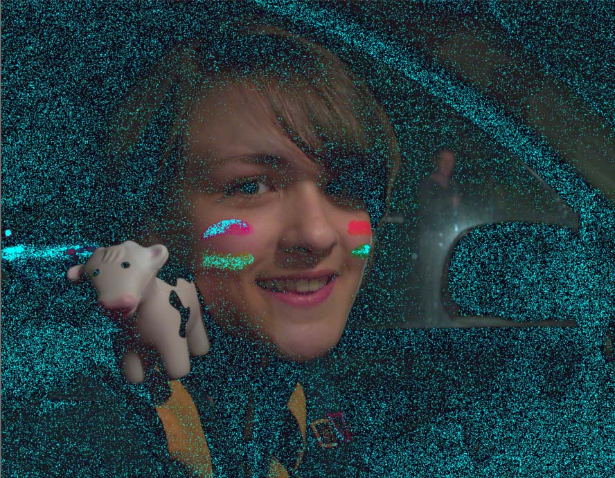
<figcaption>Neutral out of gamut</figcaption>
</figure>

**Learning objectives**
+ See the role of presharpening denoise and postsharpening denoise.
+ The role of Gamut Compression (which plays a part in noise reduction).
+ The impact of the demosiacing method and how to compensate for the lack of a contrast mask in this case.
+ The impact of Abstract Profile - and gamut controls.
+ The distribution of denoising along the process.
+ The role of GHS in balancing the image.
+ How to (partially) use the new possibilities of ‘Selective Editing > denoise’.
+ How to restore vitality to the image (Capture deconvolution, abstract profile).
+ The role of Color Appearance & Lighting (Red Green Blue).

## First step
+ Set to Neutral.
+ Set White Balance auto - to Low Sampling & Ignore camera settings : The choice is quite subjective (you can or must 'remove the 2 pass algorithm').
<figure>
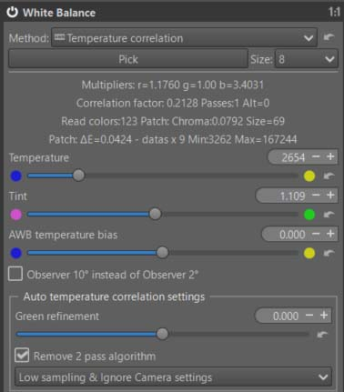
<figcaption>White Balance auto</figcaption>
</figure>

## Capture Sharpening & main Noise Reduction

+ Verify that ‘Contrast Threshold’ displays a value = 0.
+ Enable ‘Show contrast mask’, which is also insensitive to the Preview position.
+ Adjust the ‘Presharpening denoise’ setting until the mask appears (or a little more).
+ Set the demosaicing method to a dual demosaicing system (AMAZE + bilinear). There’s no mask for this system (it’s complicated to implement), but you can use the one from ‘Capture sharpening’. Increase the value in ‘Demosaicing > Contrast threshold’, for example, up to 14 (disabling auto… which remains at 0). Through trial and error, choose the method that minimizes artifacts and noise.

**Remove noise on flat areas**
+ Disable the mask.
+ View the image at 100% or 200%, then adjust the ‘Postsharpening denoise’ setting, which will take the mask information into account to process the noise. Adjust this denoising to your liking.
<figure>
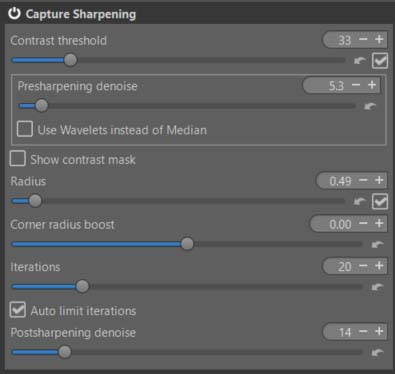
<figcaption>Capture Sharpening</figcaption>
</figure>

**Second step**
Use ‘Noise reduction’ sparingly - this isn’t (at least in my opinion) a comprehensive processing step, as it affects the entire image, resulting in a lack of nuance. I’ve chosen relatively low values ​​for ‘Luminance’ and ‘Chominance’ (see pp3 settings).

## Gamut Compression

This is one of the most important steps for this image: reducing out-of-gamut noise.
You could even say it's a noise reduction tool.

The settings I obtain (with Target Compression Gamut = sRGB) clearly show the impact of noise.

<figure>
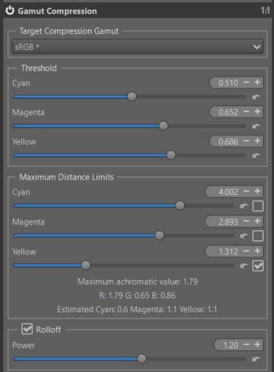
<figcaption>Gamut Compression</figcaption>
</figure>

## Selective Editing - 3 Spots

### Generalized Hyperbolic Stretch (GHS)
The goal of this step is to adjust the Linear White Point and Linear Black Point, and at a minimum, to adjust the image contrast.

The choices are fairly arbitrary.
<figure>
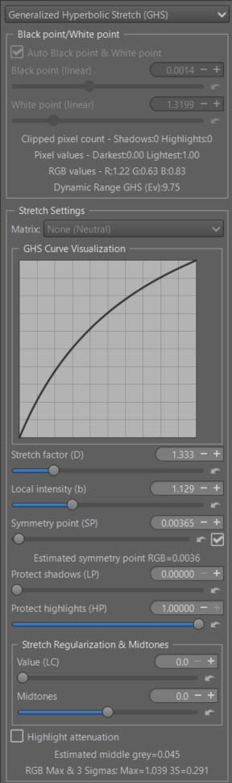
<figcaption>GHS</figcaption>
</figure>

### Adjust the noise reduction to your liking

At this stage, nothing is clear, everything is arbitrary. We are subject to the constraints of the Preview…and in the current state of the process, there is no ‘proper’ method. So we make do.
+ Add a new RT-spot (Blur/Grain & Denoise > Denoise) in Global mode (of course you can choose Full image and use deltaE, or a normal Spot…, but to simplify the explanation I choose ‘Global’)
+ Enable ‘Contrast threshold’.
+ Enable ‘Show contrast mask’.
+ Adjust the ‘Denoise contrast mask’ and ‘Equalizer denoise mask’ to isolate areas to be treated or excluded. You can balance the system by adjusting the ‘Ratio flat-structured areas’ slider.
+ Adjust the luminance and chrominance wavelets ‘as best as possible’… there’s no magic bullet.

**The importance of Locks MadL noise evaluation** :
+ Depending on the position in the Preview, the image analysis is performed using the concept of ‘MAD’ - median absolute deviation - which evaluates noise by decomposition level (here from 0 to 6) and by direction (Horizontal, Vertical, Diagonal). Unfortunately, this evaluation is performed here (as in the ‘Noise reduction’ Detail tab) on the Preview and not on the entire image.
+ If you want to see the interaction between the position in the Preview and the zoom level, select ‘Advanced’ for this RT-spot. You will see 21 sliders that display the MadL value. ‘Locks MadL noise evaluation’ must be enabled. Move the image into the Preview and see the MadL changes.
+ Low levels (0, 1, 2, 3, 4) represent the most visible noise, while higher values ​​tend towards ‘banding noise’. Refer to the tooltips; they attempt to explain the (necessarily complex) operation.
+ In this mode (Advanced), you can manually adjust the MadL values ​​and replace the automatic calculation with your own evaluation… not straightforward, but possible nonetheless.
+ Whether in ‘Basic’, ‘Standard’, or ‘Advanced’ mode, when you activate ‘Locks MadL noise evaluation’, the entire image will be processed like the Preview (at least that’s my intention).
+ Note that I could have done the same for chrominance noise (MadC).

Why is there a difference between what’s displayed in ‘Residual Noise Levels’ and the MadL sliders?
+ For the former, these measurements are taken after processing and take into account what is empirically visible (using weighting coefficients).
+ For the latter, they represent the actual values ​​used by the core algorithm designed in 2012 by Emil Martinec (who also created Color Propagation and Amaze). Of course, Ingo and I have significantly enhanced the capabilities of the noise reduction functions.

####  Simplified interface

<figure>
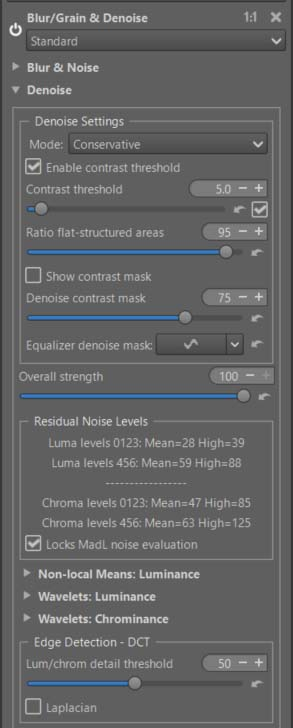
<figcaption>Selective Editing Denoise</figcaption>
</figure>

#### Complex interface

If you want to delve deeper, switch to "Advanced" complexity mode. You'll see a selection that might seem daunting, but it reflects the 7 levels of decomposition used – from 2x2 pixels up to 256x256 pixels. The lower levels focus on highly visible noise, while the higher ones are geared more towards banding.

[Daubechies Wavelets](https://en.wikipedia.org/wiki/Daubechies_wavelet)

These sliders represent the wavelet decomposition of the Daubechies method, limited to 7 levels for noise reduction. The first 7 sliders represent the horizontal dimension, the next 7 the vertical dimension, and the last 7 the diagonal dimension. The calculated values ​​are those obtained with MadL (median absolute deviation luminance) for the portion of the image you are viewing. If you switch to manual mode (checkbox "Manual settings"), you can increase or decrease these values. I admit it's not immediately obvious, but it's one of the few ways to customize the process.

Be careful not to confuse this with the sliders or the curves of the 'normal' interface which assume in the calculations that these values ​​are those of MadL by default.

I could have done the same thing for the 2 Chromatic dimensions with MadC.

<figure>
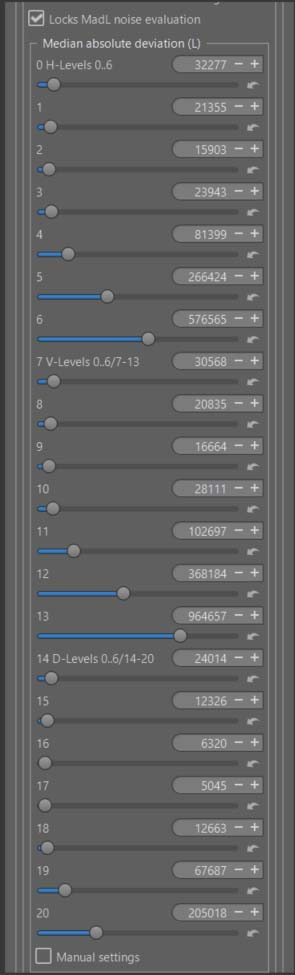
<figcaption>Daubechies 7 levels - 3 directions</figcaption>
</figure>

[Selective Editing denoise](/local_adjustments/#selective-editing----blurgrain--denoise--denoise)

### Restore some sharpness using ‘Capture deconvolution’

Open a third RT-Spot in Global mode and choose ‘Add tools to current spot…> Sharpening > Capture Deconvolution’. Can you leave the default settings or change them.
<figure>
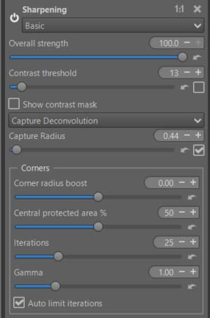
<figcaption>Selective Editing - Capture deconvolution</figcaption>
</figure>

## Abstract Profile : Adjusting Tones – Increasing Local Contrast

+ Balance the lights in the image.
+ Significantly increase local contrast.
+ Adjust gamma and slope to achieve the desired result and Attenuation threshold. This is where you can change the background, making it darker or lighter by adjusting the 'Slope' setting.
+ Enable ‘Contrast Enhancement’ - The default settings should be suitable in most cases.
+ The RGBmax indicator should display a value less than 1. If it doesn't, either change the previous AP or GHS settings, or adjust 'Final Gain & Gamut Compression'. You will see the RT process values ​​displayed below the 'Gain (Ev)' and 'Target gamut' settings. To display the data, at least one of the two settings must not be zero or 'None'. I recommend setting 'Target gamut' to sRGB (the same setting you used for Soft Proofing) and in Gamut Compression (Color Tab).
<figure>
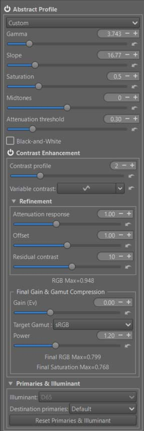
<figcaption>Abstract Profile</figcaption>
</figure>

+ In principle, there’s no point in using the ‘Primaries & Illuminant’ module here.
+ You can easily see the effect of the last controls in 'Final Gain & Gamut Compression', set 'Target Gamut' to 'None' and you will see the out-of-gamut data appear, also observe the histogram.

[TRC Tone Response Curve](/color_management/#trc---tone-response-curve)

[Contrast Enhancement](/color_management/#contrast-enhancement)

## Color Appearance & Lighting
+ Now we'll explore the new 'Red Green Blue' tool, which will allow you to finely control each of the 3 RGB channels.
+ First : enable ‘Color Appearance & Lighting’ and choose ‘Complexity = Advanced’. This gives you more choices among the CIECAM variables. Thus, you have : Lightness (J) and Contrast (J), Brightness (Q) and Contrast (Q), Chroma (C), Saturation (s), Colorfulness (M), hue raotation (h) , and 3 tones curves for Lightness, Brightness, and Color.
+ Note the default 'Scene conditions' settings which you could change if you know exactly the shooting conditions.
+ Note the default 'Viewing conditions' settings which you could change to adapt them to your viewing environment (the room you are in, its ambiance, the 'Absolute luminance' estimate, and Surround…).
+ I chose 'Lightness + Saturation' and slightly increased the overall saturation.

[CIECAM](/ciecam02/#color-appearance--lighting-ciecam0216-et-color-appearance-cam16--jzczhz---tutorial)

### Red - Green - Blue

+  You can modify each R, G, B channel to finely retouch colors or simulate films:
    - Rotate each color by degrees.
    - Change the saturation (s) in the sense of a CAM (Color Appearance Model).
    - Change the brightness (Q) with a curve that allows you to adapt the contrast and brightness to each situation.

+ As a reminder, in CIECAM there are a total of 9 variables, 6 of which are accessible to the user in RT: Lightness (J), Brightness (Q), Saturation (s), Chroma (C), Colorfulness (M), and Hue rotation (h). They are interdependent. For example Chroma = saturation * saturation * brightness.

In the case of the ‘Girl’ I arrived at the settings used in pp3, using ‘Soft proofing’ to control the gamut.

To simplify use, I’ve only included one slider per channel for hue rotation, and one slider per channel for Saturation (s). I could have also included a tone equalizer for the red, green, and blue range; If that proves useful, aside from complicating the interface, it doesn’t pose any problem. Note that the 3 Brightness curves allow you to adjust the brightness and contrast for each color range. Specifically, brightness acts on the perceived chroma via the (s) Saturation function.

Of course, the settings are quite arbitrary, depending on your tastes.

[Red Green Blue](/ciecam02/#red---green---blue---hue-rotation-h---saturation-s---brightness-curve-q)

<figure>
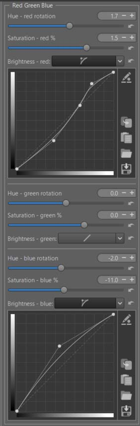
<figcaption>CIECAM Red Green Blue</figcaption>
</figure>

**Threshold Brightness Curves**

 The ‘Threshold Brightness Curves’ aims to limit artifacts due to variations in color differences.

<figure>

<figcaption>red-green-blue Threshold</figcaption>
</figure>

**Back to Abstract profile**

Check that the data displayed in ‘Final Gain & Gamut Compression’ is within limits, correct it if necessary, but be careful with the gamut. In the case of 'Girl', gamut compression is essential.

##  Image at the end of Game Changer

<figure>
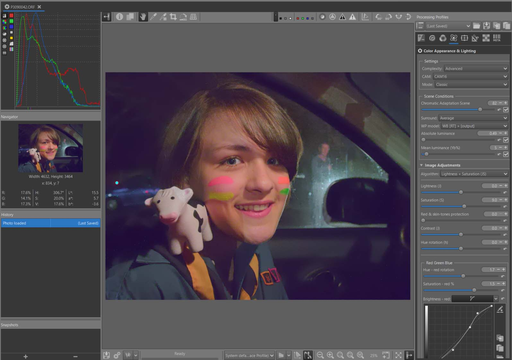
<figcaption>Young girl</figcaption>
</figure>

Obviously, as with any highly noisy image, finding the right balance between respecting the color gamut, visible detail, and noise is difficult; it's all about compromise.

