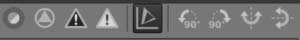
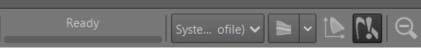
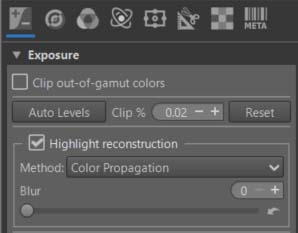

‘Game changer’ - in French, the term ‘bouleverseur’ suits me well as a translation: it aims to change the usual way of thinking and acting in terms of image processing. Before changing the way we do things, we must first agree on the way we see things. In french a great sociologist, now deceased, said : "L'accord sur ma manière de faire est avant tout un accord sur la manière de voir" (Jean-Daniel Reynaud : 1926 - 2019).

This concept isn't about forcing you to change your image processing methods, but rather about trying a different approach based on principles that solve (at least partially, I believe) difficult image processing problems, using new concepts and methods. I'm not talking about tools here, but meta-methods: how to proceed and why this processing method is preferable to another for this type of image. There isn't a single method that works in all cases, but rather principles based on specific objectives.

## A bit of history - the implications of the context

* RT was conceived and created by a single man, Gabor Horvatz, in 2005. This is a fantastic achievement. However, this has consequences: the GUI interface has remained the same, prioritizing what was good, given the knowledge available at the time in 2005. 
* Today, the powerful modules are scattered across the different Tabs, and for my part, I almost never use them (with the exception of 'Highlight reconstruction') in the first two 'Tabs'.
* Other improvements have made some modules that were very good 10 years ago a little less so. I'm thinking of the excellent "Dynamic Range Compression" (which is mathematically complex), which is slow and resource-intensive...
* A persistent problem, once you're no longer in Raw mode, is that the 'Preview', apart from 'fit to screen', is often different from the TIF/JPG output. Furthermore, the appearance varies significantly depending on the zoom level and the tools used. This is a pipeline design flaw... that hasn't been resolved (the consolation is that this problem, to varying degrees, is found in other software as well)... So you just have to live with it.
* There are also the effects of fads; yesterday everyone was talking about "XXX", then "YYY"...and now "ZZZ", and since it's present elsewhere, why isn't it being developed in RT? This doesn't mean that "ZZZ" is better than "XXX". As we say in French ‘ça tombe comme à Gravelotte’.
* RT also has the unique characteristic of employing certain specific algorithms or processing methods. People may like it or dislike it, criticize it or approve of it, and compare it to what exists elsewhere. Before condemning, compare apples to apples (you wouldn't compare a chicken and a fish). I'm referring in particular to: CIECAM, Auto WB temperature correlation, Selective Editing, Wavelets, Abstract Profiles, etc. What I observe today (early 2026) is that what was once heresy has become a focal point; I'm referring to Wavelets in another free software, or even the gamma/slope coupler...(or Abstract Profile).

## In summary: some principles
+ Start processing an image with no settings other than the default ones in 'Neutral', to avoid any side effects.
+ Use the maximum possible range for Raw data, this means that: 
  - The Black Point at the beginning of processing should be as close as possible to what the sensor allows.
  - The highest measurable values ​​on the sensor must be recorded at the White Point. Furthermore, it is desirable to be able to recover, as best as possible, the data lost when values ​​created by overexposure have saturated the sensor (see: Highlight reconstruction > Color Propagation  - which, contrary to what its name suggests, also allows data to be retrieved in very low light conditions).
+ Finding the best color balance is crucial before starting any treatments. The longer you wait, the greater the risk of 'contaminating' other methods. Note that it may be affected by chromatic noise.
+ Make the most of the possibilities in Raw mode, whether it be the demosaicing method, the improvement of sharpness and noise treatment, the correction of black point and chromatic aberrations, etc.
+ Control (and compress if necessary) the gamut at the beginning and end of the process.
+ Be careful not to use methods or tools that lead to the creation of imaginary colors. The core principle of Game Changer is to eliminate them - or at the very least, reduce them.
+ Using the concept of a pre-tone mapping, which makes an image usable or (acceptable) for further processing. That is to say:
  - Bring the Black point close to zero, to increase contrast and use the entire range of data.

  - Bring the White point as close as possible to 1: out-of-gamut data can have very high values ​​(3, 5 or 10), and all methods are more efficient when in the interval [0 1], and subsequent processing is more efficient when the data has been normalized i.e. in the interval [0 1].
  - All calculations are performed using 32-bit real numbers, and no data is lost.
  - Implementing an asymptotic process that allows us to get closer to the White point, without reaching it - and even less going beyond it.
  - This principle is included in 'Selective Editing > Equalization & Pre-tone mapping': The first RT-spot used must always be (if of course there is a need) a Pre-tone mapper in Global mode.
  - The timing of the Linear Black Point and Linear White Point calculations is of paramount importance. Performing these calculations too early in the process does not reflect reality, as processing may have occurred in the interim. Using average values ​​is also not the solution.
+ Towards the end of the process, it is possible to adjust the tones and contrasts, assuming that the image at this stage has no major defects. This method should allow visualization of the effects on the acceptable limits for the data and the gamut. The primaries in Game Changer initially only serve to render special effects.
+ At the very end of the process, it allows the implementation of the concepts of 'Scene' (source) and 'Viewing' (display): taking into account the conditions of shooting and final viewing, taking into account the physiological aspects, allowing each R, G, B channel to be retouched to better balance or modify the colors.
+ You may notice that throughout 'Game changer' (except for a few rare cases, where they are 'automatics' as in Capture Sharpening, or for a very specific use), I never use masks and layers, or Primaries. And it is unlikely that you will find these methods and tools anywhere other than in Rawtherapee (of course not all of them).

Some current tools should be avoided – or at the very least, the user should be aware of the consequences of their choices:
+ Exposure compensation.
+ Auto-Matched Tone Curve.
+ Tone curve.
+ Auto Levels.
+ All sliders below 'Exposure compensation'.
+ ...

Other tools must be used with caution, as they can interfere - it is almost impossible to review the pipeline - on Game Changer:
+ Haze removal.
+ Contrast By Detail Levels.
+ ... 

Prefer their equivalent in Selective Editing, taking care to place them "after" the pre-tone mapping.

This is partly due to the pipeline - the order in which operations are actually carried out, not the order in which you do them.
[Pipeline](/toolchain_pipeline)

You can use the tools to reduce noise, make crops, modify geometry, wavelets, etc.

But of course, there are no prohibitions; these are only general recommendations. Each image may be a special case.

### Recommendations

+ It is best to alternate between viewing the histogram in linear mode with the Working profile, and in Output profile mode with a gamma.
<figure>

<figcaption>Histogram Linear or Gamma</figcaption>
</figure>

+ It is advisable to observe gamut spillovers with Softproofing - set to your personal profile.
<figure>

<figcaption>Softproofing out-of-gamut colors</figcaption>
</figure>

+ You can control the data at the time you implement a tool, these are just possible examples of values (uncorrelated with each other):
  - Gamut Compression: Maximum achromatique value: 3.2, then R:3.2 G:1.4 B=1.8 -- Estimated Cyan:1.5 Magenta:2.2 Yellow:2.8
  - Michaelis-Menten : Subtrack black = 0.05 White point=3.1
  - Generalized Hyperbolic Strech: RGB values- R:3.3 G:1.2 B:1.9
  - Abstract Profiles : RGB max = 0.92 - Final RGB Max = 0.62 - Final Saturation Max = 0.75
+ 'Normally', if everything was within the gamut, and if no processing caused it to be exceeded, the values ​​should all be within the interval [0 1].
+ If you find values (for the maximum) ​​for Gamut Compression, Michaelis-Menten, Generalized Hyperbolic Stretch:
  - That are less than 1 or close to 1. It's likely that Highlight reconstruction > Color Propagation (or Inpaint Opposed) won't help. In that case, disable it.
  - If these same values ​​are much greater than 1, for example 3.5 or 8, or more, the use of Color Propagation is recommended, and consequently it should not be disabled.
  - In the latter case, make sure that 'Clip out-of-gamut colors' is disabled.
<figure>

<figcaption>Color Propagation - Clip out-of-gamut colors</figcaption>
</figure>

### Specific tools used
As of February 2026 - to be updated.
Apart from tools that have been around for many years, but are not always well known, I highlight new ones, or those that seem preferable to me:
+ Capture Sharpening (Raw Tab) - With Pre and Post sharpening denoise:  [Capture Sharpening](/capture_sharpening/)
+ Color Propagation in Highlight reconstruction (Exposure Tab): [Highlight Reconstruction](/exposure/#highlight-reconstruction)
+ White Balance > Automatic & Refinement > Temperature correlation (Color Tab): [Temperature Correlation](/white_balance/#the-temperature-correlation-algorithm)
+ Gamut Compression (Color Tab): [Gamut Compression](/gamut_compression)
+ Selective Editing > Equalization & Pre-Tone Mapping : Generalized Hyperbolic Stretch (GHS) & Michaelis-Menten (MM): [GHS & MM](/local_adjustments/#generalized-hyperbolic-stretch-and-michaelis-menten)
+ Abstract Profile (Color Tab): [AP](/color_management/#abstract-profiles)
  - Tone Response Curve:[AP - TRC](/color_management/#trc---tone-response-curve)
  - Contrast Enhancement: [AP-CE](/color_management/#contrast-enhancement), in particular how it works [Presets](/color_management/#each-preset-contains-a-selection-of-decomposition-levels), and [Characteristics](/color_management/#the-contrast-enhancement-module-has-the-following-characteristics)
  - Illuminant White Point: [AP - IWP](/color_management/#illuminant---white-point)
  - Primaries: [AP - Prim](/color_management/#primaries) 
+ Selective Editing > Blur/Grain & Denoise > Denoise : [SE-denoise](/local_adjustments/#selective-editing----blurgrain--denoise--denoise)
+ Color Appearance & Lighting (Advanced Tab): [CIECAM](/ciecam02)

### Alternatives

With most of the principles and recommendations outlined above, you can replace some of the tools with others.
* Selective Editing > Equalization & Pre-Tone Mapping : Generalized Hyperbolic Stretch (GHS) & Michaelis-Menten (MM)
* Abstract Profile (Color Tab)
* Color Appearance & Lighting (Advanced Tab)

By :  
* Selective Editing > Color Appearance (CAM16 & JzCzHz). This tool contains, with the exception of GHS and MM, tools similar to Abstract Profiles and Color Appearance & Lighting.

**Advantages**: Greater integration, fewer trips back and forth between different 'Tabs. Since version 5.13, the tools located in 'Source Data Adjustments', 'Red Green Blue' in 'CAM16 Images Adjustments' and 'Final Gain & Gamut Compression', provide essentially the same capabilities as the tools already presented in Game Changer. This allows the use of Selective Editing features (deltaE, transitions, etc.). GHS and MM are 'replaced' by others Tone-mappers (Slope based, Sigmoid based, Log encoding, etc.)

**Disadvantages**: Tone Mapping Operators use pre-calculated values ​​for White Points and Black Points, which may be unsuitable depending on the process used, and are not recalculated. This means that if you open a second session, the values ​​will likely be incorrect. Furthermore, it will be difficult (or even impossible) to precisely adjust the Black Point, leading to a lack of image contrast (of course, in the case where the BP value is not close to zero in linear value).

[Selective Editing > Color Appearance CAM16 & JzCzHz](local_adjustments/#cam16-with-hdr-pre-processing)

In this regard, you can examine the tutorial made in spring 2024 to develop some of the tools referenced above.

[Tutorial - Rawtherapee Processsing Challenge](rawtherapee_processing_challenge_feedback/)

You can also 'replace' Contrast Enhancement in 'Abstract Profiles' with Local Contrast & Clarity from Selective Editing which has more possibilities.

[Local contrast & Clarity](local_adjustments/#how-to-change-local-contrast--clarity-and-sharp-mask)
