This third tutorial aims to explain the concept of a ‘Game changer’, with an example using an image of a show with LED lighting and visible spotlights.

In this tutorial, we will see how to use ‘Capture Sharpening’ , ‘Gamut compression’, ‘Selective Editing > Generalized Hyperbolic Stretch’ (GHS) and Michaelis-Menten (MM), ‘Abstract Profile’ (AP), Color Appearance & Lighting . Of course, other tools are necessary, which we will cover later.

Image selection:

Raw file : (Creative Common Attribution-share Alike 4.0)

[Raw File](https://drive.google.com/file/d/1plzKzl789w4DdP_Iyklc87Dw6hPTsKg7/view)

- pp3 file 3: [Led pp3](at001219-ghs-mm.pp3 "at001219-ghs-mm.pp3")

This image is very difficult to grasp, especially if you haven’t seen the show. What colors does the viewer perceive, and how can they be reproduced? Since I don’t know them, what follows is only a series of hypotheses. This process must be seen as a path, not a solution.

Compared to the tutorial presented in November 2025, the changes are significant, including:
+ the abandonment of the use of primaries in favor of 'Red Green Blue' in 'Color Appearance & Lighting'.
+ improved gamut integration.

[Pixls.us LED's](https://discuss.pixls.us/t/game-changer-using-led-s-image-gamut-compresion-ghs-abstract-profiles-primaries/54245)

 [Some principles](/tutorials/introduction/#in-summary-some-principles)

 [Recommendations](/tutorials/introduction/#recommendations)

 [Specific tools used](/tutorials/introduction/#specific-tools-used)

 [Alternatives](/tutorials/introduction/#alternatives)

## Learning objective
+ The role of GHS & MM, in the linear portion of the data, which can be considered a ‘Pre-tone-mapper’.
+ The importance of Highlight reconstruction > Color Propagation.
+ The role of Abstract Profile, which prepares the data for use in the output (screen, TIFF/JPG).
+ The role of Capture Sharpening to reduce noise in the flat areas of the image, and of course sharpening.
+ The importance of Selective Editing > Capture deconvolution to recover the sharpening partially lost by Postsharpening denoise (Capture Sharpening).
+ The role of Gamut Compression at the beginning and at the end of the process.

## Teaching approach

The issue of out-of-gamut or anecdotal colors, due, for example, to LEDs:

To provide some background and help you understand, I’ve included two links (which I already shared during the Gamut Compression presentation in September 2024 ).

[Gamut compress](https://github.com/jedypod/gamut-compress)

[Documentation ACES](https://docs.acescentral.com/rgc/specification/)

Generally speaking, apart from very specific cases, such as the image in this tutorial, the goal of ‘Gamut compression’ is to fit colors into the gamut (for example, the screen’s gamut), while preserving the original working profile for basic processing.

We use the principle of ‘Pointer’s gamut,’ which, within the set of colors perceived by humans (CIExy diagram), corresponds to reflected colors. This includes all cases where there is no light source in the image (sun, incandescent, LED, etc.), which is still the majority of cases.

We had a debate during the development of the code and the Pull Request. Should we provide base values ​​for each working profile (Rec2020 by default, but some choose Prophoto, Adobe RGB, etc.) and the target compression gamut? What are the default values ​​(which need adjusting) for ‘Threshold’ and ‘Maximum Distance Limit’? Given the complexity and uncertainties (especially when light sources are present in the image, or artificial colors are used), we chose to leave the default settings, which are set for Aces AP0 and Aces AP1.

After numerous tests, I've chosen to offer average acceptable values ​​for images with significant or very significant out-of-gamut effects (sunset, LEDs, etc.). For 'Target Compression Gamut' images marked with an asterisk (*), you have pre-calculated values ​​for 'Maximum Distance Limits' and 'Threshold'. These are approximate values. You'll need to fine-tune these presets.

**The image in neutral mode - out-of-gamut areas**
<figure>
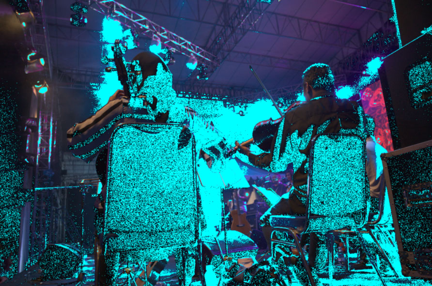
<figcaption>Neutral Out-of-gamut</figcaption>
</figure>

The image speaks for itself; not only are the colors unnatural (strong Magenta dominance), but even in 'neutral' mode, we are already out of gamut for half of the image.

### First step: Neutral & Capture Sharpening

+ Disable everything, switch to ‘Neutral’ mode.
+ In the ‘White Balance’ (Color Tab), leave it on ‘Camera’ in the face of ignorance.
+ Enable ‘Capture Sharpening’ (Raw tab).
+ Verify that ‘Contrast Threshold’ displays a value other than zero.
+ At 100% or 200%, you will see noise appear in the background.
+ Enable ‘Show contrast mask’, which is also insensitive to the Preview position. The noise on the black background becomes visible.

#### Remove noise on flat areas

Disable the mask.

View the image at 100% or 200%, then adjust the ‘Postsharpening denoise’ setting, which will take the mask information into account to process the noise. Adjust this denoising to your liking. This action will already have an effect on out-of-gamut.
<figure>
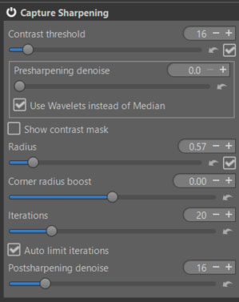
<figcaption>Capture Sharpening</figcaption>
</figure>

### Second step: Gamut Compression

This step is necessary even with less-than-ideal settings to intervene before GHS & MM and show you the impact of the settings. You will see, by enabling or disabling Gamut compression, the minimal impact on the maximum Linear White Point (in GHS or in MM).

This is one of the key points for:
+ make the colors more natural.
+ compress them within the output profile gamut.

I set it to sRGB*. Note that ‘gamut compression’ doesn’t take into account the gamma of the output profile.
+ Note the very high value of 'Maximum achromatic value', close to 12. That is 12 times the maximum 'normal' value. The chromatic values ​​– those represented in the CIExy diagram – may be 'normal', but the Y component of xyY is enormous.
+ Disable "Color Propagation" and you'll see this value become 'reasonable' (around 4), yet still high. But what's important is to 'retrieve' as much data as possible.
+ Another possible reason is that there are bright spots in the image. We are no longer in 'Pointer's Gamut'.
<figure>
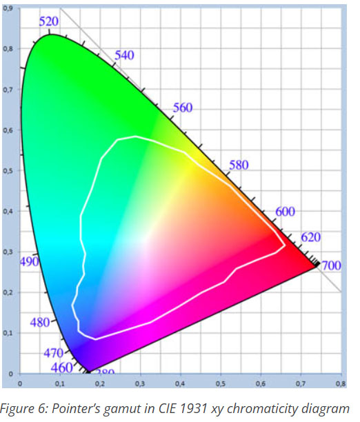
<figcaption>Pointer's Gamut</figcaption>
</figure>

+ The main reason is related to the illuminant, which here is very far from daylight, as one might assume (I don't have the one in the image).There is a 'huge' gap in the spectral distribution which results in color drifts, or even imaginary colors.

<figure>
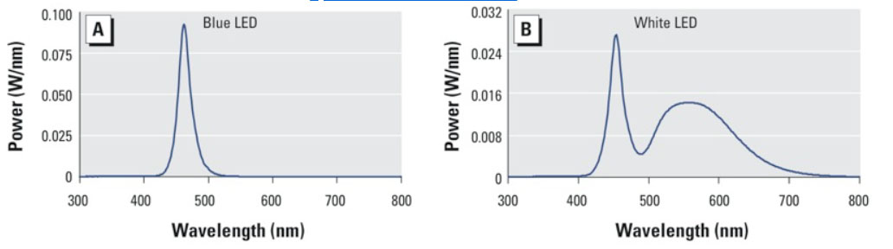
<figcaption>LED's illuminants</figcaption>
</figure>

[Common illuminants](/color_management_addon/#white-balance-gaps)

#### Some technical explanations

Whether it's each camera or our human eye, the color perception system can be summarized by 3 concepts:
+ The color specific to each object (flowers, metal, greenery, etc.). It is measured with a spectrometer and is expressed as spectral data between 380 nm and 830 nm.
+ The nature of the illuminant, which is also expressed in spectral data, is crucial: daylight and blackbody are well-known and have a Color Rendering Index (CRI) of 100 by definition. However, other light sources have emerged, such as halogens and LEDs, whose spectral distribution is not continuous; their CRI can be very poor, 60 or less. This results in "holes" in the spectrum and inaccurate data, often leading to imaginary color temperatures.
+ The Observer, which of course is different for each camera, and obviously different from that of a human.

The whole thing is solved by matrix calculations, for which I am attaching a link.

[Colorimetry - Data used](/local_adjustments/#generalized-hyperbolic-stretch--michaelis-menten--what-type-of-data-to-use-)

<figure>
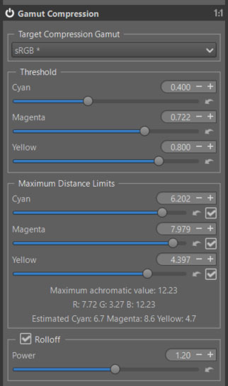
<figcaption>Gamut Compression - LED</figcaption>
</figure>

I made gradual adjustments starting from the basic settings, leading to the results shown above. I'm not sure if this is optimal.

### Third step: Generalized Hyperbolic Stretch - GHS & Michaelis-Menten - MM

I chose to perform the 'pre-tone mapping' in 2 steps:
+ The first with GHS, to bring the huge value of the data (linear White point around 11), into the interval [0 1].
+ The second wit MM, to better balance the image.

GHS:
<figure>
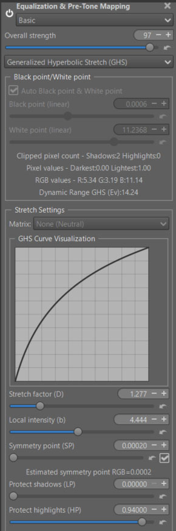
<figcaption>Generalized Hyperbolic Stretch</figcaption>
</figure>

+ Note the relatively low values for Stretch factor (D).
+ Note the 'Overall strength = 97', to try and reduce some out-of-gamut issues.

MM:
<figure>
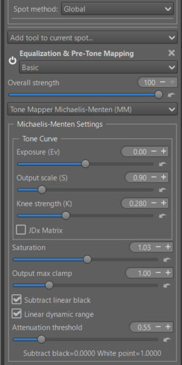
<figcaption>Michaelis-Menten</figcaption>
</figure>

+ Note the 2 values : Ouput scale (S) & Knee strength (K).
+ Note also 'Subtract linear black' and 'Linear dynamic range' enabled.
+ Note : attenuation threshold (b): better histogram, less out-of-gamut data.

[Michaelis-Menten](/local_adjustments/#michaelis-menten---mm---origin)

### Restore some sharpness to the image

+ Postsharpening denoise in Capture Sharpening, despite precautions, slightly reduced the sharpness provided by Capture Sharpening.
+ Capture deconvolution : this algorithm, which is the same as Capture Sharpening but not limited to Raw, allows you to restore some of the lost sharpness to the image. A new RT-Spot is used in Global mode (note that it is sensitive to the preview size – prefer 'fit to screen').
+ Note that this tool does not completely replace other 'Sharpening' tools, but in some cases complements 'Capture sharpening' or replaces it in the case of non-raw images.

<figure>
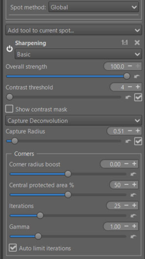
<figcaption>Capture Deconvolution</figcaption>
</figure>

### Abstract Profile

Here, I'm not using primaries, nor am I touching the illuminants. We're staying within the settings to adjust the tones, and 'Contrast enhancement'.
+ I won’t go over this somewhat unconventional concept again, which was presented four years ago.
+ However, some improvements have been made recently:
  - A ‘Saturation’ slider has been added, allowing compensation for saturation loss, particularly related to high Slope values.
  - An ‘Attenuation Threshold’ slider allows for better control of highlights using an exponential function.
  - Contrast Enhancement is a simplified way for users to utilize wavelets to improve local contrast. Readers interested in more advanced aspects can follow this link: [AP](/tutorials/introduction/#specific-tools-used) and go to the 3 links in 'Contrast Enhancement'.

<figure>
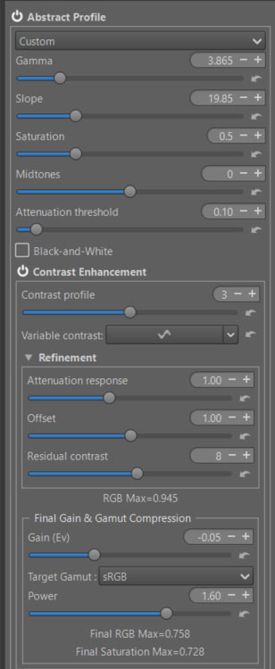
<figcaption>Abstract profile - without Primaries</figcaption>
</figure>

+ Note: RGB max = 0.945,  which corresponds to the maximum RGB values ​​before the final 'Color Appearance & Lighting' step.
+ Note: Final RGB Max = 0.758 and Final Saturation Max = 0.728 which corresponds to the maximum RGB and Saturation values ​​after the final 'Color Appearance & Lighting' step.
+ Note : the second gamut compression, with 'Power = 1.6'.

[TRC Tone Response Curve](/color_management/#trc---tone-response-curve)

[Contrast Enhancement](/color_management/#contrast-enhancement)

### Color Appearance & Lighting

Beyond CIECAM's ability to account for shooting conditions, viewing conditions, and physiological effects, it is used here for a similar purpose to primaries: to make colors appear more natural (this is quite subjective), and to maximize contrast and saturation without exceeding the color gamut.

[CIECAM](/ciecam02/#color-appearance--lighting-ciecam0216-et-color-appearance-cam16--jzczhz---tutorial)

#### Red Green Blue

+  You can modify each R, G, B channel to finely retouch colors or simulate films:
    - Rotate each color by degrees.
    - Change the saturation (s) in the sense of a CAM (Color Appearance Model).
    - Change the brightness (Q) with a curve that allows you to adapt the contrast and brightness to each situation.

+ As a reminder, in CIECAM there are a total of 9 variables, 6 of which are accessible to the user in RT: Lightness (J), Brightness (Q), Saturation (s), Chroma (C), Colorfulness (M), and Hue rotation (h). They are interdependent. For example Chroma = saturation * saturation * brightness.

[Red Green Blue](/ciecam02/#red---green---blue---hue-rotation-h---saturation-s---brightness-curve-q)

<figure>
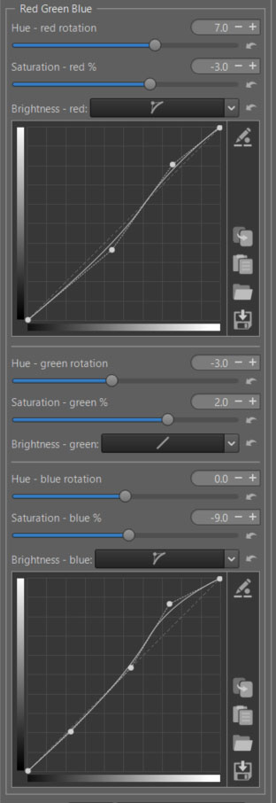
<figcaption>Red Green Blue - LED</figcaption>
</figure>

**Threshold Brightness Curves**

 The ‘Threshold Brightness Curves’ aims to limit artifacts due to variations in color differences.

<figure>
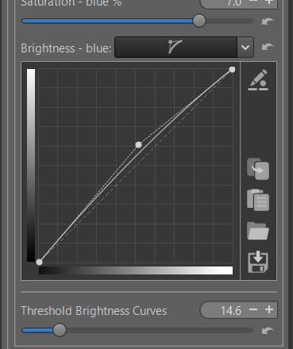
<figcaption>red-green-blue Threshold</figcaption>
</figure>

###  Image at the end of Game Changer

<figure>
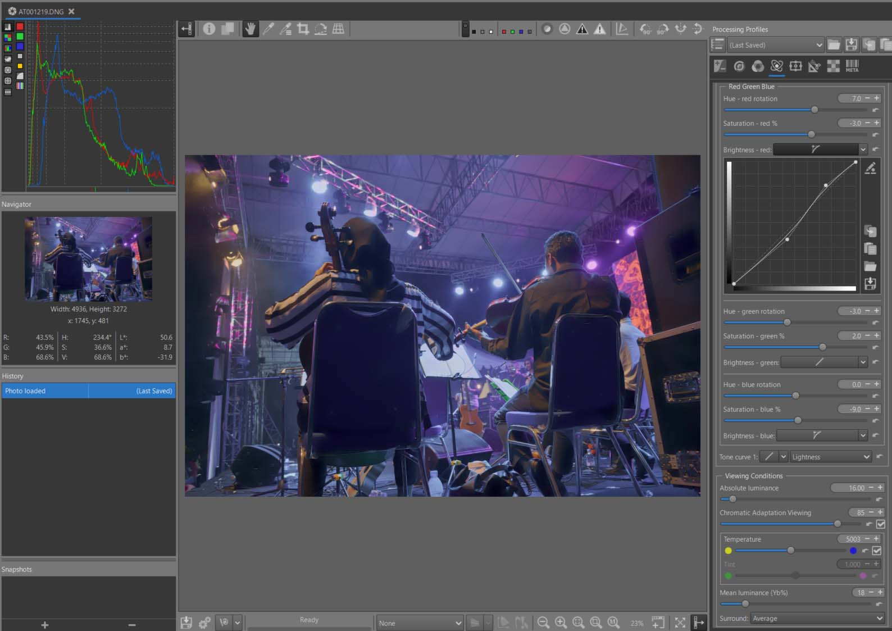
<figcaption>Image - LED</figcaption>
</figure>

I'm finding it difficult to locate areas outside the gamut; perhaps some still exist. The same applies to artifacts.
Similarly, is there respect for the colours? Difficult to say as I did not attend the show.

