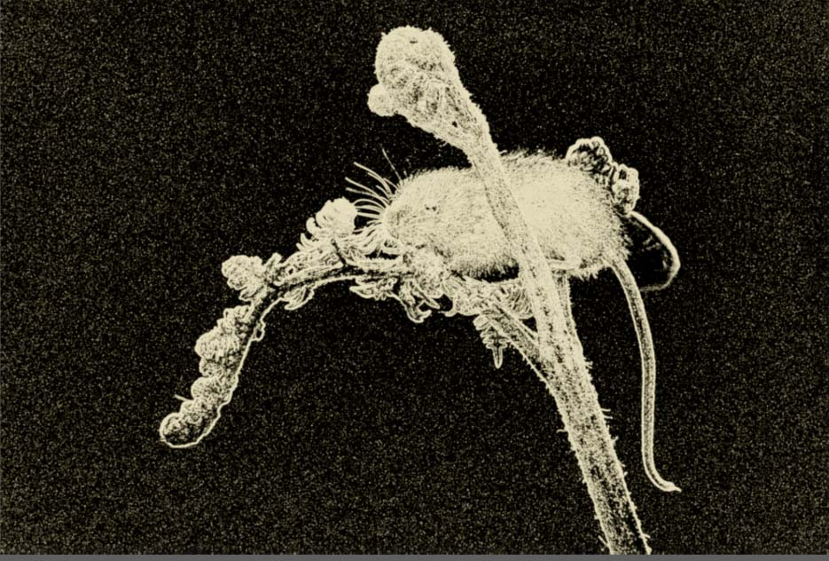
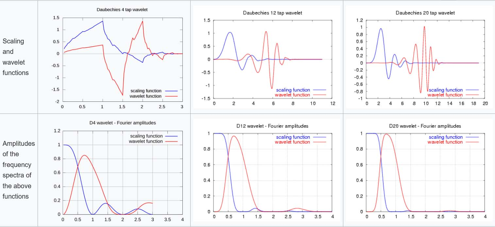
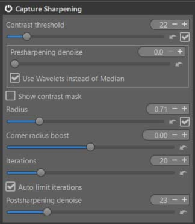
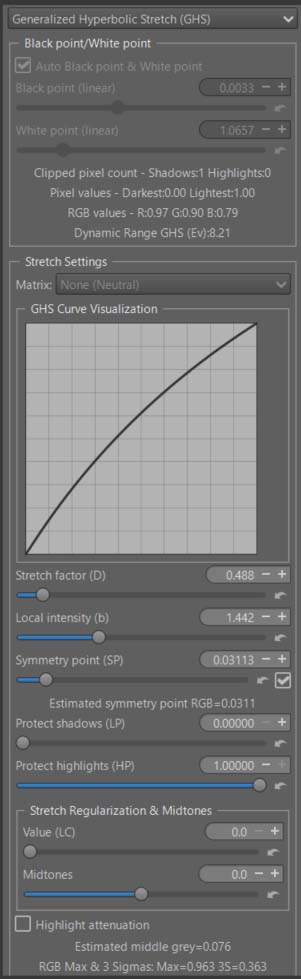
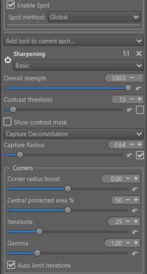
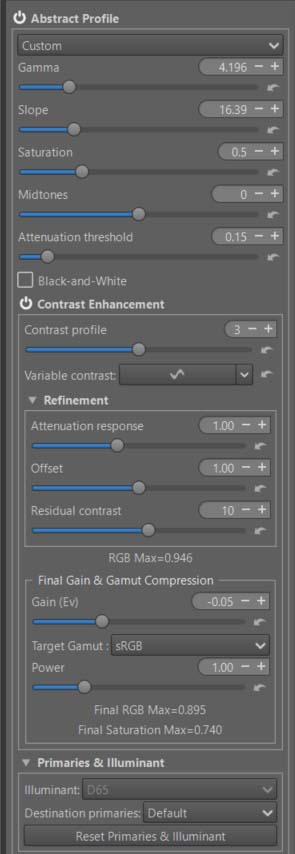
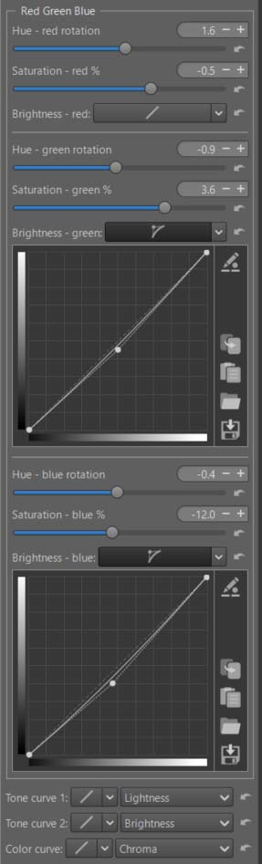
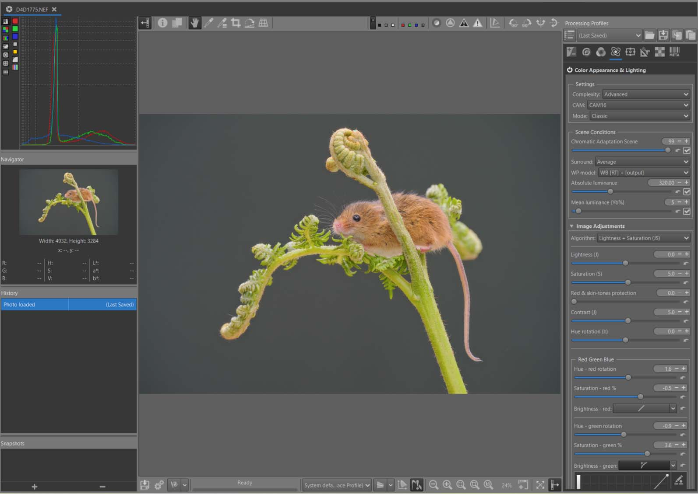

## Introduction

This tutorial aims to explain the concept of a ‘Game changer’, with an example using Andy Astbury’s harvest mouse image (thanks to him).

In this tutorial, we will see how to use ‘Capture Sharpening’ and ‘Selective Editing > Capture Deconvolution’, ‘Selective Editing > Generalized Hyperbolic Stretch’ (GHS), ‘Abstract Profile’ (AP), Color Appearance & Lighting together. Of course, other tools are necessary, which we will cover later.

Image selection:

Raw file : (Copyright Andy Astbury - Creative Common Attribution-share Alike 4.0)

[Harvest mouse](https://drive.google.com/file/d/1uND8pqgfxxaBhs554RnCvOS5NI3KsWT5/view)

- pp3 file 3: [harvest](d4d1775-cap-ghs.pp3 "d4d1775-cap-ghs.pp3")

 [Some principles](/tutorials/#in-summary-some-principles)

 [Recommendations](/tutorials/#recommendations)

 [Specific tools used](/tutorials/#specific-tools-used)

[Alternatives](/tutorials/#alternatives)

**Learning objective**

+ The importance of Capture Sharpening and postsharpening denoise to reduce noise in the flat areas of the image, and Selective Editing > Capture Deconvolution
+ The role of GHS in the linear portion of the data, which can be considered a ‘Pre-tone-mapper’.
+ The role of Abstract Profile, which prepares the data for use in the output (screen, TIFF/JPG).
+ The role of Color Appearance & Lighting : Red Green Blue.

## First steps
+ Set to Neutral.
+ Enabling Raw Black Point 'dehaze' does move the green sliders, but it introduces a strong red bias into the image. Deactivate it and return the sliders to zero.
+ Enable White Balance > Auto > Temerature correlation > the default values ​​should be suitable.
+ Enable Gamut Compression. You will see basic values ​​for the displayed data. At this stage, there is probably no need for compression. However, try adjusting the sliders to see the potential effect on the histogram and the image. In this example, Gamut Compression is disabled.

## Capture Sharpening

+ Enable ‘Capture Sharpening’ (CS) (Raw tab).
+ Verify that ‘Contrast Threshold’ displays a value other than zero, normally 22.It is unnecessary, or even harmful (except in exceptional cases), to change the 'Presharpening denoise' slider. 
+ Enable 'Show contrast mask': Zoom in or out in the Preview; you will see that this has no impact on the result. The processing is performed on the entire image – with the drawback of being relatively slow.
+ At 100% or 200%, the noise on the black background becomes clearly visible.

<figure>

<figcaption>Contrast mask - Capture Sharpening</figcaption>
</figure>

Still in the ‘Raw tab’, go to ‘Demosaicing’ and change the default method ‘Amaze’ to, for example, ‘Amaze + VNG4’ (Thanks to Ingo). These methods with ‘Double’ demosaicing use a similar contrast mask (before demosaicing). The advantages are: a) less aggressive action on the background (the black areas of the mask) while preserving the main subject, thus reducing the impact of noise; b) a slight reduction in processing time. Of course, this assumes that this mask (not the one you see in (CS), but the one for demosaicing, which isn’t user-accessible) is working and therefore that the image isn’t too noisy.

You can, if you wish, disable the ‘auto’ settings of ‘Contrast threshold’ and ‘Radius’ to adjust them to your liking.

### Remove background noise

Disable the mask.

View the image at 100% or 200%, then adjust the ‘Postsharpening denoise’ setting, which will take the mask information into account to process the noise. Adjust this denoising to your liking. It’s clear that even with a mask, the denoising action isn’t localized pixel by pixel but rather applied to areas of pixels (here, 64 x 64). Therefore, you will inevitably see denoising in the transition areas. For example, the mouse's whiskers.

Note: In the case of this low-noise image, I haven’t enabled ‘Presharpening denoise,’ which is only useful for making CS usable by performing denoising before CS.

For technical information – the denoising uses wavelets with a vanishing moment of 20 to minimize artifacts. This process takes place in three dimensions (horizontal, vertical, and diagonal). The ‘Noise reduction’ function (Detail tab) uses a vanishing moment of 4 in all three dimensions. By comparison, ‘Contrast by Detail Levels’ (which is not used for noise reduction) uses Haar’s method with a vanishing moment of 2.

<figure>

<figcaption>Wavelets - vanishing moments</figcaption>
</figure>

<figure>

<figcaption>Capture Sharpening</figcaption>
</figure>

The post-sharpening denoise setting is quite arbitrary; it depends partly on your tastes and partly on subsequent adjustments depending on whether you want to keep a very dark or lighter background.

## Second step: Generalized Hyperbolic Stretch - GHS

I preferred to use Generalized Hyperbolic Stretch (GHS) rather than Michaelis-Menten (MM) as a pre-tone mapper, because it allows (by default) for better preservation of the dark background, and reserving its modification for a later step.

The goal of this step is to adjust the White Point (linear) and Black Point (linear), and at a minimum, to adjust the image contrast.
Go to ‘Selective Editing > Global > Equalization & Pre-Tone Mapping’. Choose Genralized Hyperbolic Stretch.

Click on ‘Auto Black Point & White Point’ and examine the values. You should see BP = 0.0033, meaning the image’s black levels were not optimized, and WP = 1.0657, also indicating no optimization. Adjusting these values ​​to the range [0, 1] (32-bit real format) will result in an image with greater contrast and deeper blacks.This reduction in linear Black point, does essentially the same thing as "Raw Black Point," but here it doesn't introduce a color cast. All three RGB channels are treated identically.

The (somewhat arbitrary) settings are ‘Stretch factor (D)’ = 0.488, ‘Local intensity (b)’ = 1.442 and ‘Symmetry point (SP)’ = 0.03113. Of course you can change these settings.

<figure>

<figcaption>GHS</figcaption>
</figure>

## Third Step: Activate a second RT-spot in Global mode – Capture Deconvolution

The goal is to restore sharpness to the transition areas of the image between the (noisy) background and the main subject.

Select ‘Add tool to current spot.. > Sharpening > Capture Deconvolution'

The major problem – not specific to this tool but generally due to RawTherapee’s pipeline – is the sensitivity to the zoom level and the preview position. So, you have to make do. Ideally, you would have a screen large enough to see the details in ‘fit to screen’ mode (which is definitely not the case for me). In most cases, choose a reasonable zoom level of 50%, 100%, or 200% to see the area in question (here, the mouse’s nose). Activate ‘Show contrast mask’ with ‘Contrast threshold’ in ‘automatic’ mode. When you are satisfied with the resulting effect, uncheck the ‘automatic’ box; the setting will be retained for the entire process (including Output).

‘Capture Deconvolution’ uses the same algorithm as ‘Capture Sharpening’ (Raw Tab). Some adjustments (to put it mildly) were necessary for it to work further in the process and on non-raw images (TIFF/JPG, etc.).

In ‘fit to screen’ mode, you have the option (not very useful in this example) to increase or decrease sharpening based on the position relative to the center of the image. The area where changes are applied using the main settings is defined by ‘Central protected area %’.

When ‘Capture Sharpening’ (Raw Tab) is enabled, the ‘Capture Radius’ value in ‘automatic’ mode within ‘Capture Deconvolution’ is set to 90% of the ‘Capture Sharpening’ value. Of course, you can disable this and adjust it manually

<figure>

<figcaption>Capture Deconvolution</figcaption>
</figure>

## Fourth step – Abstract Profile : Adjusting Tones – Increasing Local Contrast

+ Balance the lights in the image.
+ Significantly increase local contrast.
+ Adjust gamma and slope to achieve the desired result and Attenuation threshold. This is where you can change the background, making it darker or lighter by adjusting the 'Slope' setting.
+ Enable ‘Contrast Enhancement’ - The default settings should be suitable in most cases. I increased 'Contrast profile' to 3. This means that 1 basic level of Wavelet decomposition is used (to simplify).
+ The RGBmax indicator should display a value less than 1. If it doesn't, either change the previous AP or GHS settings, or adjust 'Final Gain & Gamut Compression'. You will see the RT process values ​​displayed below the 'Gain (Ev)' and 'Target gamut' settings. To display the data, at least one of the two settings must not be zero or 'None'. I recommend setting 'Target gamut' to sRGB (the same setting you used for Soft Proofing) and in Gamut Compression (Color Tab).
<figure>

<figcaption>Abstract Profile</figcaption>
</figure>

+ In principle, there’s no point in using the ‘Primaries & Illuminant’ module here.
+ You can easily see the effect of the last controls in 'Final Gain & Gamut Compression', set 'Target Gamut' to 'None' and you will see the out-of-gamut data appear, also observe the histogram.

[TRC Tone Response Curve](/color_management/#trc---tone-response-curve)

[Contrast Enhancement](/color_management/#contrast-enhancement)

## Color Appearance & Lighting
+ Now we'll explore the new 'Red Green Blue' tool, which will allow you to finely control each of the 3 RGB channels.
+ First : enable ‘Color Appearance & Lighting’ and choose ‘Complexity = Advanced’. This gives you more choices among the CIECAM variables. Thus, you have : Lightness (J) and Contrast (J), Brightness (Q) and Contrast (Q), Chroma (C), Saturation (s), Colorfulness (M), hue raotation (h) , and 3 tones curves for Lightness, Brightness, and Color.
+ Note the default 'Scene conditions' settings which you could change if you know exactly the shooting conditions.
+ Note the default 'Viewing conditions' settings which you could change to adapt them to your viewing environment (the room you are in, its ambiance, the 'Absolute luminance' estimate, and Surround…).
+ I chose 'Lightness + Saturation' and slightly increased the overall saturation and contrast (J)

[CIECAM](/ciecam02/#color-appearance--lighting-ciecam0216-et-color-appearance-cam16--jzczhz---tutorial)

### Red - Green - Blue

+  You can modify each R, G, B channel to finely retouch colors or simulate films:
    - Rotate each color by degrees.
    - Change the saturation (s) in the sense of a CAM (Color Appearance Model).
    - Change the brightness (Q) with a curve that allows you to adapt the contrast and brightness to each situation.

+ As a reminder, in CIECAM there are a total of 9 variables, 6 of which are accessible to the user in RT: Lightness (J), Brightness (Q), Saturation (s), Chroma (C), Colorfulness (M), and Hue rotation (h). They are interdependent. For example Chroma = saturation * saturation * brightness.

In the case of the ‘Harvest mouse’ I arrived at the settings used in pp3, using ‘Soft proofing’ to control the gamut.

To simplify use, I’ve only included one slider per channel for hue rotation, and one slider per channel for Saturation (s). I could have also included a tone equalizer for the red, green, and blue range; If that proves useful, aside from complicating the interface, it doesn’t pose any problem. Note that the 3 Brightness curves allow you to adjust the brightness and contrast for each color range. Specifically, brightness acts on the perceived chroma via the (s) Saturation function.

Of course, the settings are quite arbitrary, depending on your tastes.

[Red Green Blue](/ciecam02/#red---green---blue---hue-rotation-h---saturation-s---brightness-curve-q)

<figure>

<figcaption>CIECAM Red Green Blue</figcaption>
</figure>

**Threshold Brightness Curves**

 The ‘Threshold Brightness Curves’ aims to limit artifacts due to variations in color differences.

<figure>

<figcaption>red-green-blue Threshold</figcaption>
</figure>

**Back to Abstract profile**

Check that the data displayed in ‘Final Gain & Gamut Compression’ is within limits, correct it if necessary, but be careful with the gamut. In the case of 'Harvest mouse', gamut compression is essential.

##  Image at the end of Game Changer

<figure>

<figcaption>Harvest mouse</figcaption>
</figure>

