This second tutorial aims to explain the concept of a ‘Game changer’ here applied to a sunset.

In this tutorial, we will see how to use:
+ Generalized Hyperbolic Stretch (GHS) in 2 modes: RGB Standard & RGB Luminance.
+ Michaelis-Menten (MM).
+ Abstract Profile (AP).
+ Color Appearance & Lighting.

Of course, other tools are necessary, such as 'Gamut Compression', 'White Balance Auto - Temperature Correlation' (See the first tutorial for more details: of course the settings are different).

[Gamut Compression](/tutorials/shadows-highlights/#gamut-compression)

[Auto White Balance - Temperature Correlation](/tutorials/shadows-highlights/#white-balance---temperature-correlation)

Image selection:
Image n°5 IMGP2426.DNG from the Rawtherapee Processing Challenge feedback (begin 2024)

[Raw Image](https://drive.google.com/file/d/17R3iBq08s71DuDRiv9T6TzlJVsxqBISo/view)

Raw file (Creative Commons Attribution-NonCommercial-ShareAlike 4.0 International License)

This image seems innocuous at first glance, a typical sunset. The image is generally underexposed, and the sun doesn’t appear overexposed.

- pp3 file 1: [First example with Generalized Hyperbolic Strech - RGB Luminance](i2426-ghs-lum.pp3 "i2426-ghs-lum.pp3")
- pp3 file 2: [Second example with Generalized Hyperbolic Strech - RGB Standard](i2426-ghs-std.pp3 "i2426-ghs-std.pp3")
- pp3 file 3: [Third example with Michaelis-Menten](i2426-mm.pp3 "i2426-mm.pp3")

 [Some principles](/tutorials/introduction/#in-summary-some-principles)

 [Recommendations](/tutorials/introduction/#recommendations)

 [Specific tools used](/tutorials/introduction/#specific-tools-used)

 [Alternatives](/tutorials/introduction/#alternatives)

**Learning objective**

The user will understand the ‘Game changer’ approach discussed in this tutorial:
+ The role of ‘GHS’ or 'MM' in the linear portion of the data, which can be considered a ‘Pre-tone-mapper’.
+ The role of ‘Abstract Profile’, which prepares the data for use in the output (screen, TIFF/JPG).
+ Minimize the use of other tools, aside from those essential for the proper functioning of RawTherapee, GHS, MM, and AP, and reduce back-and-forth navigation within the GUI.
+ Highlight the tools to avoid and those that can be beneficial.
+ The settings (sliders, checkboxes, etc.) are provided for illustrative purposes. They are not intended to provide perfect settings, but rather to show the way forward.

#### First step: GHS - MM  and necessary adjustments

+ Deactivate everything, switch to ‘Neutral’ mode.
+ Activate ‘Capture Sharpening’ (Raw Tab): check that ‘Contrast threshold’ displays a value other than zero. Otherwise, it means it is not operational (noisy image). Resolving this potential problem related to noisy images will be covered in a later tutorial.
+ The image was taken outdoors at sunset, therefore with a daylight illuminant, so there is no problem setting the white balance (Color Tab) to ‘Automatic & refinement > Temperature correlation’.
+ In the Exposure Tab, disable ‘Clip out-of-gamut colors’, enable ‘Highlight reconstruction’, and zoom the image to 100% while examining the sun. Try ‘Inpaint Opposed’, ‘Blend’, and ‘Color Propagation’. For each case, re-enable ‘Clip out-of-gamut colors’ and observe the differences. The image without artifacts (I think?) is with ‘Color Propagation’ and ‘Clip out-of-gamut colors’ disabled. Try ‘Blur’ (Color Propagation) to see if artifacts at transitions appear or disappear. ‘Blur’ is finally set to 0.

#### Using Generalized Hyperbolic Stretch (GHS)

##### Preamble

[Generalized Hyperbolic Stretch](/local_adjustments/#generalized-hyperbolic-strech---ghs---origin)

I won’t compare it to other tone mappers in RawTherapee or other software, using tables or a pros/cons list. That would be tedious and probably not very interesting from a user’s perspective. I will simply (given the lack of documentation) draw your attention to the specific points that are crucial:

+ Setting the ‘White point (linear)’ (WP) and ‘Black point (linear)’ (BP) is THE first fundamental aspect of its operation. It is done entirely in linear mode (unlike Black Ev and White Ev). It is dynamic, meaning that each new session (for example, when creating a second RT Spot) recalculates and triggers the GHS algorithm. Consequently, the values ​​are always accurate (at least in theory). Preferably, use the ‘Auto Black point & White point’ checkbox (except in Inverse mode).
+ To understand how this works in the simplest way possible, let’s assume that the base data, before the calculation and implementation of ‘BP’ and ‘WP’, is in the range [0, 1] - 32-bit real format -(this is rarely the case)… If the ‘auto’ setting for ‘BP’ is 0.05 and ‘WP’ is 3.05. This means that if we do nothing, the actual data after the ‘Color Propagation’ action would be 0.05 for the BP (resulting in a loss of contrast due to an excessively high black point) and a WP of 3.05, which will be incompatible (or very poorly handled) by the majority of Rawtherapee’s algorithms, which are not at all designed to work with huge values, often resulting in data clipping, color drift, etc. The RGB data will be transformed by dividing the actual values ​​by a factor equal to the difference between ‘WP’ and ‘BP’, which here is 3.05 - 0.05, therefore 3. This means that the data we saw in the ‘Preview’ which was in the range [0, 1] becomes [0, 0.33]. The image becomes extremely dark, but the sun enters the gamut with a value of 1.
+ The second factor to consider, and one that caused me a lot of problems, is determining the ‘Symmetry Point (SP)’ value. Theoretically, this is the peak of the luminance in the histogram in linear mode. In astrophotography software, the user clicks on an area that seems most promising. This seems quite obvious: the brightest nebulae located near stars. The ‘SP’ is then adjusted to the value found. In the case of general-purpose images, I challenge anyone to find the area where the histogram (luminance portion) has its maximum in both Working Profile and Linear modes. This ‘SP’ is THE second key point that determines how the algorithm works. It has little to no relation to mid-grey. GHS’s complex calculations use a variety of complex hyperbolic functions, depending on the values ​​of ‘SP’, ‘Stretch factor (D)’, and especially ‘Local Intensity (b)’. These functions provide an asymptote to the luminance for highlights and adjust the amplitude range (increasing or decreasing) of the data within the interval [0-1] to make the image acceptable. By default, leave the ‘Symmetry point (SP)’ slider checkbox set to Automatic.
+ Of course, I suggest you try modifying these ‘auto’ settings and changing ‘Color Propagation’ to something else. Uncheck the ‘auto’ boxes, change ‘SP’, and change ‘WP’ and ‘BP’. … Just to see the effects and potentially find better settings.
+ The ‘GHS Curve Visualization’ has very little relation to a ‘Tone curve’, it only reflects the action of hyperbolic functions and not the direct action on tones.

##### Adjusting ‘Stretch factor (D)’ and ‘Local Intensity (b)’

‘Stretch factor (D)’ will stretch (and compress) the image data according to the areas. It is a logarithmic function (but has absolutely no relation to Filmic or Log encoding). You will notice that there are only positive values ​​– we are working in ‘positive space’. If you want to use the equivalent of negative values ​​(which is impossible with a Log function), you must switch to ‘Inverse GHS’ mode, which activates ‘negative space’ mode. We will see this later.
’Local intensity (b)’ will localize the effect of Stretch. Depending on its value, hyperbolic functions of very different natures will modify the data (the only point in common with Sigmoid is the term hyperbolic). 

##### The advantage of doing multiple stretches

Rather than attempting a single stretch, in the case of images with a high WP (3 to 5), which will require a high 'Stretch factor (D)', or where the user will have difficulty locating the area where action should be prioritized, it is better to perform two stretches. The first, with moderate values, will place the data in the interval [0-1] (32-bit real format), while the second will allow for better localization of the action.

+ Note that GHS settings can cause data (depending on the GHS settings) to fall outside the [0, 1] range, both in linear and output data. Constantly monitor the histogram in both modes (working profile - linear and output profile - gamma) and make any necessary corrections. In reality, to give the GHS algorithm some leeway, I added 0.1 to the calculations. This means that if you open a second RT-Spot, you'll see the WP value as 1.1, not 1.
+ In ‘Stretch Regularization & Midtones’, you can set the value (LC) – the local contrast – to zero to avoid artifacts in the sun area. Local contrast can be addressed later in Abstract Profile.
+ To see the effects, instead of a single ‘Stretch factor (D)’ with high values, you can try constructing the stretch using two RT-spots. The first with lower (D) and (b) values. The second with values ​​adjusted to your preference. You’ll see that for this second RT-spot, the values ​​of (BP) will be close to zero, and those of (WP) very close to 1.0 (minor adjustments are possible). The image will be different, the sun less prominent.

###### First Spot - GHS

<figure>
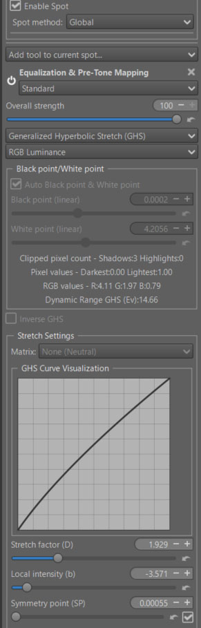
<figcaption>GHS - first spot - Low Strech factor</figcaption>
</figure>

###### Second Spot - GHS

<figure>
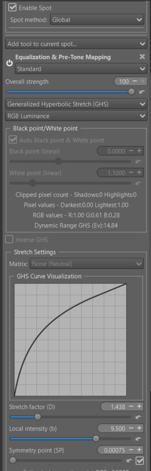
<figcaption>GHS - second spot</figcaption>
</figure>

##### Inverse GHS

This function, not available in Selective Editing’s ‘Basic’ complexity mode, allows you to undo previous actions on all (somewhat oddly) or part of the image. It works similarly to ‘negative space’.

The selection of the ‘WP’ and ‘BP’ is manual… Move closer to [0, 1] if it isn’t already.
In the case of the processed image, I created a second RT-spot in normal mode, in the form of a rectangle. Its purpose is to reduce the effect in the sky area without significantly affecting the sun. It resembles (somewhat) a Graduated Filter. The center was placed on a cloud, with the Scope set to 25. The center of the spot is positioned relatively far in the image. Of course, you can change the position of the RT-spot, Scope, and Transition in Selective Editing > Settings.

Sliders like ‘Stretch factor (D)’ work in reverse. They reduce contrast, darkening the image.

<figure>
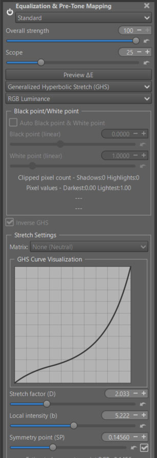
<figcaption>GHS - Inverse</figcaption>
</figure>

##### Six methods available - two recommended

Six methods available (RGB Luminance, RGB Standard, Lightness & chromaticity (Lab), Luminance (HSL), Saturation (HSL), Hue (HSL)). Two are recommended:

+ RGB Luminance : the three channels R, G, B are used equally. To control the system, an equivalent luminance is calculated, attempting to take into account WP values ​​above 1.
+ RGB Standard (default) : the three channels R, G, B are used equally.

They will differ in how they render very high highlights, which are out of gamut. The choice between the two depends on the images and your preference.
An example in RGB Luminance mode for the first RT-spot

##### LMS Matrix conversion

Performs the entire GHS processing, including Matrix conversion either AgX or JzAzBz or Cat16. For JzAzBz and Cat16 you have the choice between a transformation in RGB mode or in XYZ mode (preferably).

* To allow this matrix to be enabled or disabled, the 'Auto Black point & White point' must be disabled.
* You need to re-enable 'Auto Black point & White point' to recalculate the values ​​of 'BP', 'WP' and 'Symmetry point (SP)'.

#### Using Michaelis-Menten (MM)

This algorithm is much simpler than GHS. It often provides almost the correct settings on the first try. However, it cannot operate in 'Inverse' mode. Like GHS, it requires adjustments to the 'Black point (linear)' and 'White point (linear)'. 

For the sake of simplicity, it is only offered in RGB Standard mode, i.e. the 3 channels Red, Green, Blue used in the same way.

[Michaelis-Menten](/local_adjustments/#michaelis-menten---mm---origin)

##### MM Settings

This tone mapper uses the Michaelis-Menten equation, which is borrowed from biochemistry to describe enzyme kinetics. In image processing, it creates a smooth, saturating curve that is useful for tone mapping.

* Exposure: Adjusts the input image brightness.
* Output scale (S): Controls the maximum asymptotic value of the curve; essentially the output white level.
* Knee strength (K): Determines the “knee” of the curve. Lower values result in a sharper transition to the compressed highlight region.
* Saturation: Adjusts color saturation post-tone mapping.
* Output max clamp: Sets the final clipping point for the output values.
* JDx Matrix : the JDx checkbox allows the user to choose either the default or the JDx LMS transformations. LMS is a color space transform which represents the response (sensitivity) of the three types of cone cell in the human eye at long, medium, and short wavelengths.These transformations are matrices that modify each of the R G B channels for each individual pixel, giving priority to certain dominant colors depending on the selected option
  - Unchecked: leaves the data unchanged (default).
  - JDx: accentuates each of the R G B channels by acting on X Y Z such that the LMS data is perceived as being more colorful.

The two settings to prioritize are Output scale (S) and Knee strength (K) ; these are the ones that directly affect the hyperbolic function.

##### MM - Subtract linear black & Linear dynamic range - Attenuation threshold

As in GHS, these two settings, which I wanted to be simpler, are essential for the proper functioning of the algorithm.

+ Subtract linear black: reduces the linear black point values ​​to almost zero. This makes optimal use of the available data by increasing overall contrast and reducing haze effects.
+ Linear dynamic range: allows you to include any data outside the color gamut (in the case of sunsets for example). Enabling ‘Highlight reconstruction’ > Color Propagation can provide a significant improvement.

In addition:
+ Attenuation threshold: uses an exponential function to reduce highlights likely to cause gamut overshoot.

<figure>
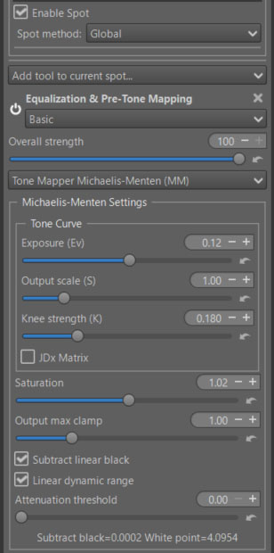
<figcaption>First Spot : Michaelis-Menten - Settings</figcaption>
</figure>

##### MM - Darken the clouds - inverse GHS

<figure>
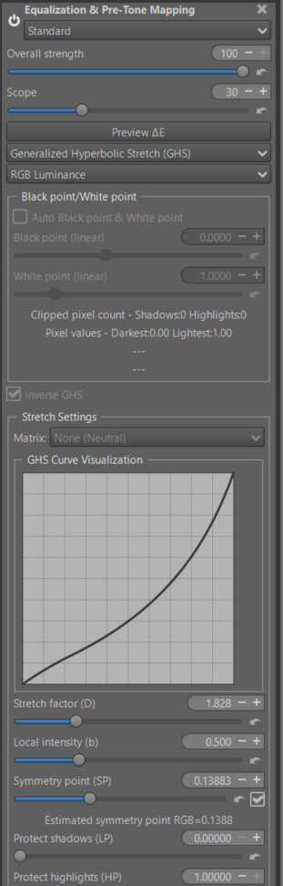
<figcaption>Second Spot : Inverse GHS</figcaption>
</figure>

#### A preview at the end of Game Changer

To give the user a glimpse of the possibilities of each of these 'pre-tone mappers', here is the result at the end of the Game Changer process. We will then see how to process Abstract Profile and Color Appearance & Lighting.

##### Sunset GHS - RGB Luminance

<figure>
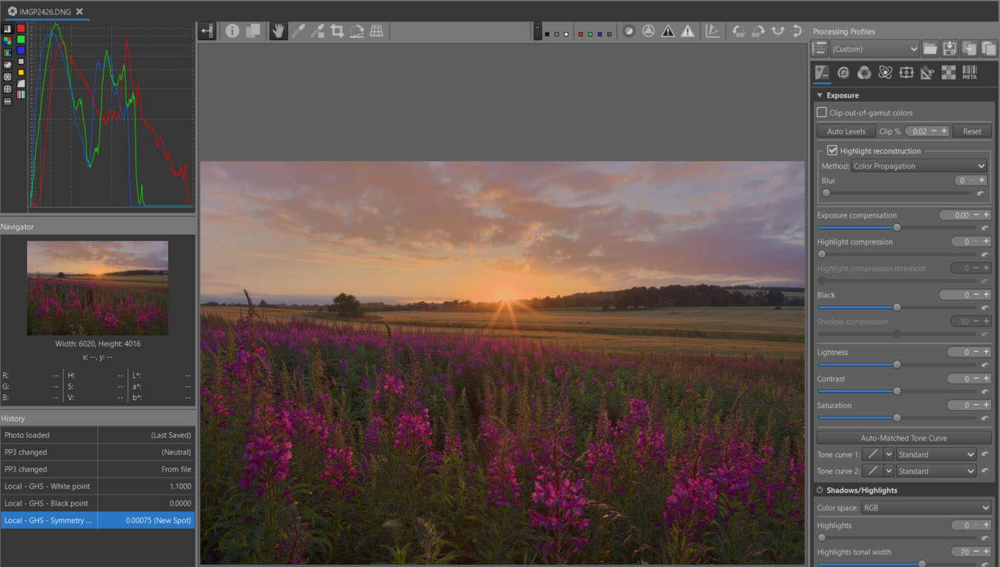
<figcaption>Sunset GHS RGB Luminance</figcaption>
</figure>

##### Sunset GHS - RGB Standard

<figure>
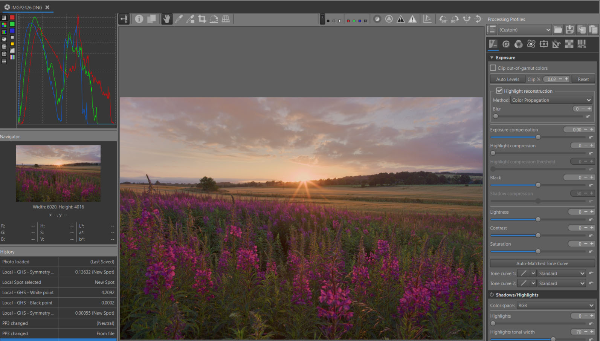
<figcaption>Sunset GHS RGB Standard</figcaption>
</figure>

##### Sunset MM

<figure>
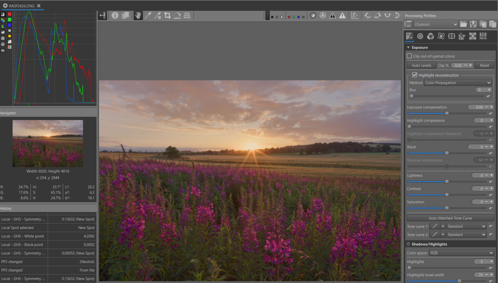
<figcaption>Sunset MM</figcaption>
</figure>

#### Abstract Profile – A Possible Approach to Preparing Output

+ I won’t go over this somewhat unconventional concept again, which was presented four years ago.
+ However, some improvements have been made recently:
  - A ‘Saturation’ slider has been added, allowing compensation for saturation loss, particularly related to high Slope values.
  - An ‘Attenuation Threshold’ slider allows for better control of highlights using an exponential function.
  - Contrast Enhancement is a simplified way for users to utilize wavelets to improve local contrast. Readers interested in more advanced aspects can follow this link: [AP](/tutorials/introduction/#specific-tools-used) and go to the 3 links in 'Contrast Enhancement'.

##### Let’s return to our image.

The image obtained after GHS or MM is perfectly acceptable. I could have added a series of add-ons to GHS/MM to avoid using another module, such as ‘Contrast Enhancement’ or ‘Gamma & Slope’, but that would have complicated the tool.

###### Abstract Profile

+ I modified ‘Gamma’, ‘Slope’, and ‘Attenuation Threshold’ to create a more balanced image.
+ I activated ‘Contrast Enhancement’ with a value of 3 and slightly increased ‘Residual Contrast’.
+ But, primarily and mainly for educational purposes, I used the ‘Dominant Color’ function (is not included in pp3)

[TRC Tone Response Curve](/color_management/#trc---tone-response-curve)

[Contrast Enhancement](/color_management/#contrast-enhancement)

###### Dominant Color

This function, also available in ‘Selective Editing > Color Appearance (CAM16)’, allows you to correct or introduce a dominant color. Without modifying the primaries, which is possible in graphic mode, choose ‘Destination primaries > Custom (CIExy Diagram)’.

In this mode, ‘Dominant Color’ displays the calculated position of the dominant color in gray. The position of the white point (the default illuminant D65 in Rec2020) is shown in white. You can move the dominant color using ‘Shift x’ and ‘Shift y’.

Moving the Refine Colors slider (Illuminant white point) will increase or decrease the purity and saturation of the selected color. Of course, you can also change the illuminant; try different values.

I ‘forgot’ one thing. After ‘Abstract profile’, it is possible (even recommended) to implement ‘CIECAM’ (Color Appearance & Lighting) whether for chromatic adaptation or to adapt the output to viewing conditions (darkness, surround, etc.).

<figure>
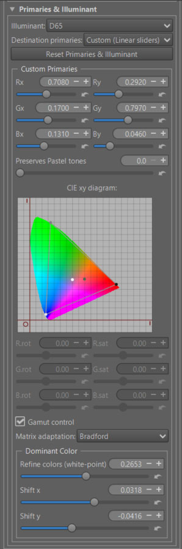
<figcaption>Abstract Profile - Dominant Color</figcaption>
</figure>

#### Color Appearance & Lighting

[CIECAM](/ciecam02/#color-appearance--lighting-ciecam0216-et-color-appearance-cam16--jzczhz---tutorial)

We use the same principles as in the first tutorial, but the settings are different. Here, the goal isn't to create a dramatic effect, but to amplify the sunburst.
[CIECAM - Best shadows & highlights technics](/tutorials/shadows-highlights/#color-appearance--lighting)

##### CIECAM - Main settings (GHS & MM)

<figure>
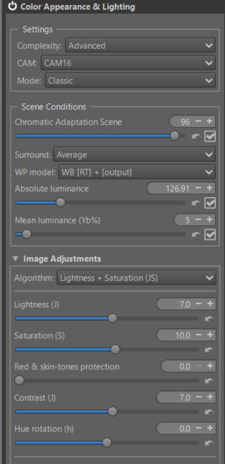
<figcaption>CIECAM Curves & Viewing Conditions</figcaption>
</figure>

Here, I used 'Lightness + Saturation (s)' which has a differentiated action on shadows.

<figure>

<figcaption>CIECAM Curves & Viewing Conditions</figcaption>
</figure>

+ I chose not to adjust the automatic settings (Chromatic Adaptation Viewing, Absolute luminance, Mean Luminance (Yb%), Surround). But this is where you can (must) adapt the image you see to the Viewing conditions (yours).

##### CIECAM - Red Green Blue (GHS & MM)

+  You can modify each R, G, B channel to finely retouch colors or simulate films:
    - Rotate each color by degrees.
    - Change the saturation (s) in the sense of a CAM (Color Appearance Model).
    - Change the brightness (Q) with a curve that allows you to adapt the contrast and brightness to each situation.

+ As a reminder, in CIECAM there are a total of 9 variables, 6 of which are accessible to the user in RT: Lightness (J), Brightness (Q), Saturation (s), Chroma (C), Colorfulness (M), and Hue rotation (h). They are interdependent. For example Chroma = saturation * saturation * brightness.

[Red Green Blue](/ciecam02/#red---green---blue---hue-rotation-h---saturation-s---brightness-curve-q)

<figure>
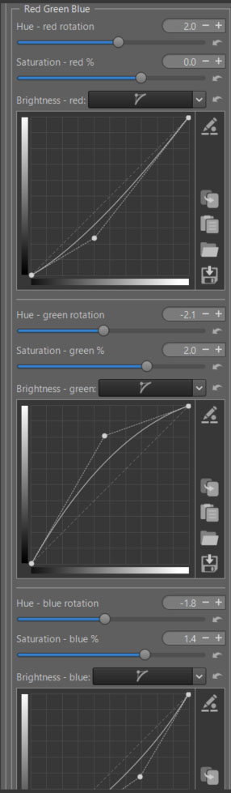
<figcaption>CIECAM Red Green Blue</figcaption>
</figure>

**Threshold Brightness Curves**

 The ‘Threshold Brightness Curves’ aims to limit artifacts due to variations in color differences.

<figure>

<figcaption>red-green-blue Threshold</figcaption>
</figure>
