## Introduction : What is a "Game changer"?

‘Game changer’ - in French, the term ‘bouleverseur’ suits me well as a translation: it aims to change the usual way of thinking and acting in terms of image processing. Before changing the way we do things, we must first agree on the way we see things. In french a great sociologist, now deceased, said : "L'accord sur ma manière de faire est avant tout un accord sur la manière de voir" (Jean-Daniel Reynaud : 1926 - 2019).

This concept isn't about forcing you to change your image processing methods, but rather about trying a different approach based on principles that solve (at least partially, I believe) difficult image processing problems, using new concepts and methods. I'm not talking about tools here, but meta-methods: how to proceed and why this processing method is preferable to another for this type of image. There isn't a single method that works in all cases, but rather principles based on specific objectives.

### A bit of history - the implications of the context

* RT was conceived and created by a single man, Gabor Horvatz, in 2005. This is a fantastic achievement. However, this has consequences: the GUI interface has remained the same, prioritizing what was good, given the knowledge available at the time in 2005. 
* Today, the powerful modules are scattered across the different Tabs, and for my part, I almost never use them (with the exception of 'Highlight reconstruction') in the first two 'Tabs'.
* Other improvements have made some modules that were very good 10 years ago a little less so. I'm thinking of the excellent "Dynamic Range Compression" (which is mathematically complex), which is slow and resource-intensive...
* A persistent problem, once you're no longer in Raw mode, is that the 'Preview', apart from 'fit to screen', is often different from the TIF/JPG output. Furthermore, the appearance varies significantly depending on the zoom level and the tools used. This is a pipeline design flaw... that hasn't been resolved (the consolation is that this problem, to varying degrees, is found in other software as well)... So you just have to live with it.
* There are also the effects of fads; yesterday everyone was talking about "XXX", then "YYY"...and now "ZZZ", and since it's present elsewhere, why isn't it being developed in RT? This doesn't mean that "ZZZ" is better than "XXX".
* RT also has the unique characteristic of employing certain specific algorithms or processing methods. People may like it or dislike it, criticize it or approve of it, and compare it to what exists elsewhere. Before condemning, compare apples to apples (you wouldn't compare a chicken and a fish). I'm referring in particular to: CIECAM, Auto WB temperature correlation, Selective Editing, Wavelets, Abstract Profiles, etc.

### In summary: some principles
+ Start processing an image with no settings other than the default ones in 'Neutral', to avoid any side effects.
+ Use the maximum possible range for Raw data, this means that: 
  - The Black Point at the beginning of processing should be as close as possible to what the sensor allows.
  - The highest measurable values ​​on the sensor must be recorded at the White Point. Furthermore, it is desirable to be able to recover, as best as possible, the data lost when values ​​created by overexposure have saturated the sensor (see: Highlight reconstruction > Color Propagation  - which, contrary to what its name suggests, also allows data to be retrieved in very low light conditions).
+ Finding the best color balance is crucial before starting any treatments. The longer you wait, the greater the risk of 'contaminating' other methods.
+ Make the most of the possibilities in Raw mode, whether it be the demosaicing method, the improvement of sharpness and noise treatment, the correction of black points and chromatic aberrations, etc.
+ Control (and compress if necessary) the gamut at the beginning and end of the process.
+ Using the concept of a pre-tone mapping, which makes an image usable or (acceptable) for further processing. That is to say:
  - Bring the black point close to zero, to increase contrast and use the entire range of data.
  - Bring the White point as close as possible to 1: out-of-gamut data can have very high values ​​(3, 5 or 10), and all methods are more efficient when in the interval [0 1].
  - Implementing an asymptotic process that allows us to get closer to the white point, without reaching it - and even less going beyond it.
  - This principle is included in 'Selective Editing > Equalization & Pre-tone mapping': The first RT-spot used must always be (if of course there is a need) a Pre-tone mapper in Global mode.
+ Towards the end of the process, it is possible to adjust the tones and contrasts, assuming that the image at this stage has no major defects (with the exception of images taken with exotic illuminants such as LEDs, which may require the use of primaries). This method should allow visualization of the effects on the acceptable limits for the data and the gamut.
+ At the very end of the process, it allows the implementation of the concepts of 'Scene' (source) and Viewing (display): taking into account the conditions of shooting and final viewing, taking into account the physiological aspects, allowing each R, G, B channel to be retouched to better balance or modify the colors.
+ You may notice that throughout 'Game changer' (except for a few rare cases, where they are 'automatics' as in Capture Sharpening, or for a very specific use), I never use masks and layers, or Primaries. And it is unlikely that you will find these methods and tools anywhere other than in Rawtherapee (of course not all of them).

Some current tools should be avoided – or at the very least, the user should be aware of the consequences of their choices:
+ Exposure compensation.
+ Auto-Matched Tone Curve.
+ Tone curve.
+ Auto Levels.
+ All sliders below 'Exposure compensation'
+ ...

Other tools must be used with caution, as they can interfere - it is almost impossible to review the pipeline - on Game Changer:
+ Haze removal
+ Contrast By Detail Levels
+ ... 

Prefer their equivalent in Selective Editing, taking care to place them "after" the pre-tone mapping.

This is partly due to the pipeline - the order in which operations are actually carried out, not the order in which you do them.
[Pipeline](/toolchain_pipeline)

You can use the tools to reduce noise, make crops, modify geometry, wavelets, etc.

But of course, there are no prohibitions; these are only general recommendations. Each image may be a special case.

#### Recommendations

+ It is best to alternate between viewing the histogram in linear mode with the Working profile, and in Output profile mode with a gamma.
<figure>
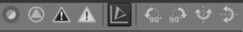
<figcaption>Histogram Linear or Gamma</figcaption>
</figure>

+ It is advisable to observe gamut spillovers with Softproofing - set to your personal profile.
<figure>

<figcaption>Softproofing out-of-gamut colors</figcaption>
</figure>

+ You can control the data at the time you implement a tool, these are just possible examples of values (uncorrelated with each other):
  - Gamut Compression: Maximium achromatique value: 3.2, then R:3.2 G:1.4 B=1.8 -- Estimated Cyan:1.5 Magenta:2.2 Yellow:2.8
  - Michaelis-Menten : Subtrack black = 0.05 White point=3.1
  - Generalized Hyperbolic Strech: RGB values- R:3.3 G:1.2 B=1.9
  - Abstract Profiles : RGB max = 0.92 - Final RGB Max = 0.62 - Final Saturation Max = 0.75
+ 'Normally', if everything was within the gamut, and if no processing caused it to be exceeded, the values ​​should all be within the interval [0 1]
+ If you find values (for the maximum) ​​for Gamut Compression, Michaelis-Menten, Generalized Hyperbolic Stretch:
  - That are less than 1 or close to 1. It's likely that Highlight reconstruction > Color Propagation (or Inpaint Opposed) won't help. In that case, disable it.
  - If these same values ​​are much greater than 1, for example 3.5 or 8, or more, the use of Color Propagation is recommended, and consequently it should not be disabled.
  - In the latter case, make sure that 'Clip out-of-gamut colors' is disabled.
<figure>
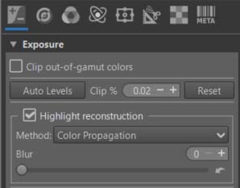
<figcaption>Color Propagation - Clip out-of-gamut colors</figcaption>
</figure>

### Specific tools used
As of February 2026 - to be updated.
Apart from tools that have been around for many years, but are not always well known, I highlight new ones, or those that seem preferable to me:
+ Capture Sharpening (Raw Tab) - With Pre and Post sharpening denoise  [Capture Sharpening](/capture_sharpening/)
+ Color Propagation in Highlight reconstruction (Exposure Tab) [Highlight Reconstruction](/exposure/#highlight-reconstruction)
+ White Balance > Automatic & Refinement > Temperature correlation (Color Tab) [Temperature Correlation](/white_balance/#the-temperature-correlation-algorithm)
+ Gamut Compression (Color Tab) [Gamut Compression](/gamut_compression)
+ Selective Editing > Equalization & Pre-Tone Mapping : Generalized Hyperbolic Stretch (GHS) & Michaelis-Menten (MM) [GHS & MM](/local_adjustments/#generalized-hyperbolic-stretch-and-michaelis-menten)
+ Abstract Profile (Color Tab) [AP](/color_management/#abstract-profiles)
  - Tone Response Curve [AP - TRC](/color_management/#trc---tone-response-curve)
  - Contrast Enhancement [AP-CE](/color_management/#contrast-enhancement), in particular how it works [Presets](/color_management/#each-preset-contains-a-selection-of-decomposition-levels), and [Characteristics](/color_management/#the-contrast-enhancement-module-has-the-following-characteristics)
  - Illuminant White Point [AP - IWP](/color_management/#illuminant---white-point)
  - Primaries [AP - Prim](/color_management/#primaries) 
+ Selective Editing > Blur/Grain & Denoise > Denoise [SE-denoise](/local_adjustments/#selective-editing----blurgrain--denoise--denoise)
+ Color Appearance & Lighting (Advanced Tab) [CIECAM](/ciecam02)

## The tutorials

The first tutorial, 'Best Shadows & Highlights Techniques', is the most detailed in its explanation of each method or tool (except for noise reduction). To avoid overloading the other tutorials with repetition, prior knowledge of the explanations will be assumed.

### Game Changer - Best Shadows & Higlights techniques 

In this tutorial, we will see how to use various tools to avoid or remove artifacts. Propose one solution among others to simultaneously brighten shadows, control highlights, and create a dramatic effect.
The image is difficult, and the question is: what should be done with it? Emphasize the dramatic aspect? Lighten or darken the shadows? There are as many answers as there are people.

This image is a real challenge: usually we struggle with highlights, but here there are both highlights and, above all, very (very) low highlights, where the values ​​are very close to zero, even at zero for the Red channel, the Green channel, and a very small value for the Blue channel, or even at zero for all three channels.

Beyond the aesthetic aspect of the result, there is above all a technical challenge in terms of methods.

I deliberately chose extreme settings to show that even with a 'degraded' starting image it is possible to obtain a more than acceptable result, for example the "Contrast Enhancement" values ​​are huge.

 [Some principles](/tutorials/#in-summary-some-principles)

 [Recommandations](/tutorials/#recommendations)

 [Specific tools used](/tutorials/#specific-tools-used)

**Image selection**

+ [Raw Image](https://discuss.pixls.us/t/show-your-best-shadow-highlight-techniques/55731)
+ This file is licensed [Creative Commons, By-Attribution, Share-Alike](https://creativecommons.org/licenses/by-sa/4.0/).

- pp3 file 1: [First example with Color Propagation](1q8a5461.cr3-jd-std.pp3 "first-cp.pp3")
- pp3 file 2: [Second example with Color Propagation and blur](1q8a5461.cr3-jd-blur.pp3 "second-cp-blur.pp3")

**Image : neutral**
+ Here is a screenshot of the image in 'neutral' mode with 'Lockable Color Pickers'. You can immediately see that the photographer has underexposed the overall frame to avoid overexposing the sunset sky. Despite this choice, potential artifacts are already appearing in the area of ​​the sky near the power pole. See also the histogram in 'linear' mode.
<figure>
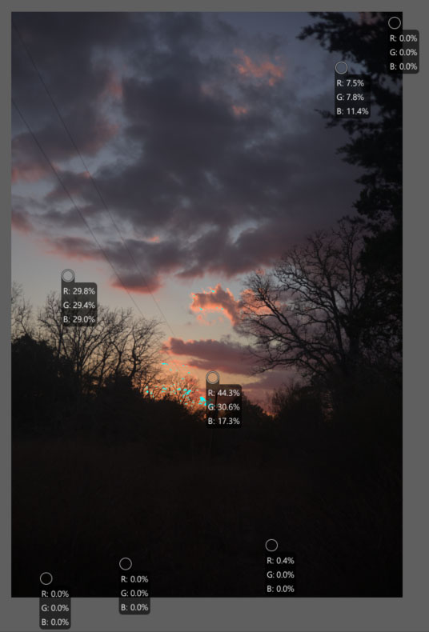
<figcaption>Image - Neutral</figcaption>
</figure>

If you examine:
+ The Raw histogram, it's not 'abnormal' except for very few values ​​outside the shadows. The blue channel is dominant.
+ The Metadata: the camera used is a recent 24x36 camera - Canon EOS R6 with a good quality 50mm f/1.8 lens, open to 2.8. ISO = 100. Shooting in 'auto' mode.
+ The data is in the 'black' part of the image: in short, there are two groups: values ​​with R=0.4%, G=0.4%, and B=0.4%, and others with R=0%, B=0%, and G=0%. In Lab mode, there are values ​​with L=0, a=1, and b=-4 (which is theoretically impossible).
+ As soon as we want to act on something, we see (of course, with the help of the histogram, the soft proofing, and of course, the examination of the image), many artifacts appear:
  - In the deep shadows, numerous 'green dots' appear.
  - The area near sunset is dotted with artifacts of several types.
  - The transition zones in the sky, between the reddish clouds and the blue, show very poor transitions.
+ It is not mentioned that the author has access to 'Dark frame' [Dark Frame](/dark-frame) or 'Flat field' [Flat field](/flat-field) which might have solved (perhaps) this problem. Nevertheless, this 'absence' is pedagogically interesting.

**Learning objective:**

The user will understand the ‘Game changer’ approach discussed in this tutorial:
+ The role of Raw Tabs tools, in particular to combat artifacts
+ The importance of Color Propagation, including in (very) deep shadows.
+ The importance of Gamut Compression.
+ White Balance optimization - Temperature correlation.
+ The role of Graduated Filter.
+ The importance and settings of Abstract Profile - with a reasoned use of primaries
+ The combined use of Selective Editing > Generalized Hyperbolic Stretch (GHS) & Michaelis-Menten (MM) and 2 Excluding Spots.
+ The use of Color Appearance & Lighting and the possible corrections of the 3 channels R, G, B.

I will present two possible processing methods using two pp3 files. I will describe the first; the reader can discover the second for themselves. The essential difference lies in the 'Color Propagation' and 'Raw Black Points' settings.

I've separated the tools as they appear in the interface, but it would be more accurate to refer to them as Raw processes. From my perspective, tools like 'Color Propagation', which is activated immediately after assigning the 'Working Profile', and 'White balance Temperature correlation', which is activated immediately after demosaicing, fall under the 'Raw' category.

Do not attempt to reduce noise, whether using in 'Capture Sharpening', 'Presharpening denoise', 'Postsharpening denoise', or 'Noise reduction' (Detail tab); you will only degrade the image. The only option, if desired, is to add an additional RT-Spot to the sky (or part of the sky) using 'Selective Editing > Blur/Grain & Denoise > Denoise'.

#### Raw tools

##### Demosaicing

+ The choice of Amaze+VNG4 allows for good detail rendering of structures and a possible reduction of artifacts in flat areas.
+ False color suppresion steps: setting it to 4 slightly reduces artifacts

##### Raw Black points

The 'Dehaze' system designed by Ingo Weirich suggests here, due to the difference between the values ​​R=0, G=0, B=0 and the very low values ​​R=0.4%, G=0.4%, B=0.4%, that it's a haze problem... I think that's not the case. We're dealing with data corruption here... just like what happens in highlights.

+ First, try the "Dehaze" checkbox; you'll see the sliders move to the right, the histogram expands, especially to the left (the shadow areas), and the image is brighter and more colorful: Red:+1, Green 1:+7, Green 2:+7, Blue:+2.
+ Second, increase the settings (by unchecking the 'Dehaze' box) : Red:+3, Green 1:+14, Green 2:+8, Blue:+5. You will again notice a more vivid image, a better utilized histogram, and a reduction in artifacts.

<figure>
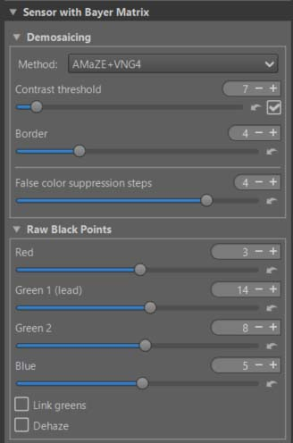
<figcaption>Demosaicing & Raw Black Points</figcaption>
</figure>

Below, you can see the influence of Raw Black Point on the image at the end of the process.
+ Note the difference on the horizontal axis, close to zero.
+ Note that the overall histogram is better filled.
<figure>
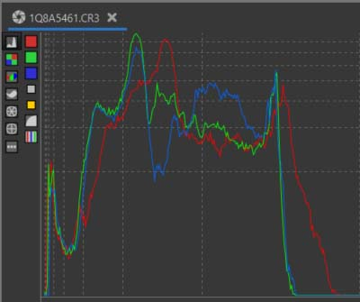
<figcaption>Histogram without Raw Black point</figcaption>
</figure>

<figure>
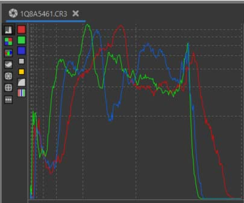
<figcaption>Histogram with Raw Black point</figcaption>
</figure>

+ Be **very careful**, these settings are very sensitive and can contribute to making the images unusable.

##### Chromatique Aberration Correction
+ We can reduce some minor artifacts caused by Chromatic Aberration by manually adjusting the red and blue channels
<figure>
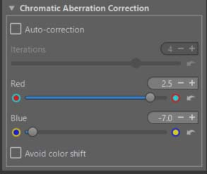
<figcaption>Chromatic Aberration Correction</figcaption>
</figure>

##### Preprocess White Balance
I chose "Camera" which seems to give a better result. During the Raw pre-processing, when nothing is determined, it's necessary to choose a temperature to quantify the data. This is either the 'Camera' value present in the Exif, or a rough calculation done with 'Automatic RGB Grey'.
<figure>
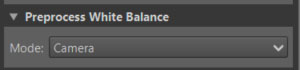
<figcaption>Preprocess WB</figcaption>
</figure>

##### Capture Sharpening

+ Activating Capture Sharpening works without any problems. The contrast threshold is not set to zero. It will recover details lost due to in-camera blurring.
<figure>
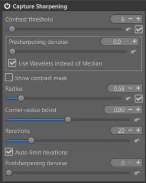
<figcaption>Capture Sharpening</figcaption>
</figure>

#### Color Propagation

+ Observing the reaction of the modules mentioned in the recommendations, the contribution of "Color Propagation" is small on the 'numbers', but not negligible. On the other hand, and this is its initial role, it allows the recovery of 'lost' data in highlight, but also in very low light.
+ If you try another tool in 'Highlight reconstruction', such as 'Inpaint opposed' you will see that it has no effect on very low lights.
+ The first example is without the 'Blur' slider in 'Color Propagation' being activated. This slider allows you to adjust the transitions between 'recovered' (and therefore lost) areas and healthy areas. This also led to a change in the 'Raw Black Points' setting.
  - [Recommandations](/tutorials/#recommendations)

#### White Balance - Temperature correlation

To fully utilize the capabilities of "White Balance Auto temperature correlation", you can activate the corresponding checkbox in Preferences > Color Management
<figure>
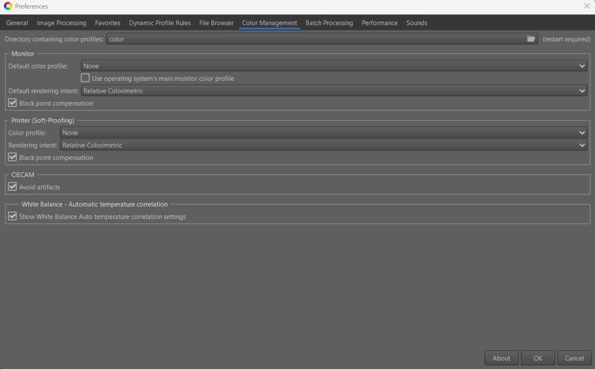
<figcaption>Preferences - Color Management</figcaption>
</figure>

+ Once this choice is made, you can select 'Close to full CIE diagram', because clearly with this sky we are beyond the reflected colors and the default selection 'Medium sampling - near Pointers's Gamut'.
+ You can also check 'Remove 2 pass algorithms' which seems to give a slightly more 'dramatic' result (but that's a matter of perspective). 
+ You could also, but it doesn't seem necessary here, use 'Green refinement' which can in some cases compensate for the algorithm's shortcomings.
<figure>
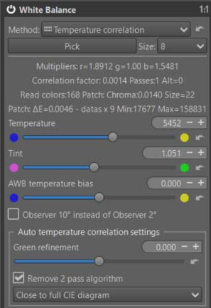
<figcaption>White Balance - Temperature correlation</figcaption>
</figure>

+ The automatic calculation always performs two passes: the first with the base results, and a second to try to get closer to D50, thus avoiding color adaptation (which can be done in "Automatic Symmetric" mode using Color Appearance & Lighting). The choice is up to the user. Among the criteria is the 'Correlation factor'; the smaller it is, the better. The other criterion is the 'Size', which is the number of colors found to be significant for comparison with the reference spectral colors (approximately 400). The larger the 'Size', the better.

#### Gamut Compression

As a reminder, this algorithm does not perform a "conversion" but compresses the data to the output profile (in linear mode, without gamma). It will ensure, at _a minima_, that the data will be within the gamut. Hence the importance of examining the histogram in mode 'gamma-corrected **output profile**'
<figure>
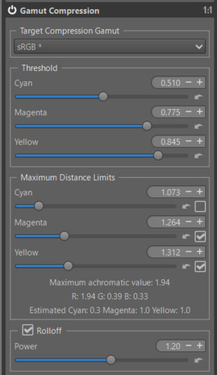
<figcaption>Gamut Compression</figcaption>
</figure>

+ I made a few small changes to the default settings, but you can try modifying all 3 'Threshold' values ​​as well as 'Rolloff & Power'.

#### Selective Editing - Five RT-Spots

##### The first - Equalization & Pre-Tone Mapping - Michaelis-Menten (MM)

<figure>
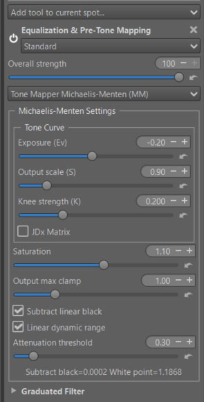
<figcaption>Michaelis-Menten Global mode</figcaption>
</figure>

+ I used this module (MM) rather than (GHS), not because it's simpler, but because, unlike GHS, it doesn't rely on an algorithm to calculate 'Linear White Point', and especially 'Linear Black point' in this case. When I designed GHS, I assumed that a reduced value of 0.001 was negligible; however, it isn't here, in this very specific image, and necessitates a manual correction (in negative) of the Black point. A smaller value, for example 0.000001, should have been used, but that would break compatibility.
+ Note the preferred use of the two 'hyperbolic' parameters - Output scale (S) and Knee strength (K). Exposure (Ev) is considered only as an adjustment.
+ Note the use of checkboxes (uncheck them all first). Start with 'Subtract linear black'; you'll see the histogram compress towards the left, even with the work done beforehand in the Raw section. Then activate 'Linear dynamic range'; the histogram will be compressed by roughly 1.18 (see the values ​​displayed below). The asymptote for highlights will be better defined, and contrast and saturation will increase.
+ The other settings - which are also important - are part of the chain of mastering gamut and artifacts.

##### The second - Equalization & Pre-Tone Mapping - Generalized Hyperbolic Stretch (GHS)

<figure>
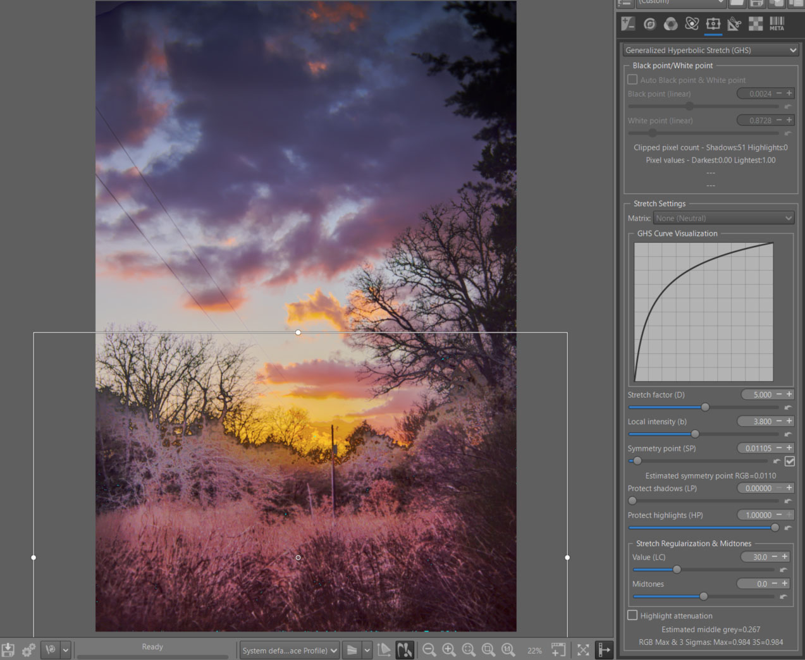
<figcaption>GHS lightens the shadows</figcaption>
</figure>

+ Choose a Normal RT-Spot 'Rectangle', with a small Scope value, so as not to interfere with the sky. Of course, DeltaE and transitions apply; the limits of the RT-spot are of little importance.
+ Due to RT issues with the Preview, set the image to 'fit to screen', and enable 'Auto Black point & White point'. Then disable it.
+ Activate 'Auto Symmetry point (SP)'.
+ Adjust 'Stretch factor (D)' and 'Local intensity (b)' to achieve the desired effect.

##### The third - Color & Light - Excluding Spot

<figure>
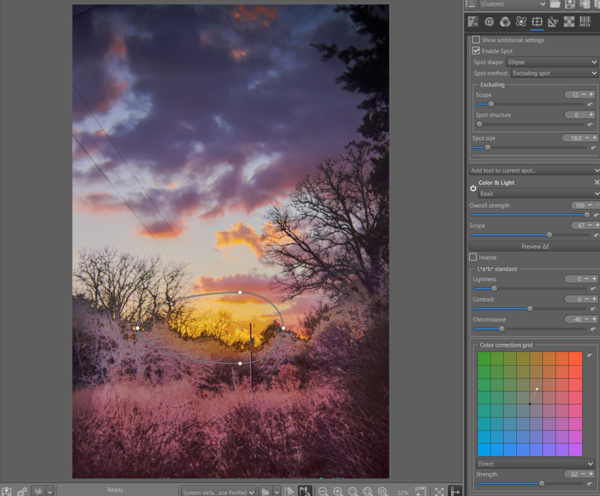
<figcaption>Excluding spot - remove artefacts - changes color</figcaption>
</figure>

+ This Spot Exclusion will undo all changes and allow you to add more. It will remove (at least partially) some of the artifacts and amplify the sky color to make it more dramatic.
+ Note the use of 'Color correction grid'

##### The fourth - to reduce artifacts

<figure>
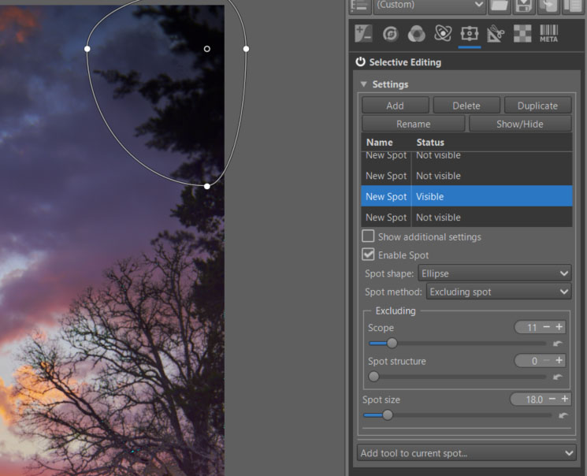
<figcaption>Excluding spot - remove artefacts</figcaption>
</figure>

##### The fifth Equalization & Pre-Tone Mapping - Standard - (GHS) increases the dramatic aspect of the sky

<figure>
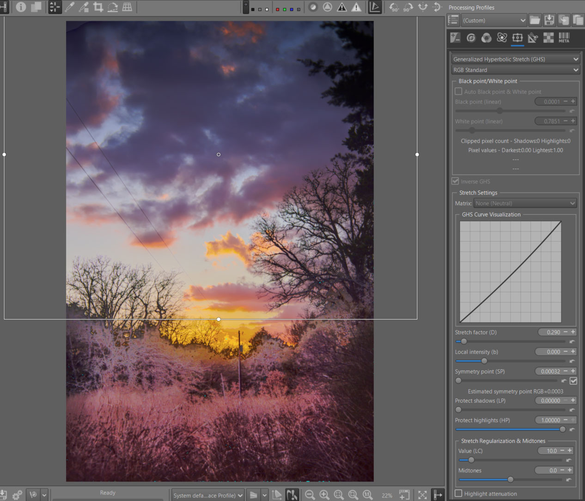
<figcaption>GHS - Inverse mode - increases the dramatic aspect of the sky</figcaption>
</figure>

+ To enhance the dramatic effect of the sky, I used GHS's 'Inverse' mode, which allows it to either reverse the image or reduce contrast and highlights. That's what was done here.
+ Note the need to switch the complexity mode to 'Standard' to have the 'Inverse' mode available.
+ Activate 'Auto Symmetry point (SP)'.
+ Adjust 'Stretch factor (D)' and 'Local intensity (b)' to achieve the desired effect.

#### Graduated Filter

<figure>
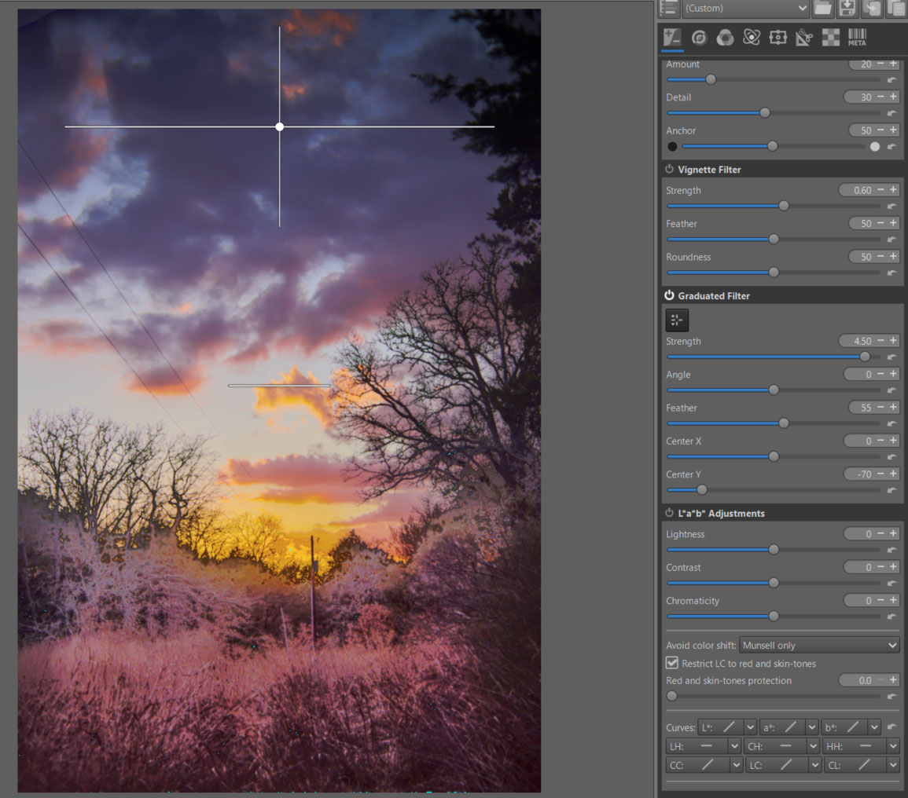
<figcaption>Graduated Filter - increases the dramatic aspect of the sky</figcaption>
</figure>

+ Nothing new here, I'm using a tool that's been around in RT for a long time. I could have used the same tool found in Selective Editing associated with each tool, but except for 'fit to screen', it's sensitive to the Preview's dimensions.
+ I positioned it to increase the contrast (more dramatic effect) between the clouds and the rest of the image.

#### Abstract Profile

I'll proceed in two steps. First, adjust the tones and check for any potential excesses in the histogram and gamut. Second, have some fun with the 'Primaries & Illuminants' module.

##### TRC Adjust the tones - Contrast Enhancement

<figure>
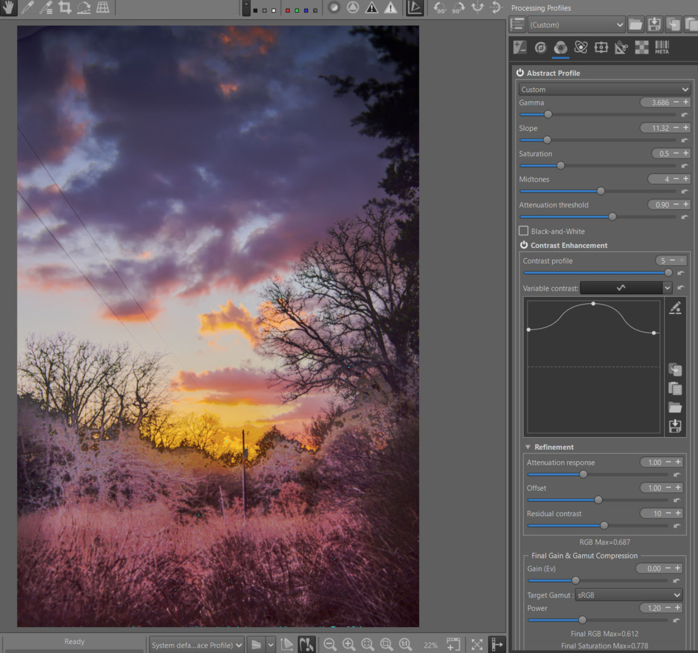
<figcaption>Abstract Profiles - TRC and Contrast Enhancement</figcaption>
</figure>

+ Note the gamma and slope settings (which is a seamless function) that connect a straight line with a slope value of 'Slope' to a parabolic curve with a 'Gamma' value. You are manipulating the balance of shadows and highlights.
+ The other settings are fairly intuitive. Note the importance of 'Attenuation threshold' which acts asymptotically on highlights.
+ For Contrast Enhancement, note the very high value of both Contrast profile (5), which leads to modifying the contrast from 2x2 pixel groups up to 1024x1024 (if the size of your Preview allows it), and the curve which is almost at its maximum. The system uses only wavelets, and only for signal processing. 'Normally' as it is designed, it should not (or very little) generate artifacts. The goal here is to make the whole image more dramatic (it is certain that for a portrait, or traditional images, the basic settings are sufficient).

###### RGB Max - informations

Provides information on out-of-limit RGB values. Values greater than 1 clearly indicate that we are out of gamut whereas for values less than 1, we cannot say whether the image is within gamut or not because it depends, for example, on the luminance. This check is performed at the end of the Abstract Profile and takes into account all parameters. The ‘Attenuation threshold’ slider can be used to limit the RGB values.

Changes made to 'Color Appearance and Lighting', 'Final Gain and Gamut Compression' are not taken into account. 

###### Final RGB Max & Final Saturation Max - informations

Provides information on out-of-limit RGB values and RGB saturation. Values greater than 1 for ‘Final RGB Max’ and ‘Final Saturation Max’ clearly indicate that we are out of gamut whereas for values less than 1, we cannot say whether the image is within gamut or not because it depends, for example, on the luminance. This check is performed at the end of the processing pipeline and takes into account all parameters. Changes made in Color Appearance & Lighting and in Final Gain & Gamut Compression are taken into account.

Adjusting the Gain (Ev) and Gamut Compression (Target Gamut and Power) settings will allow you to see the impact of these adjustments. You should also observe the histogram, which takes into account the output profile therefore the gamma. This data, which is directly related to the RGB values ​​and Saturation and is in the Working Profile, is in linear mode.

The data is only displayed if Target Gamut is enabled, or if Gain (Ev) is not equal to 0.

##### Primaries & Illuminants

The objective here is twofold:
+ Accentuate the dramatic aspect of the image by strongly increasing the colors in the reds and yellows.
+ To show that primaries can also be used in RT (this was initially one of the goals of Abstract profile, to allow color effects).
<figure>
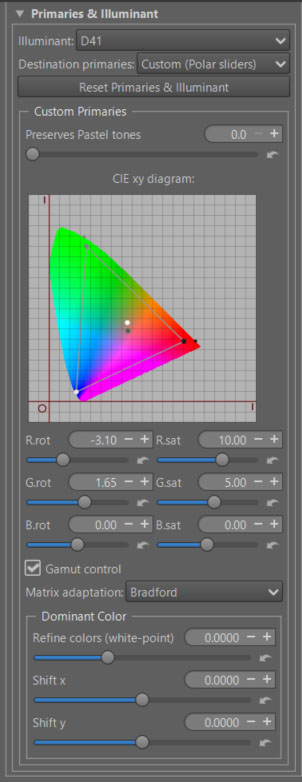
<figcaption>Abstract Profiles - Primaries & Illuminants</figcaption>
</figure>

+ Note that I used polar coordinates to make this modification of the primaries. I could have done it directly with the CIExy diagram, or in linear mode.
+ Note that if instead of increasing the saturation, I had reduced it, we would have gone outside the CIExy diagram, hence the generation of imaginary colors.
+ Note that I've changed the 'White point' of the internal ICC profile to D41. When you change it, you change the dominant color. The primary rotation is done from this 'new' White point.

#### Color Appearance & Lighting

I would like to remind you that this concept is one of the most advanced methods for color management. It is a Color Appearance Model, based on the work of researchers from around the world; its first version (in the form of an Excel spreadsheet) dates back to 1997. Its current name is CIECAM16 (published in 2020).

+ It takes into account (I'm simplifying drastically):
  - The concepts of 'scene' (source) and 'viewing' (display).
  - The separation into 3 processes, with image processing in the middle.
  - The shooting conditions (e.g., Absolute luminance), viewing conditions (the image does not look the same in a dark or bright environment...).
  - Numerous physiological aspects such as simultaneous contrast, etc.

In this tutorial, I will present it briefly in 2 parts: 
+ The main settings.
+ Those dedicated to modifying each R, G, B channel to finely retouch colors or simulate films.

##### CIECAM - main settings

<figure>
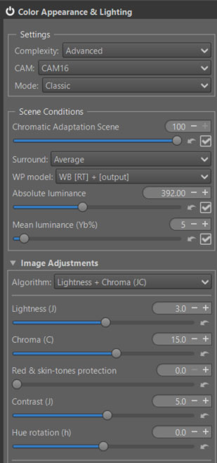
<figcaption>CIECAM Scene & Image Adjustments</figcaption>
</figure>

+ I chose not to adjust the automatic settings (Chromatic Adaptation Scene, Absolute luminance, Mean Luminance (Yb%), Surround).
+ I chose 'Lightness + Chroma' and modified the values ​​as shown in the attached image.

<figure>
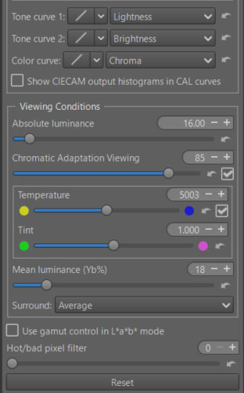
<figcaption>CIECAM Curves & Viewing Conditions</figcaption>
</figure>

+ I chose not to adjust the automatic settings (Chromatic Adaptation Viewing, Absolute luminance, Mean Luminance (Yb%), Surround). But this is where you can (must) adapt the image you see to the Viewing conditions (yours).
+ Just try changing 'Surround' from 'Average' to 'Dim'

##### CIECAM - Red Green Blue

+  You can modify each R, G, B channel to finely retouch colors or simulate films:
  - Rotate each color by degrees.
  - Change the saturation (s) in the sense of a CAM (Color Appearance Model).
  - Change the brightness (Q) with a curve that allows you to adapt the contrast and brightness to each situation.

+ As a reminder, in CIECAM there are a total of 9 variables, 6 of which are accessible to the user in RT: Lightness (J), Brightness (Q), Saturation (s), Chroma (C), Colorlness (M), and Hue rotation (h). They are interdependent. For example Chroma = saturation * saturation * brightness.

<figure>
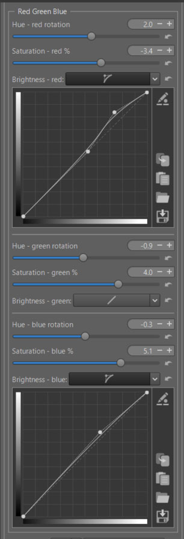
<figcaption>CIECAM Red Green Blue</figcaption>
</figure>

+ For this challenging image, I made a point of moderating the settings to avoid artifacts.

#### Appearance of the result at the end of treatment

+ Of course, nothing is perfect, and there remain small artifacts only visible during softproofing.
+ I wanted to make the image as dramatic as possible, perhaps even going too far. But let's remember the objectives; this is first and foremost an educational approach.

<figure>
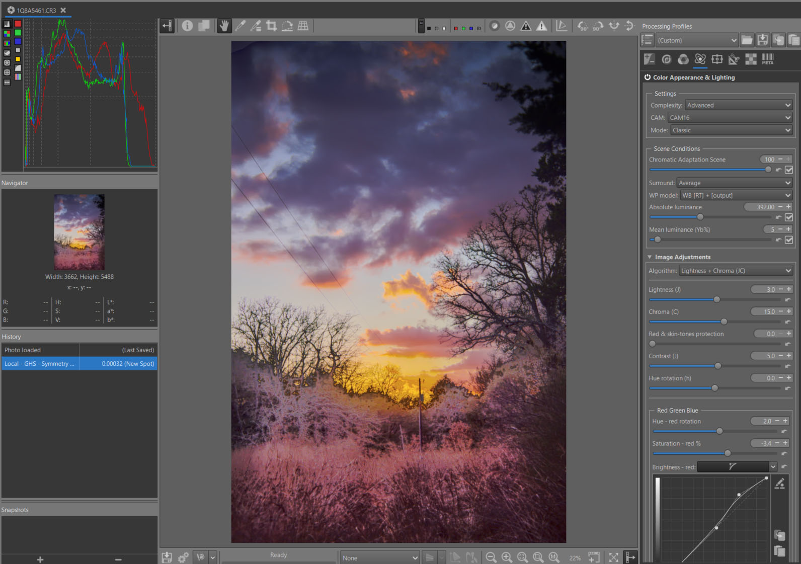
<figcaption>Game Changer - Final Image</figcaption>
</figure>

### Game Changer - How to Process a Sunset

This first tutorial aims to explain the concept of a ‘Game changer’ here applied to a sunset.

In this tutorial, we will see how to use:
+ Generalized Hyperbolic Stretch (GHS) in 2 modes: RGB Standard & RGB Luminance.
+ Michaelis-Menten (MM).
+ Abstract Profile (AP).
+ Color Appearance & Lighting.

Of course, other tools are necessary, such as 'Gamut Compression', 'White Balance Auto - Temperature Correlation' (See the first tutorial for more details: of course the settings are different).

[Gamut Compression](/tutorials/#gamut-compression)

[Auto White Balance - Temperature Correlation](/tutorials/#white-balance---temperature-correlation)

Image selection:
Image n°5 IMGP2426.DNG from the Rawtherapee Processing Challenge feedback (begin 2024)

[Raw Image](https://drive.google.com/file/d/17R3iBq08s71DuDRiv9T6TzlJVsxqBISo/view)

Raw file (Creative Commons Attribution-NonCommercial-ShareAlike 4.0 International License)

This image seems innocuous at first glance, a typical sunset. The image is generally underexposed, and the sun doesn’t appear overexposed.

- pp3 file 1: [First example with Generalized Hyperbolic Strech - RGB Luminance](i2426-ghs-lum.pp3 "i2426-ghs-lum.pp3")
- pp3 file 2: [Second example with Generalized Hyperbolic Strech - RGB Standard](i2426-ghs-std.pp3 "i2426-ghs-std.pp3")
- pp3 file 3: [Third example with Michaelis-Menten](i2426-mm.pp3 "i2426-mm.pp3")

 [Some principles](/tutorials/#in-summary-some-principles)

 [Recommandations](/tutorials/#recommendations)

 [Specific tools used](/tutorials/#specific-tools-used)

**Learning objective**

The user will understand the ‘Game changer’ approach discussed in this tutorial:
+ The role of ‘GHS’ or 'MM' in the linear portion of the data, which can be considered a ‘Pre-tone-mapper’
+ The role of ‘Abstract Profile’, which prepares the data for use in the output (screen, TIFF/JPG).
+ Minimize the use of other tools, aside from those essential for the proper functioning of RawTherapee, GHS, MM, and AP, and reduce back-and-forth navigation within the GUI.
+ Highlight the tools to avoid and those that can be beneficial.
+ The settings (sliders, checkboxes, etc.) are provided for illustrative purposes. They are not intended to provide perfect settings, but rather to show the way forward.

#### First step: GHS - MM  and necessary adjustments

+ Deactivate everything, switch to ‘Neutral’ mode
+ Activate ‘Capture Sharpening’ (Raw Tab): check that ‘Contrast threshold’ displays a value other than zero. Otherwise, it means it is not operational (noisy image). Resolving this potential problem related to noisy images will be covered in a later tutorial.
+ The image was taken outdoors at sunset, therefore with a daylight illuminant, so there is no problem setting the white balance (Color Tab) to ‘Automatic & refinement > Temperature correlation’.
+ In the Exposure Tab, disable ‘Clip out-of-gamut colors’, enable ‘Highlight reconstruction’, and zoom the image to 100% while examining the sun. Try ‘Inpaint Opposed’, ‘Blend’, and ‘Color Propagation’. For each case, re-enable ‘Clip out-of-gamut colors’ and observe the differences. The image without artifacts (I think?) is with ‘Color Propagation’ and ‘Clip out-of-gamut colors’ disabled. Try ‘Blur’ (Color Propagation) to see if artifacts at transitions appear or disappear. ‘Blur’ is finally set to 0.

#### Using Generalized Hyperbolic Stretch (GHS)

##### Preamble

I won’t compare it to other tone mappers in RawTherapee or other software, using tables or a pros/cons list. That would be tedious and probably not very interesting from a user’s perspective. I will simply (given the lack of documentation) draw your attention to the specific points that are crucial:

+ Setting the ‘White point (linear)’ (WP)  and ‘Black point (linear)’ (BP) is THE first fundamental aspect of its operation. It is done entirely in linear mode (unlike Black Ev and White Ev). It is dynamic, meaning that each new session (for example, when creating a second RT Spot) recalculates and triggers the GHS algorithm. Consequently, the values ​​are always accurate (at least in theory). Preferably, use the ‘Auto Black point & White point’ checkbox (except in Inverse mode). This setting is only accessible if ‘Stretch factor (D)’ is between 0.001 and 0.002. These very low values ​​will have little effect on the image, but they allow adjustments to ‘White Point (linear)’ and ‘Black Point (linear)’ and enable the GHS algorithm to function.
+ To understand how this works in the simplest way possible, let’s assume that the base data, before the calculation and implementation of ‘BP’ and ‘WP’, is in the range [0, 1] (this is rarely the case)… If the ‘auto’ setting for ‘BP’ is 0.05 and ‘WP’ is 3.05. This means that if we do nothing, the actual data after the ‘Color Propagation’ action would be 0.05 for the BP (resulting in a loss of contrast due to an excessively high black point) and a WP of 3.05, which will be incompatible (or very poorly handled) by the majority of Rawtherapee’s algorithms, which are not at all designed to work with huge values, often resulting in data clipping, color drift, etc. The RGB data will be transformed by dividing the actual values ​​by a factor equal to the difference between ‘WP’ and ‘BP’, which here is 3.05 - 0.05, therefore 3. This means that the data we saw in the ‘Preview’ which was in the range [0, 1] becomes [0, 0.33]. The image becomes extremely dark, but the sun enters the gamut with a value of 1.
+ The second factor to consider, and one that caused me a lot of problems, is determining the ‘Symmetry Point (SP)’ value. Theoretically, this is the peak of the luminance in the histogram in linear mode. In astrophotography software, the user clicks on an area that seems most promising. This seems quite obvious: the brightest nebulae located near stars. The ‘SP’ is then adjusted to the value found. In the case of general-purpose images, I challenge anyone to find the area where the histogram (luminance portion) has its maximum in both Working Profile and Linear modes. This ‘SP’ is THE second key point that determines how the algorithm works. It has little to no relation to mid-grey. GHS’s complex calculations use a variety of complex hyperbolic functions, depending on the values ​​of ‘SP’, ‘Stretch factor (D)’, and especially ‘Local Intensity (b)’. These functions provide an asymptote to the luminance for highlights and adjust the amplitude range (increasing or decreasing) of the data within the interval [0-1] to make the image acceptable. By default, leave the ‘Symmetry point (SP)’ slider checkbox set to Automatic.
+ Of course, I suggest you try modifying these ‘auto’ settings and changing ‘Color Propagation’ to something else. Uncheck the ‘auto’ boxes, set ‘Stretch factor (D)’ to 0.001 (default), change ‘SP’, and change ‘WP’ and ‘BP’. … Just to see the effects and potentially find better settings.
+ The ‘GHS Curve Visualization’ has very little relation to a ‘Tone curve’, it only reflects the action of hyperbolic functions and not the direct action on tones.

##### Adjusting ‘Stretch factor (D)’ and ‘Local Intensity (b)’

‘Stretch factor (D)’ will stretch (and compress) the image data according to the areas. It is a logarithmic function (but has absolutely no relation to Filmic or Log encoding). You will notice that there are only positive values ​​– we are working in ‘positive space’. If you want to use the equivalent of negative values ​​(which is impossible with a Log function), you must switch to ‘Inverse GHS’ mode, which activates ‘negative space’ mode. We will see this later.
’Local intensity (b)’ will localize the effect of Stretch. Depending on its value, hyperbolic functions of very different natures will modify the data (the only point in common with Sigmoid is the term hyperbolic). 

##### The advantage of doing multiple stretches

Rather than attempting a single stretch, in the case of images with a high WP (3 to 5), which will require a high 'Stretch factor (D)', or where the user will have difficulty locating the area where action should be prioritized, it is better to perform two stretches. The first, with moderate values, will place the data in the interval [0-1], while the second will allow for better localization of the action.

+ Note that GHS settings can cause data (depending on the GHS settings) to fall outside the [0, 1] range, both in linear and output data. Constantly monitor the histogram in both modes (working profile - linear and output profile - gamma) and make any necessary corrections. In reality, to give the GHS algorithm some leeway, I added 0.1 to the calculations. This means that if you open a second RT-Spot, you'll see the WP value as 1.1, not 1.
+ In ‘Stretch Regularization & Midtones’, you can set the value (LC) – the local contrast – to zero to avoid artifacts in the sun area. Local contrast can be addressed later in Abstract Profile.
+ To see the effects, instead of a single ‘Stretch factor (D)’ with high values, you can try constructing the stretch using two RT-spots. The first with lower (D) and (b) values. The second with values ​​adjusted to your preference. You’ll see that for this second RT-spot, the values ​​of (BP) will be close to zero, and those of (WP) very close to 1.0 (minor adjustments are possible). The image will be different, the sun less prominent.

###### First Spot - GHS

<figure>
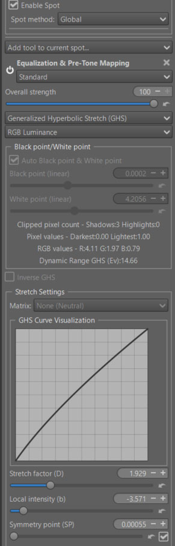
<figcaption>GHS - first spot - Low Strech factor</figcaption>
</figure>

###### Second Spot - GHS

<figure>
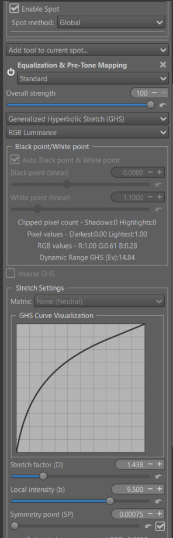
<figcaption>GHS - second spot</figcaption>
</figure>

##### Inverse GHS

This function, not available in Selective Editing’s ‘Basic’ complexity mode, allows you to undo previous actions on all (somewhat oddly) or part of the image. It works similarly to ‘negative space’.

The selection of the ‘WP’ and ‘BP’ is manual… Move closer to [0, 1] if it isn’t already.
In the case of the processed image, I created a second RT-spot in normal mode, in the form of a rectangle. Its purpose is to reduce the effect in the sky area without significantly affecting the sun. It resembles (somewhat) a Graduated Filter. The center was placed on a cloud, with the Scope set to 25. The center of the spot is positioned relatively far in the image. Of course, you can change the position of the RT-spot, Scope, and Transition in Selective Editing > Settings.

Sliders like ‘Stretch factor (D)’ work in reverse. They reduce contrast, darkening the image.

<figure>
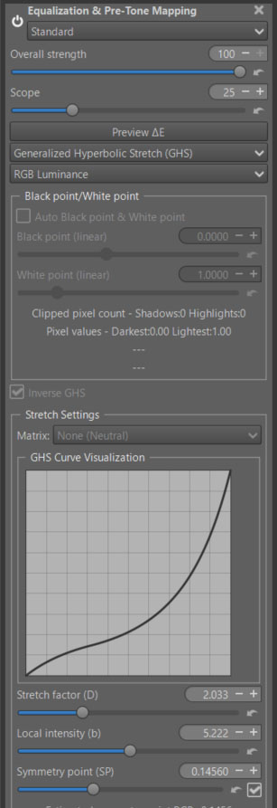
<figcaption>GHS - Inverse</figcaption>
</figure>

##### Six methods available - two recommended

Six methods available (RGB Luminance, RGB Standard, Lightness & chromaticity (Lab), Luminance (HSL), Saturation (HSL), Hue (HSL)). Two are recommanded:

+ RGB Luminance : the three channels R, G, B are used equally. To control the system, an equivalent luminance is calculated, attempting to take into account WP values ​​above 1.
+ RGB Standard (default) : the three channels R, G, B are used equally.

They will differ in how they render very high highlights, which are out of gamut. The choice between the two depends on the images and your preference.
An example in RGB Luminance mode for the first RT-spot

##### LMS Matrix conversion

Performs the entire GHS processing, including Matrix conversion either AgX or JzAzBz or Cat16. For JzAzBz and Cat16 you have the choice between a transformation in RGB mode or in XYZ mode (preferably).

* To allow this matrix to be enabled or disabled, the 'Stretch factor (D)' must be between 0.001 and 0.002 and 'Auto Black point & White point' disabled.
* You need to re-enable 'Auto Black point & White point' to recalculate the values ​​of 'BP', 'WP' and 'Symmetry point (SP)'.

#### Using Michaelis-Menten (MM)

This algorithm is much simpler than GHS. It often provides almost the correct settings on the first try. However, it cannot operate in 'Inverse' mode. Like GHS, it requires adjustments to the 'Black points (linear)' and 'White points (linear)'. 

For the sake of simplicity, it is only offered in RGB Standard mode, i.e. the 3 channels Red, Green, Blue used in the same way.

##### MM Settings

This tone mapper uses the Michaelis-Menten equation, which is borrowed from biochemistry to describe enzyme kinetics. In image processing, it creates a smooth, saturating curve that is useful for tone mapping.

* Exposure: Adjusts the input image brightness.
* Output scale (S): Controls the maximum asymptotic value of the curve; essentially the output white level.
* Knee strength (K): Determines the “knee” of the curve. Lower values result in a sharper transition to the compressed highlight region.
* Saturation: Adjusts color saturation post-tone mapping.
* Output max clamp: Sets the final clipping point for the output values.
* JDx Matrix : the JDx checkbox allows the user to choose either the default or the JDx LMS transformations. LMS is a color space transform which represents the response (sensitivity) of the three types of cone cell in the human eye at long, medium, and short wavelengths.These transformations are matrices that modify each of the R G B channels for each individual pixel, giving priority to certain dominant colors depending on the selected option
  - Unchecked: leaves the data unchanged (default).
  - JDx: accentuates each of the R G B channels by acting on X Y Z such that the LMS data is perceived as being more colorful.

The two settings to prioritize are Output scale (S) and Knee strength (K) ; these are the ones that directly affect the hyperbolic function.

##### MM - Subtract linear black & Linear dynamic range - Attenuation threshold

As in GHS, these two settings, which I wanted to be simpler, are essential for the proper functioning of the algorithm.

+ Subtract linear black: reduces the linear black point values ​​to almost zero. This makes optimal use of the available data by increasing overall contrast and reducing haze effects.
+ Linear dynamic range: allows you to include any data outside the color gamut (in the case of sunsets for example). Enabling ‘Highlight reconstruction’ > Color Propagation can provide a significant improvement.

In addition:
+ Attenuation threshold: uses an exponential function to reduce highlights likely to cause gamut overshoot.

<figure>
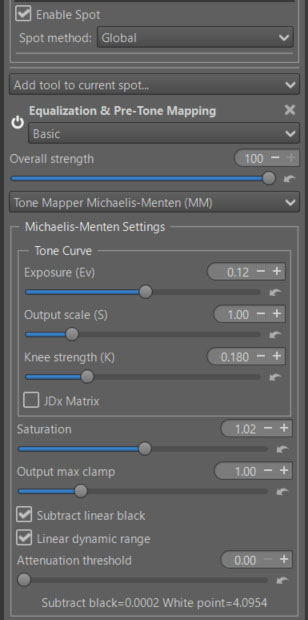
<figcaption>First Spot : Michaelis-Menten - Settings</figcaption>
</figure>

##### MM - Darken the clouds - inverse GHS

<figure>
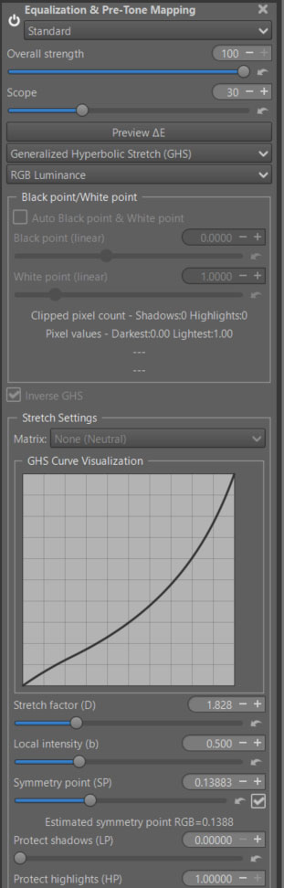
<figcaption>Second Spot : Inverse GHS</figcaption>
</figure>

#### A preview at the end of Game Changer

To give the user a glimpse of the possibilities of each of these 'pre-tone mappers', here is the result at the end of the Game Changer process. We will then see how to process Abstract Profile and Color Appearance & Lighting.

##### Sunset GHS - RGB Luminance

<figure>
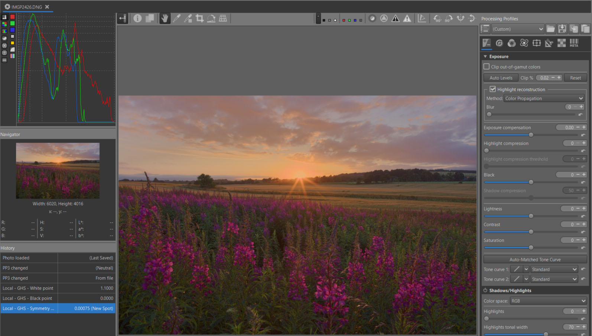
<figcaption>Sunset GHS RGB Luminance</figcaption>
</figure>

##### Sunset GHS - RGB Standard

<figure>
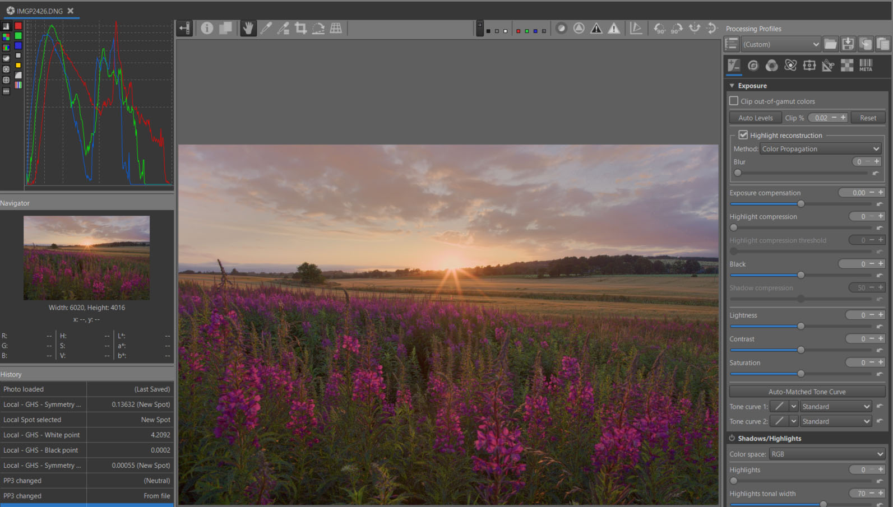
<figcaption>Sunset GHS RGB Standard</figcaption>
</figure>

##### Sunset MM

<figure>
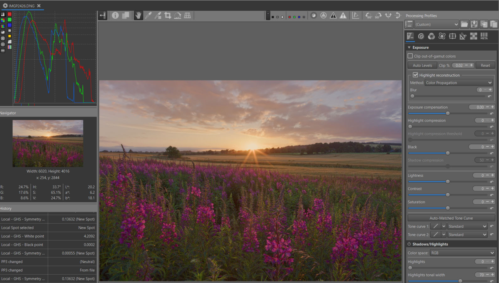
<figcaption>Sunset MM</figcaption>
</figure>

#### Abstract Profile – A Possible Approach to Preparing Output

+ I won’t go over this somewhat unconventional concept again, which was presented four years ago.
+ However, some improvements have been made recently:
  - A ‘Saturation’ slider has been added, allowing compensation for saturation loss, particularly related to high Slope values.
  - An ‘Attenuation Threshold’ slider allows for better control of highlights using an exponential function.
  - Contrast Enhancement is a simplified way for users to utilize wavelets to improve local contrast. Readers interested in more advanced aspects can follow this link: [AP](/tutorials/#specific-tools-used) and go to the 3 links in 'Contrast Enhancement'.

##### Let’s return to our image.

The image obtained after GHS or MM is perfectly acceptable. I could have added a series of add-ons to GHS/MM to avoid using another module, such as ‘Contrast Enhancement’ or ‘Gamma & Slope’, but that would have complicated the tool.

###### Abstract Profile

+ I modified ‘Gamma’, ‘Slope’, and ‘Attenuation Threshold’ to create a more balanced image.
+ I activated ‘Contrast Enhancement’ with a value of 3 and slightly increased ‘Residual Contrast’.
+ But, primarily and mainly for educational purposes, I used the ‘Dominant Color’ function (is not included in pp3)

###### Dominant Color

This function, also available in ‘Selective Editing > Color Appearance (CAM16)’, allows you to correct or introduce a dominant color. Without modifying the primaries, which is possible in graphic mode, choose ‘Destination primaries > Custom (CIExy Diagram)’.

In this mode, ‘Dominant Color’ displays the calculated position of the dominant color in gray. The position of the white point (the default illuminant D65 in Rec2020) is shown in white. You can move the dominant color using ‘Shift x’ and ‘Shift y’.

Moving the Refine Colors slider (Illuminant white point) will increase or decrease the purity and saturation of the selected color. Of course, you can also change the illuminant; try different values.

I ‘forgot’ one thing. After ‘Abstract profile’, it is possible (even recommended) to implement ‘CIECAM’ (Color Appearance & Lighting) whether for chromatic adaptation or to adapt the output to viewing conditions (darkness, surround, etc.).

<figure>
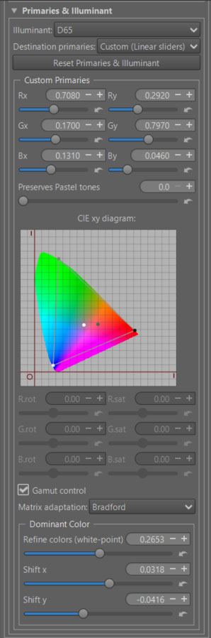
<figcaption>Abstract Profile - Dominant Color</figcaption>
</figure>

#### Color Appearance & Lighting

We use the same principles as in the first tutorial, but the settings are different. Here, the goal isn't to create a dramatic effect, but to amplify the sunburst.
[CIECAM - Best shadows & highlights technics](/tutorials/#color-appearance--lighting)

##### CIECAM - Main settings (GHS & MM)

<figure>
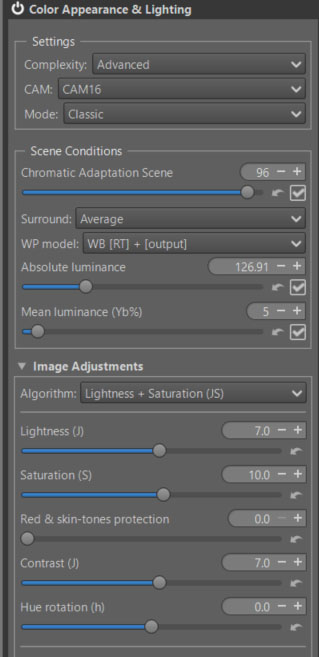
<figcaption>CIECAM Curves & Viewing Conditions</figcaption>
</figure>

Here, I used 'Lightness + Saturation (s)' which has a differentiated action on shadows.

<figure>

<figcaption>CIECAM Curves & Viewing Conditions</figcaption>
</figure>

+ I chose not to adjust the automatic settings (Chromatic Adaptation Viewing, Absolute luminance, Mean Luminance (Yb%), Surround). But this is where you can (must) adapt the image you see to the Viewing conditions (yours).

##### CIECAM - Red Green Blue (GHS & MM)

+  You can modify each R, G, B channel to finely retouch colors or simulate films:
    - Rotate each color by degrees.
    - Change the saturation (s) in the sense of a CAM (Color Appearance Model).
    - Change the brightness (Q) with a curve that allows you to adapt the contrast and brightness to each situation.

+ As a reminder, in CIECAM there are a total of 9 variables, 6 of which are accessible to the user in RT: Lightness (J), Brightness (Q), Saturation (s), Chroma (C), Colorfullness (M), and Hue rotation (h). They are interdependent. For example Chroma = saturation * saturation * brightness.

<figure>
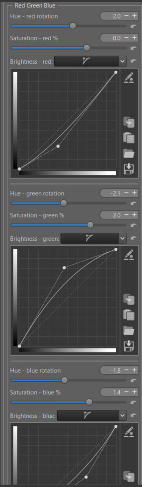
<figcaption>CIECAM Red Green Blue</figcaption>
</figure>

### Game changer using LED’s image

This third tutorial aims to explain the concept of a ‘Game changer’, with an example using an image of a show with LED lighting and visible spotlights.

In this tutorial, we will see how to use ‘Capture Sharpening’ , ‘Gamut compression’, ‘Selective Editing > Generalized Hyperbolic Stretch’ (GHS) and Michaelis-Menten (MM), ‘Abstract Profile’ (AP), Color Appearance & Lighting . Of course, other tools are necessary, which we will cover later.

Image selection:

Raw file : (Creative Common Attribution-share Alike 4.0)

[Raw File](https://drive.google.com/file/d/1plzKzl789w4DdP_Iyklc87Dw6hPTsKg7/view)

- pp3 file 3: [Led pp3](at001219-ghs-mm.pp3 "at001219-ghs-mm.pp3")

This image is very difficult to grasp, especially if you haven’t seen the show. What colors does the viewer perceive, and how can they be reproduced? Since I don’t know them, what follows is only a series of hypotheses. This process must be seen as a path, not a solution.

Compared to the tutorial presented in November 2025, the changes are significant, including:
+ the abandonment of the use of primaries in favor of 'Red Green Blue' in 'Color Appearance & Lighting'.
+ improved gamut integration.

[Pixls.us LED's](https://discuss.pixls.us/t/game-changer-using-led-s-image-gamut-compresion-ghs-abstract-profiles-primaries/54245)

 [Some principles](/tutorials/#in-summary-some-principles)

 [Recommandations](/tutorials/#recommendations)

 [Specific tools used](/tutorials/#specific-tools-used)

**Learning objective**
+ The role of GHS & MM, in the linear portion of the data, which can be considered a ‘Pre-tone-mapper’.
+ The importance of Highlight reconstruction > Color Propagation.
+ The role of Abstract Profile, which prepares the data for use in the output (screen, TIFF/JPG).
+ The role of Capture Sharpening to reduce noise in the flat areas of the image, and of course sharpening.
+ The importance of Selective Editing > Capture deconvolution to recover the sharpening partially lost by Postsharpening denoise (Capture Sharpening).
+ The role of Gamut Compression at the beginning and at the end of the process.

**Teaching approach**
The issue of out-of-gamut or anecdotal colors, due, for example, to LEDs:

To provide some background and help you understand, I’ve included two links (which I already shared during the Gamut Compression presentation in September 2024 ).

[Gamut compress](https://github.com/jedypod/gamut-compress)

[Documentation ACES](https://docs.acescentral.com/rgc/specification/)

Generally speaking, apart from very specific cases, such as the image in this tutorial, the goal of ‘Gamut compression’ is to fit colors into the gamut (for example, the screen’s gamut), while preserving the original working profile for basic processing.

We use the principle of ‘Pointer’s gamut,’ which, within the set of colors perceived by humans (CIExy diagram), corresponds to reflected colors. This includes all cases where there is no light source in the image (sun, incandescent, LED, etc.), which is still the majority of cases.

We had a debate during the development of the code and the Pull Request. Should we provide base values ​​for each working profile (Rec2020 by default, but some choose Prophoto, Adobe RGB, etc.) and the target compression gamut? What are the default values ​​(which need adjusting) for ‘Threshold’ and ‘Maximum Distance Limit’? Given the complexity and uncertainties (especially when light sources are present in the image, or artificial colors are used), we chose to leave the default settings, which are set for Aces AP0 and Aces AP1.

After numerous tests, I've chosen to offer average acceptable values ​​for images with significant or very significant out-of-gamut effects (sunset, LEDs, etc.). For 'Target Compression Gamut' images marked with an asterisk (*), you have pre-calculated values ​​for 'Maximum Distance Limits' and 'Threshold'. These are approximate values. You'll need to fine-tune these presets.

**The image in neutral mode - out-of-gamut areas**
<figure>
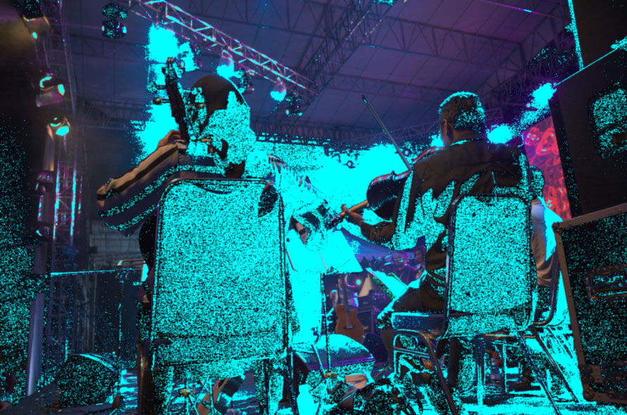
<figcaption>Neutral Out-of-gamut</figcaption>
</figure>

The image speaks for itself; not only are the colors unnatural (strong Magenta dominance), but even in 'neutral' mode, we are already out of gamut for half of the image.

#### First step: Neutral & Capture Sharpening

+ Disable everything, switch to ‘Neutral’ mode.
+ In the ‘White Balance’ (Color Tab), leave it on ‘Camera’ in the face of ignorance.
+ Enable ‘Capture Sharpening’ (Raw tab).
+ Verify that ‘Contrast Threshold’ displays a value other than zero.
+ At 100% or 200%, you will see noise appear in the background.
+ Enable ‘Show contrast mask’, which is also insensitive to the Preview position. The noise on the black background becomes visible.

##### Remove noise on flat areas

Disable the mask.

View the image at 100% or 200%, then adjust the ‘Postsharpening denoise’ setting, which will take the mask information into account to process the noise. Adjust this denoising to your liking. This action will already have an effect on out-of-gamut.
<figure>
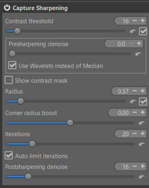
<figcaption>Capture Sharpening</figcaption>
</figure>

#### Second step: Gamut Compression

This step is necessary even with less-than-ideal settings to intervene before GHS & MM and show you the impact of the settings. You will see, by enabling or disabling Gamut compression, the minimal impact on the maximum Linear White Point (in GHS or in MM).

This is one of the key points for:
+ make the colors more natural.
+ compress them within the output profile gamut.

I set it to sRGB*. Note that ‘gamut compression’ doesn’t take into account the gamma of the output profile.
+ Note the very high value of 'Maximum achromatic value', close to 12. That is 12 times the maximum 'normal' value. The chromatic values ​​– those represented in the CIExy daigram – may be 'normal', but the Y component of xyY is enormous.
+ Disable "Color Propagation" and you'll see this value become 'reasonable' (around 4), yet still high. But what's important is to 'retrieve' as much data as possible.
+ Another possible reason is that there are bright spots in the image. We are no longer in 'Pointer's Gamut'.
<figure>
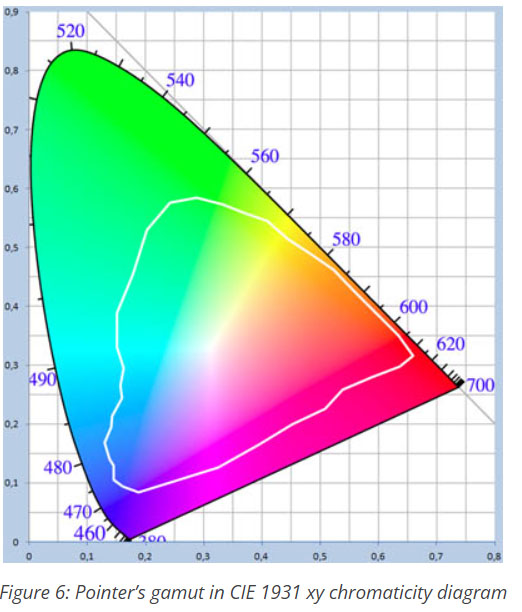
<figcaption>Pointer's Gamut</figcaption>
</figure>

+ The main reason is related to the illuminant, which here is very far from daylight, as one might assume (I don't have the one in the image).There is a 'huge' gap in the spectral distribution which results in color drifts, or even imaginary colors.

<figure>
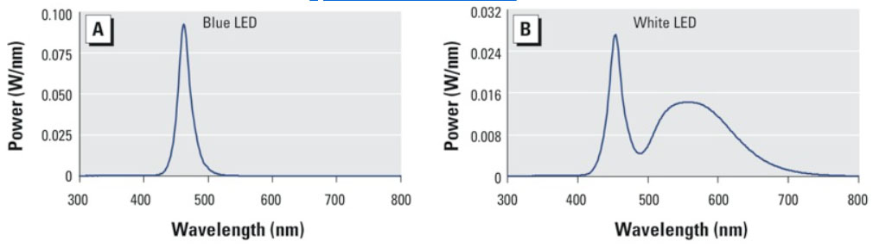
<figcaption>LED's illuminants</figcaption>
</figure>

[Common illuminants](/color_management_addon/#white-balance-gaps)

<figure>
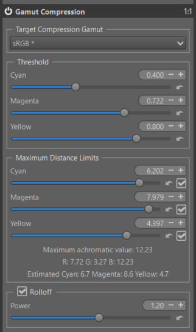
<figcaption>Gamut Compression - LED</figcaption>
</figure>

I made gradual adjustments starting from the basic settings, leading to the results shown above. I'm not sure if this is optimal.

#### Third step: Generalized Hyperbolic Stretch - GHS & Michaelis-Menten - MM

I chose to perform the 'pre-tone mapping' in 2 steps:
+ The first with GHS, to bring the huge value of the data (linear White point around 11), into the interval [0 1]
+ The second wit MM, to better balance the image.

GHS:
<figure>
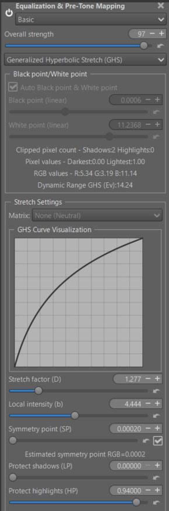
<figcaption>Generalized Hyperbolic Stretch</figcaption>
</figure>

+ Note the relatively low values for Stretch factor (D).
+ Note the 'Overall strength = 97', to try and reduce some out-of-gamut issues.

MM:
<figure>
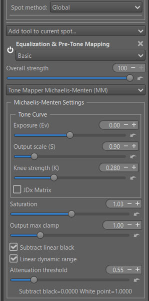
<figcaption>Michaelis-Menten</figcaption>
</figure>

+ Note the 2 values : Ouput scale (S) & Knee strength (K).
+ Note also 'Subtract linear black' and 'Linear dynamic range' enabled.
+ Note : attenuation threshold (b): better histogram, less out-of-gamut data.

#### Restore some sharpness to the image

+ Postsharpening denoise in Capture Sharpening, despite precautions, slightly reduced the sharpness provided by Capture Sharpening.
+ Capture deconvolution : this algorithm, which is the same as Capture Sharpening but not limited to Raw, allows you to restore some of the lost sharpness to the image. A new RT-Spot is used in Global mode (note that it is sensitive to the preview size – prefer 'fit to screen').
+ Note that this tool does not completely replace other 'Sharpening' tools, but in some cases complements 'Capture sharpening' or replaces it in the case of non-raw images.

<figure>
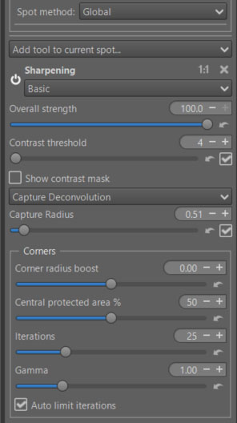
<figcaption>Capture Deconvolution</figcaption>
</figure>

#### Abstract Profile

Here, I'm not using primaries, nor am I touching the illuminants. We're staying within the settings to adjust the tones, and 'Contrast enhancement'.
+ I won’t go over this somewhat unconventional concept again, which was presented four years ago.
+ However, some improvements have been made recently:
  - A ‘Saturation’ slider has been added, allowing compensation for saturation loss, particularly related to high Slope values.
  - An ‘Attenuation Threshold’ slider allows for better control of highlights using an exponential function.
  - Contrast Enhancement is a simplified way for users to utilize wavelets to improve local contrast. Readers interested in more advanced aspects can follow this link: [AP](/tutorials/#specific-tools-used) and go to the 3 links in 'Contrast Enhancement'.

<figure>
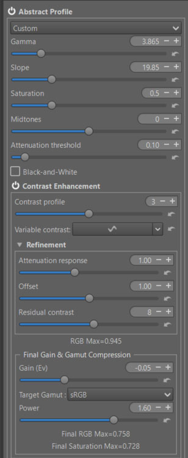
<figcaption>Abstract profile - without Primaries</figcaption>
</figure>

+ Note: RGB max = 0.945,  which corresponds to the maximum RGB values ​​before the final 'Color Appearance & Lighting' step.
+ Note: Final RGB Max = 0.758 and Final Saturation Max = 0.728 which corresponds to the maximum RGB and Saturation values ​​after the final 'Color Appearance & Lighting' step.
+ Note : the second gamut compression, with 'Power = 1.6'.

#### Color Appearance & Lighting

Beyond CIECAM's ability to account for shooting conditions, viewing conditions, and physiological effects, it is used here for a similar purpose to primaries: to make colors appear more natural (this is quite subjective), and to maximize contrast and saturation without exceeding the color gamut.

##### Red Green Blue

+  You can modify each R, G, B channel to finely retouch colors or simulate films:
    - Rotate each color by degrees.
    - Change the saturation (s) in the sense of a CAM (Color Appearance Model).
    - Change the brightness (Q) with a curve that allows you to adapt the contrast and brightness to each situation.

+ As a reminder, in CIECAM there are a total of 9 variables, 6 of which are accessible to the user in RT: Lightness (J), Brightness (Q), Saturation (s), Chroma (C), Colorfullness (M), and Hue rotation (h). They are interdependent. For example Chroma = saturation * saturation * brightness.

<figure>
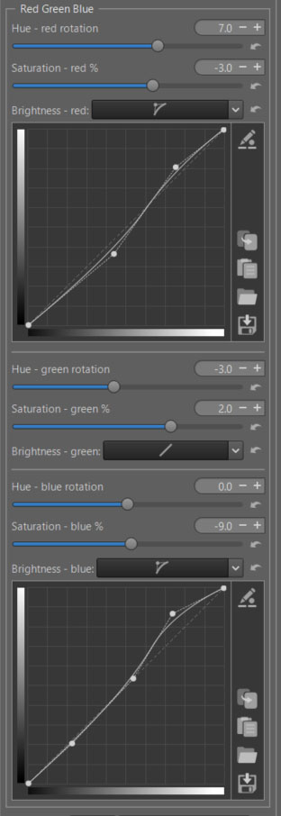
<figcaption>Red Green Blue - LED</figcaption>
</figure>

####  Image at the end of Game Changer

<figure>
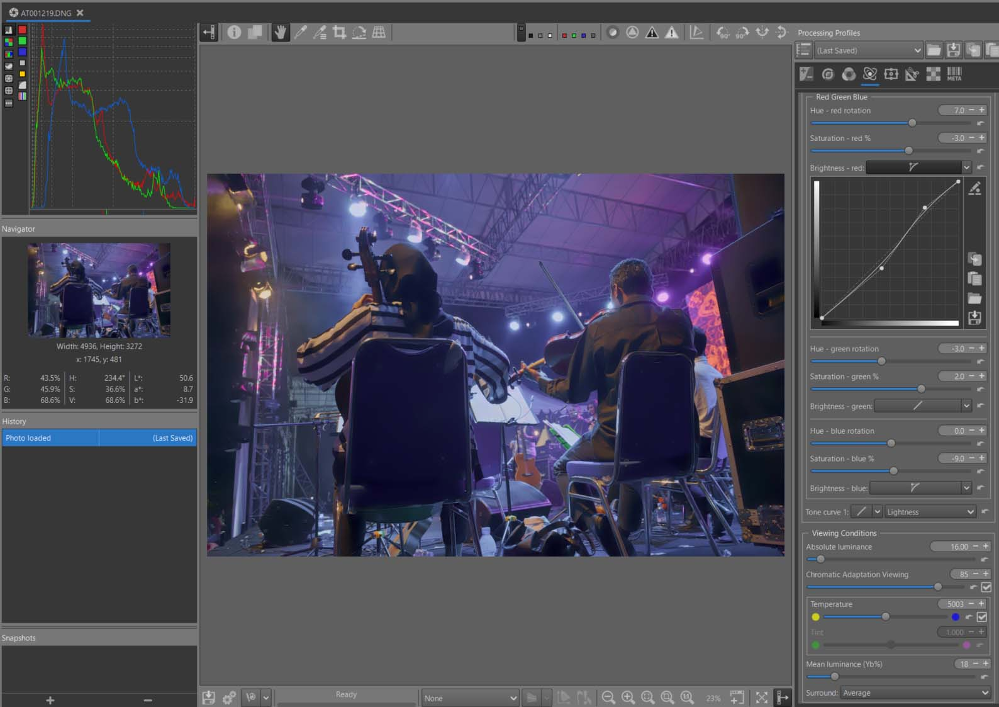
<figcaption>Image - LED</figcaption>
</figure>

I'm finding it difficult to locate areas outside the gamut; perhaps some still exist. The same applies to artifacts.
Similarly, is there respect for the colours? Difficult to say as I did not attend the show.

### Game changer : Mastery of Colors & Film Simulation

#### Introduction

When I look and listen to other open-source software around me, all anyone talks about is "..X". As we say in French ‘ça tombe comme à Gravelotte’.
There are few (if any) references to "..X" in RT, and I don't think that will change (at least not on my end). I'm not saying these aren't good methods (they are), but:
+ there's something equivalent in RT, even if the concepts and vocabulary are different;
+ some tools require implementation work (code modification, downloading and configuring libraries, etc.) that isn't accessible to everyone. These 'custom' tools are certainly relevant, but they only allow exchanges between users who have installed them (and what about updates?). Since its creation, RT has maintained compatibility with previous versions (which is often a drawback) and is delivered as a complete package. Everyone receives the same distributed package, thus ensuring compatibility over time and between users. So, in summary, yes to these tools if they can be fully integrated into the overall code.
+ Note that the color gamut of printed materials, whether CMYK or RGB, is 'small' (often smaller than sRGB, especially in shadows...). So, simulation is possible, but...

This tutorial is not intended to say that other tools are bad, nor to provide a comprehensive overview of colorimetry, but to highlight the latest recently implemented changes.

There are many methods on the market for creating (nostalgia) the colours and appearance of black and white, colour and slide films.
+ The latest ones are based on Dynamic Spectral LUTs '..x', which are not easily portable from one user to another.
+ The ones I developed in 2006 with the help of Profile Maker 5.0 (Greta MacBeth), which generates 6 LUTs for each film: 3 for R, G, B colors and 3 for TRCs. It would be too much work to do.
+ The one that has been present for many years in Rawtherapee (Film Simulation) [Film simulation](/film_simulation) is based on HaldCLUT. They are very efficient, but the drawback is that they are 'fixed', meaning that you cannot adjust the reds, blues, or greens to your personal taste, whether it be rotation, saturation or brightness. [HaldCLUT.zip](http://rawtherapee.com/shared/). Simply download and extract the zip file to the folder of your choice and specify this folder in Preferences.

<figure>
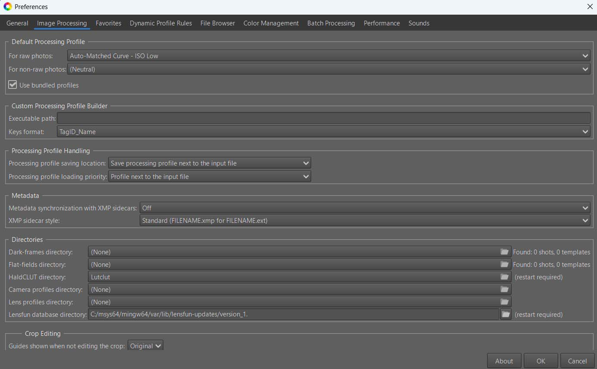
<figcaption>Preferences - HaldCLUT</figcaption>
</figure>

+ I chose to improve this last approach with the new 'Red Green Blue' option in Color Appearance & Lighting, which in fact gives you an addition of at least the equivalent of 9 dynamic LUTs.
+ In this tutorial, I arbitrarily chose Kodak Portra 400 NC 1 film.
<figure>
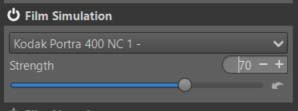
<figcaption>Film Simulation</figcaption>
</figure>

 [Some principles](/tutorials/#in-summary-some-principles)

 [Recommandations](/tutorials/#recommendations)

 [Specific tools used](/tutorials/#specific-tools-used)

**In summary:**

1) Color Appearance & Lighting : by allowing hue rotation (slider) , saturation (slider), brightness (curve) variation for each R, G, and B channel.
2) Michaelis-Menten (MM) : through use and adjustments of settings, whose default values ​​have become 'neutral'.
3) Abstract profile : a) by using the visualization of maximum R,G,B data or RGB saturation, to guide the action; b) by giving the possibility to act on the 'Gain (Ev)' at the output, as well as a possible compression of the gamut before the output process(es).
4) And of course, others tools.

**Educational objectives**
* Demonstrate the use of the new ‘Color Appearance & Lighting tools’ (CIECAM), for: a) To finely control colors in terms of hue, saturation, and brightness for each of the R, G, and B channels, entirely within the second CIECAM process - Image adjustments - in order to adapt the color gamut to specific needs (sky, sun, shadows, flowers, etc.)

* Demonstrate the usefulness of the new indicators in 'Abstract profile' and the 'Gain (Ev)' and 'Gamut compression' settings in the final phase of the RT process, just before output.

* Show the possible association of 1), 3) - and to a lesser degree 2) - above, with the tool already in place in RT (Film simulation - HaldCLUT) to complement it with corrections of hue, saturation, brightness and contrast, while finely controlling the gamut.

Image selection:

Raw file : (Creative Common Attribution-share Alike 4.0)
  [Raw File - Blue Horse](https://drive.google.com/file/d/1rRcFYYihDjW0ZHadA9S0nNyt3vwxG1Yu/view?usp=drive_link)

- pp3 file 3: [Blue Horse pp3](2010montr-film3.pp3 "2010montr-film.pp3")

##### Some remarks on histograms and Image

If the image in 'neutral' mode already shows green dots scattered across the screen, then the processing will be difficult.

If the histogram looks like this, there is at the very least a problem with the black point adjustment
<figure>
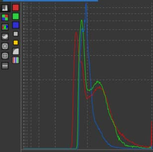
<figcaption>Histogram Black point</figcaption>
</figure>

If the histogram shows this second aspect, we are probably dealing with a high dynamic range image, where it will be difficult to find a balance between shadows and highlights. This is the domain of "tone mappers".
<figure>
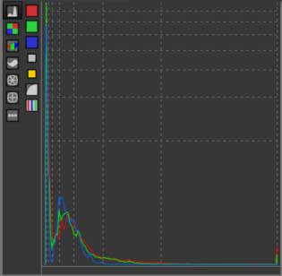
<figcaption>Histogram high dynamic range</figcaption>
</figure>

Fortunately, not all images are like that, and the histogram in 'neutral' mode is usually quite well distributed. For example for ‘The Blue Horse’. However, even in this case, we see that the blue channel 'overflows'...We risk having problems with the gamut.
<figure>
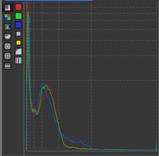
<figcaption>Histogram Blue Horse</figcaption>
</figure>

#### Start of treatment

+ set to Neutral.
+ Highlight reconstruction – Color Propagation (Exposure Tab) - disable ‘Clip out-of-gamut colors’. At this stage, we don't yet know if this selection is useful. It allows us to find the maximum linear value of the white point. Depending on the values ​​found later in Michaelis-Menten (Selective Editing) or in Gamut Compression (Color Tab) , you may or may not want to disable it.
+ The values found for ‘Maximum achromatic value’ in Gamut Compression (Color Tab), are strongly influenced by the settings chosen for 'Clip out-of-gamut colors' and 'Highlight reconstruction'. In this case (‘The Blue Horse’), I preferred to keep 'Highlight reconstruction > Color propagation' enabled and uncheck ‘Clip out-of-gamut colors'
+ Capture Sharpening (Raw Tab) - Enabled - You'll notice that "Contrast threshold" isn't set to zero. You can leave the default settings. The image doesn't appear to be noisy, so don't change anything for the two sliders (Presharpening denoise, Postsharpening denoise);
+ Raw Black Points (Raw Tab) - Activate 'Dehaze'. Since the sliders remain at zero, it likely indicates an incorrect black point setting due to haze; you can deactivate it.
+ White Balance > Automatic & Refinement > Temperature correlation: The illuminant _a priori_, is of the Daylight type; this automatic setting should be the most suitable.

#### Gamut Compression
<figure>
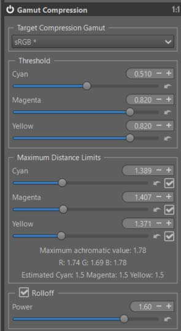
<figcaption>Gamut Compression</figcaption>
</figure>

Check if the histogram changes when you enable or disable it. Of course, choose the same 'Target compression Gamut' as the 'Soft proofing'. If it does change, the automatic settings should be fine. Look at the ‘Power’ incidence (the higher it is, the purer the compressed colors will be). Try slightly adjusting the values ​​of the three 'Threshold' sliders and/or ‘Maximum Distance Limits’. But most importantly, look at the values ​​of the three RGB channels, which in this image are each around 1.7. This means these values ​​are beyond the default profile and need to be adjusted. Hence the need for a 'Tone mapper' (here, Michaelis-Menten). As a reminder, we do not convert the data to the Target Compression Gamut (TCG), but we compress it in such a way that the critical data is inside the TCG, while remaining in the Working profile.

#### Pre-tone mapper : Michaelis-Menten
<figure>
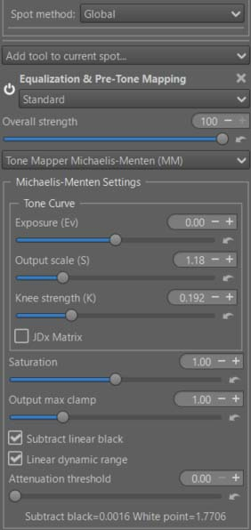
<figcaption>Michaelis-Menten</figcaption>
</figure>

+ Ensure that Subtract lines black and Linear dynamic range are enabled.
+ You can see that these values ​​are respectively at 0.0016 and 1.7706. This means that significant compression has been performed to 'fit' into Rec2020.
+ Note that I did not act on 'Exposure (Ev)' but on Output scale (S) and Knee strength (K)

#### Abstract Profile

<figure>
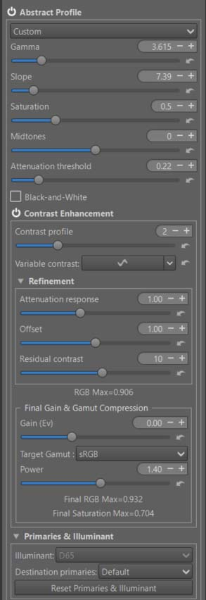
<figcaption>Abstract Profile</figcaption>
</figure>

+ Adjust gamma and slope to achieve the desired result and Attenuation threshold
+ Enable ‘Contrast Enhancement’ - The default settings should be suitable in most cases.
+ The RGBmax indicator should display a value less than 1. If it doesn't, either change the previous AP or MM settings, or adjust 'Final Gain & Gamut Compression'. You will see the RT process values ​​displayed below the 'Gain (Ev)' and 'Target gamut' settings. To display the data, at least one of the two settings must not be zero or 'None'. I recommend setting 'Target gamut' to sRGB (the same setting you used for Soft Proofing) and in Gamut Compression (Color Tab).

####  Color Appearance & Lighting

+ Now we'll explore the new 'Red Green Blue' tool, which will allow you to finely control each of the 3 RGB channels.
+ First : enable ‘Color Appearance & Lighting’ and choose ‘Complexity = Advanced’. This gives you more choices among the CIECAM variables. Thus, you have : Lightness (J) and Contrast (J), Brightness (Q) and Contrast (Q), Chroma (C), Saturation (s), Colorfullness (M), hue raotation (h) , and 3 tones curves for Lightness, Brightness, and Color.
+ Note the default 'Scene conditions' settings which you could change if you know exactly the shooting conditions.
+ Note the default 'Viewing conditions' settings which you could change to adapt them to your viewing environment (the room you are in, its ambiance, the 'Absolute luminance' estimate, and Surround…).
+ I chose 'Lightness + Saturation' and slightly increased the overall saturation and contrast (J)

##### Red - Green - Blue

+  You can modify each R, G, B channel to finely retouch colors or simulate films:
    - Rotate each color by degrees.
    - Change the saturation (s) in the sense of a CAM (Color Appearance Model).
    - Change the brightness (Q) with a curve that allows you to adapt the contrast and brightness to each situation.

+ As a reminder, in CIECAM there are a total of 9 variables, 6 of which are accessible to the user in RT: Lightness (J), Brightness (Q), Saturation (s), Chroma (C), Colorfullness (M), and Hue rotation (h). They are interdependent. For example Chroma = saturation * saturation * brightness.

In the case of the ‘Blue Horse’ I arrived at the settings used in pp3, using ‘Soft proofing’ to control the gamut.

To simplify use, I’ve only included one slider per channel for hue rotation, and one slider per channel for Saturation (s). I could have also included a tone equalizer for the red, green, and blue range; If that proves useful, aside from complicating the interface, it doesn’t pose any problem. Note that the 3 Brightness curves allow you to adjust the brightness and contrast for each color range. Specifically, brightness acts on the perceived chroma via the (s) Saturation function.

Of course, the settings are quite arbitrary, depending on your tastes.

<figure>
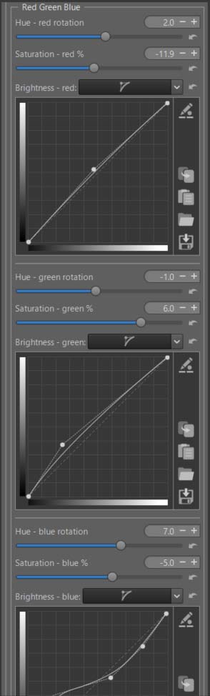
<figcaption>CIECAM Red Green Blue</figcaption>
</figure>

**Back to Abstract profile**

Check that the data displayed in ‘Final Gain & Gamut Compression’ is within limits, correct it if necessary, but be careful with the gamut

**Back to Film Simulation**

Of course, you can change the choices in 'HardCLUT', for example by selecting Fuji... Be careful to check and change the settings, as they are not universal. Always check the gamut (histogram, soft proofing, display of values ​​in Abstract profile).

####  Image at the end of Game Changer

<figure>
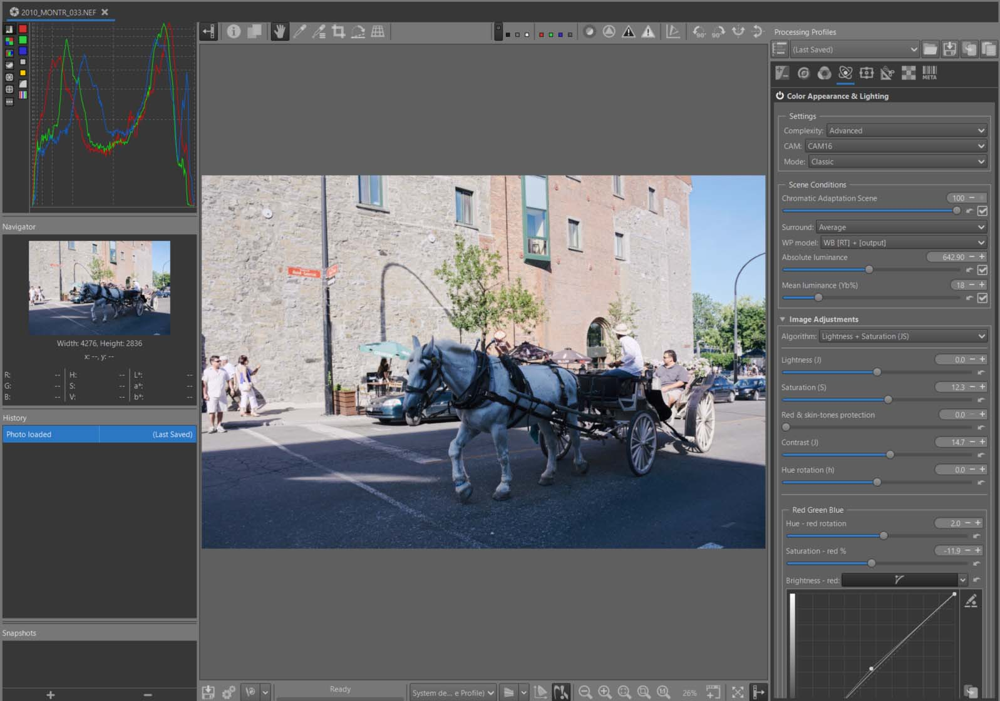
<figcaption>The Blue Horse</figcaption>
</figure>

### Game changer: a complete process on a user Rocks image

#### Introduction

I extracted this tutorial from an ongoing thread, which is referenced with the image link below, in order to preserve this tutorial over time.

[Original Raw NEF](https://discuss.pixls.us/t/selective-editing/54199)

- pp3 file: [Red rocks](tz5_1767-ghs.pp3 "tz5_1767-ghs.pp3")

At first, I thought this image was from a Gorge near my home, in the hinterland of Nice in France. It’s less than 100km from where I live. I haven’t been there in a while, but it does somewhat resemble this Middle Eastern landscape. The colors of the rock near Nice are redder. So I tried to recreate this effect (it’s subjective). Here is a link in French, but there are other sites

[Gorges du Cians](https://www.alpesdazur-tourisme.fr/les-essentiels/gorges-du-cians-et-de-daluis-bienvenue-dans-le-colorado-nicois/)

I’m going to show you how to process this image; some of the settings might be excessive. My aim is to teach through example, rather than focusing on the final result itself. The most important thing for any photography enthusiast is that they are happy with the outcome. Of course you can criticize, add treatments, remove some… and say ‘it’s better with XXX’

 [Some principles](/tutorials/#in-summary-some-principles)

 [Recommandations](/tutorials/#recommendations)

 [Specific tools used](/tutorials/#specific-tools-used)

#### First steps
+ set to Neutral.
+ activate ‘Highlight reconstruction > Color propagation’, and check the image and histogram to ensure there is no change. Since there appears to be no effect, deactivate ‘Highlight reconstruction’.
+ Go to the ‘Color tab’ and enable 'Gamut compression’. I’ve chosen ‘sRGB’ as the ‘Target Compression Gamut’, which should be suitable for most users with a standard monitor. Again, double-check that there are no changes to the image or histogram, and examine the information line under ‘Maximum achromatic value’. You’ll see three values: R :, G :, and B :, which correspond to the maximum of the three channels (in sRGB). In this case, they are all much lower than 1. This suggests that the image has been underexposed. We’ll see what to do with this information later. Then deactivate ‘Gamut compression’
+ Go to 'Raw tab > Capture Sharpening’, activate it, and check that ‘Contrast threshold’ is not set to zero. If it is, you will need to adjust ‘Presharpening denoise’. Leave the default settings and leave ‘Capture Sharpening’ enabled.
+ Go to ‘Color tab > White Balance’ and choose ‘Automatic & Refinement > Temperature correlation’. This algorithm compares up to 236 colors in the image with over 400 spectral reference colors. Some of these colors are in ‘Beta RGB’, the smallest color space encompassing ‘Pointer’s gamut’ (the reflected colors seen by humans), while others are in the entire visible spectrum (ACES-P0). Try the two settings ‘Medium sampling - near Pointers’s gamut’ and ‘Close to full CIE diagram’. You’ll see a difference in the calculations, which is probably due to the slightly hazy upper area of ​​the image – perhaps corresponding to a break in the sunlight. I chose to keep the first setting. Note that these references are only used for calculations and have no direct relation to the ‘Working Profile’ or ‘Output profiles’. It makes no sense to use it with illuminants other than Daylight and Blackbody
 [Temperature correlation](/tutorials/#white-balance---temperature-correlation)

#### Selective Editing - 5 RT-spots

##### First spot : Generalized hyperbolic stretch (GHS)
<figure>
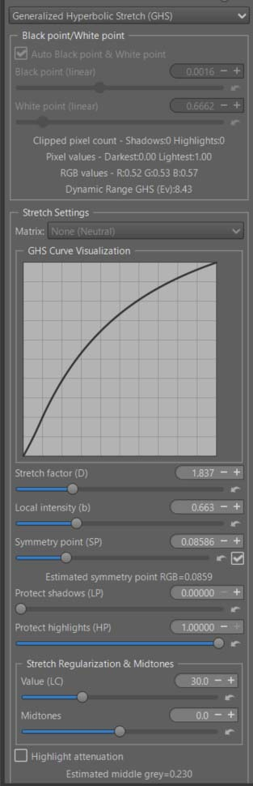
<figcaption>GHS settings</figcaption>
</figure>

+ activate the checkbox 'Auto black point & White point', and also 'Symmetry point (SP)'.
+ you can see the two settings found by the algorithm which show the underexposure of the image. After these settings, the data is in Rec2020 in the interval [0 1]. BP (linear) = 0.0016, WP (linear) = 0.6662.

##### First spot : Sharpening

+ To add a bit more vibrancy to this somewhat dull image, although that's not strictly Capture Deconvolution's purpose.
<figure>
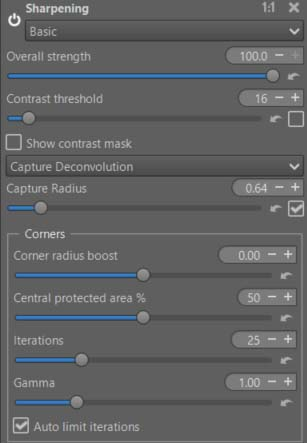
<figcaption>Sharpening - Capture deconvolution</figcaption>
</figure>

##### Second spot : Color & Light
+ The goal is to make the upper left part of the rock much redder, like in the Cians gorges.
<figure>
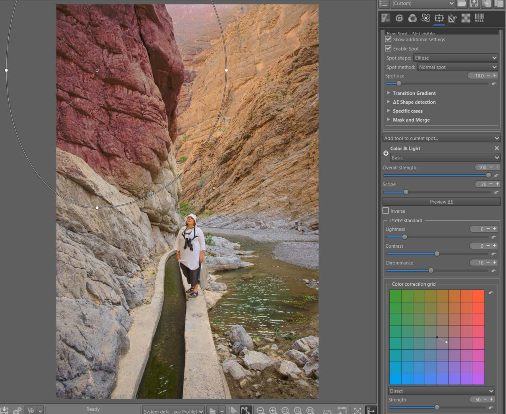
<figcaption>Red as Gorges du Cians</figcaption>
</figure>

##### Second spot : Inverse GHS
+ The goal is to darken this part to make it even redder.
<figure>
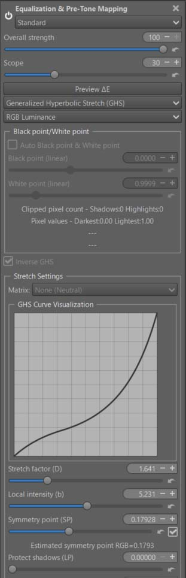
<figcaption>Inverse GHS</figcaption>
</figure>
+ note : the scope value; the shape of 'GHS Curve Visualisation' which works 'in reverse.

##### Third spot : Increase the sense of clarity in the upper part of the image
+The goal is to increase the sense of clarity in the upper part of the image. To do this, I use 'Color correction grid'
<figure>
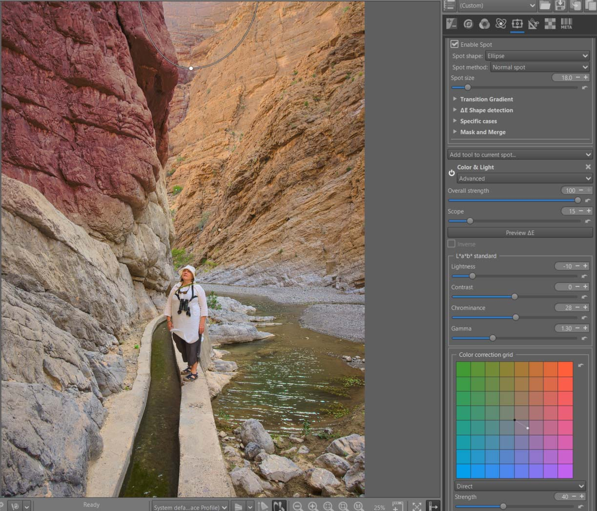
<figcaption>Clarity</figcaption>
</figure>

##### Fourth spot: retouch the colors below the red part of the rock
+ The goal is to shed light on this dark area.
+ Note : the Excluding Spot.
<figure>
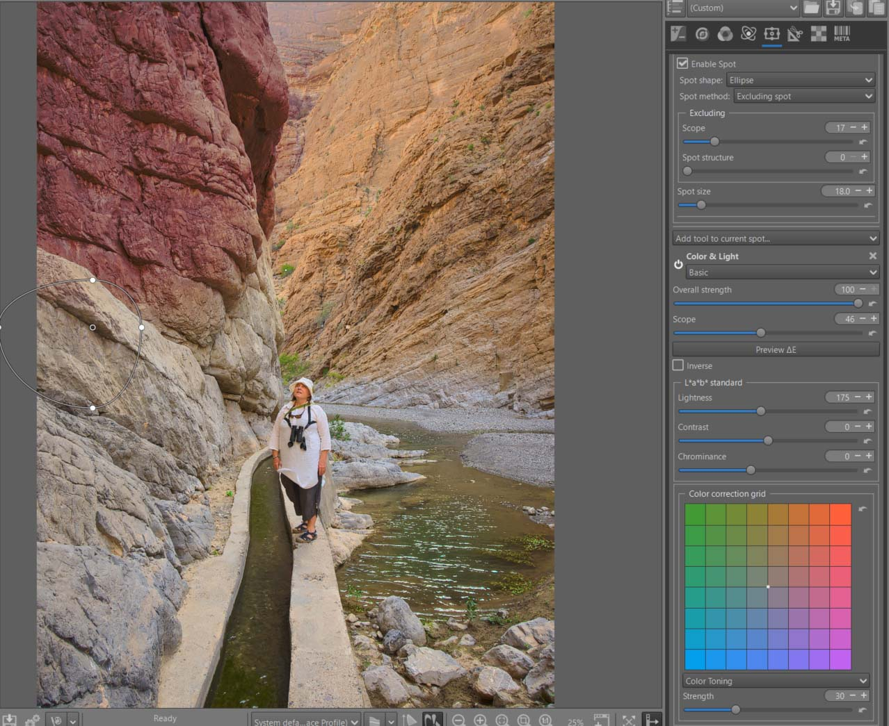
<figcaption>Excluding Spot</figcaption>
</figure>

##### Fifth spot: make the little greenery greener
+ for this, I use a full-image Spot.
+ the center of the Spot, whose Spot size I reduced to 4, is located in a small bush above the woman's head, near the red rock (difficult to see).
+ the Scope value is very low in order to pinpoint that color (the small green bushes).
<figure>
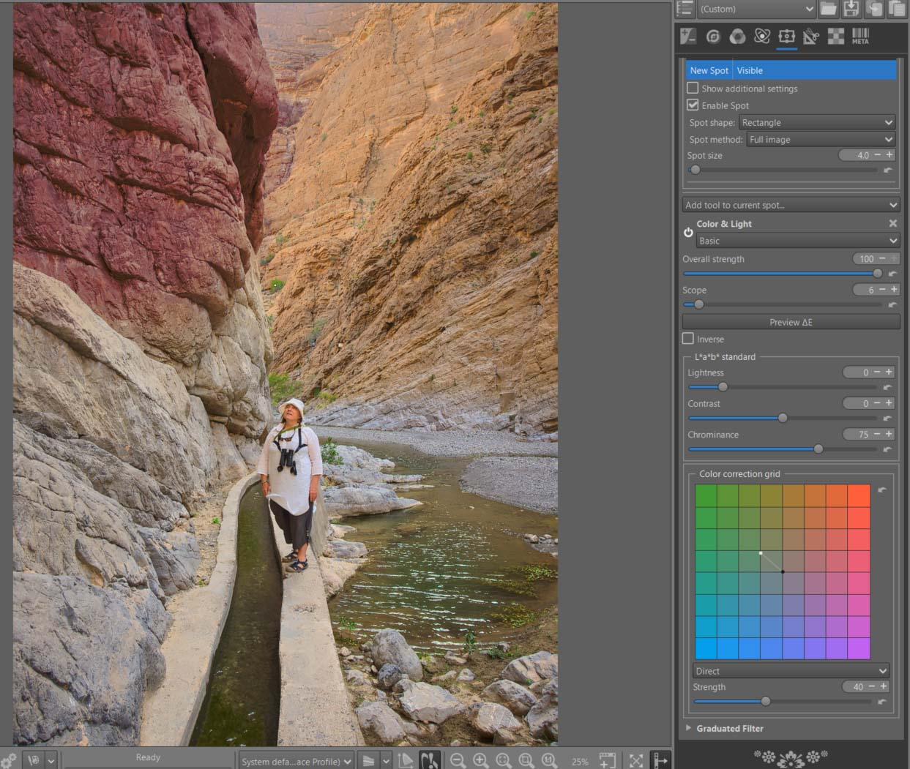
<figcaption>Green bushes</figcaption>
</figure>

#### Abstract profile
+ Balance the lights in the image.
+ Significantly increase local contrast.
+ Adjust gamma and slope to achieve the desired result and Attenuation threshold.
+ Enable ‘Contrast Enhancement’ - The default settings should be suitable in most cases.
+ The RGBmax indicator should display a value less than 1. If it doesn't, either change the previous AP or GHS settings, or adjust 'Final Gain & Gamut Compression'. You will see the RT process values ​​displayed below the 'Gain (Ev)' and 'Target gamut' settings. To display the data, at least one of the two settings must not be zero or 'None'. I recommend setting 'Target gamut' to sRGB (the same setting you used for Soft Proofing) and in Gamut Compression (Color Tab).
<figure>
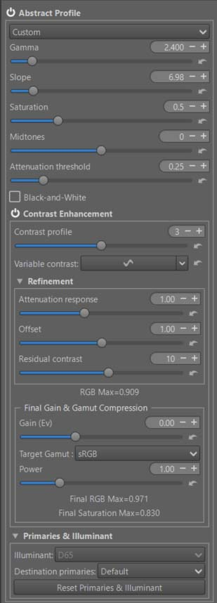
<figcaption>Abstract Profile</figcaption>
</figure>

#### Color Appearance & Lighting
+ Now we'll explore the new 'Red Green Blue' tool, which will allow you to finely control each of the 3 RGB channels.
+ First : enable ‘Color Appearance & Lighting’ and choose ‘Complexity = Advanced’. This gives you more choices among the CIECAM variables. Thus, you have : Lightness (J) and Contrast (J), Brightness (Q) and Contrast (Q), Chroma (C), Saturation (s), Colorfullness (M), hue raotation (h) , and 3 tones curves for Lightness, Brightness, and Color.
+ Note the default 'Scene conditions' settings which you could change if you know exactly the shooting conditions.
+ Note the default 'Viewing conditions' settings which you could change to adapt them to your viewing environment (the room you are in, its ambiance, the 'Absolute luminance' estimate, and Surround…).
+ I chose 'Lightness + Saturation' and slightly increased the overall saturation and contrast (J)

##### Red - Green - Blue

+  You can modify each R, G, B channel to finely retouch colors or simulate films:
    - Rotate each color by degrees.
    - Change the saturation (s) in the sense of a CAM (Color Appearance Model).
    - Change the brightness (Q) with a curve that allows you to adapt the contrast and brightness to each situation.

+ As a reminder, in CIECAM there are a total of 9 variables, 6 of which are accessible to the user in RT: Lightness (J), Brightness (Q), Saturation (s), Chroma (C), Colorfullness (M), and Hue rotation (h). They are interdependent. For example Chroma = saturation * saturation * brightness.

In the case of the ‘Red rocks’ I arrived at the settings used in pp3, using ‘Soft proofing’ to control the gamut.

To simplify use, I’ve only included one slider per channel for hue rotation, and one slider per channel for Saturation (s). I could have also included a tone equalizer for the red, green, and blue range; If that proves useful, aside from complicating the interface, it doesn’t pose any problem. Note that the 3 Brightness curves allow you to adjust the brightness and contrast for each color range. Specifically, brightness acts on the perceived chroma via the (s) Saturation function.

Of course, the settings are quite arbitrary, depending on your tastes.

<figure>
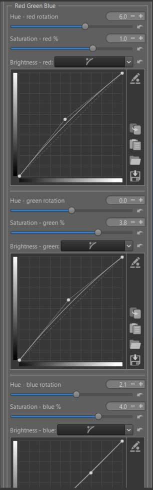
<figcaption>CIECAM Red Green Blue</figcaption>
</figure>

**Back to Abstract profile**

Check that the data displayed in ‘Final Gain & Gamut Compression’ is within limits, correct it if necessary, but be careful with the gamut.

####  Image at the end of Game Changer

<figure>
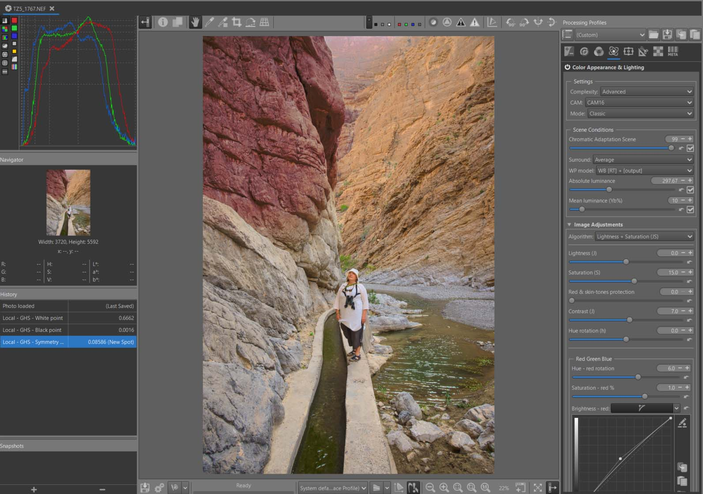
<figcaption>Les Gorges du Cians</figcaption>
</figure>

### Game changer: using Harvest mouse

#### Introduction

This tutorial aims to explain the concept of a ‘Game changer’, with an example using Andy Astbury’s harvest mouse image.

In this tutorial, we will see how to use ‘Capture Sharpening’ and ‘Selective Editing > Capture Deconvolution’, ‘Selective Editing > Generalized Hyperbolic Stretch’ (GHS), ‘Abstract Profile’ (AP), Color Appearance & Lighting together. Of course, other tools are necessary, which we will cover later.

Image selection:

Raw file : (Copyright Andy Astbury - Creative Common Attribution-share Alike 4.0)

[Harvest mouse](https://drive.google.com/file/d/1uND8pqgfxxaBhs554RnCvOS5NI3KsWT5/view)

- pp3 file 3: [harvest](d4d1775-cap-ghs.pp3 "d4d1775-cap-ghs.pp3")

 [Some principles](/tutorials/#in-summary-some-principles)

 [Recommandations](/tutorials/#recommendations)

 [Specific tools used](/tutorials/#specific-tools-used)

**Learning objective**

+ The importance of Capture Sharpening and postsharpening denoise to reduce noise in the flat areas of the image, and Selective Editing > Capture Deconvolution
+ The role of GHS in the linear portion of the data, which can be considered a ‘Pre-tone-mapper’.
+ The role of Abstract Profile, which prepares the data for use in the output (screen, TIFF/JPG).
+ The role of Color Appearance & Lighting : Red Green Blue.

#### First steps
+ set to Neutral.
+ Enabling Raw Black Point 'dehaze' does move the green sliders, but it introduces a strong red bias into the image. Deactivate it and return the sliders to zero.
+ Enable White Balance > Auto > Temerature correlation > the default values ​​should be suitable.
+ Enable Gamut Compression. You will see basic values ​​for the displayed data. At this stage, there is probably no need for compression. However, try adjusting the sliders to see the potential effect on the histogram and the image. In this example, Gamut Compression is disabled.

#### Capture Sharpening

+ Enable ‘Capture Sharpening’ (CS) (Raw tab).
+ Verify that ‘Contrast Threshold’ displays a value other than zero, normally 22.It is unnecessary, or even harmful (except in exceptional cases), to change the 'Presharpening denoise' slider. 
+ Enable 'Show contrast mask': Zoom in or out in the Preview; you will see that this has no impact on the result. The processing is performed on the entire image – with the drawback of being relatively slow.
+ At 100% or 200%, the noise on the black background becomes clearly visible.

<figure>
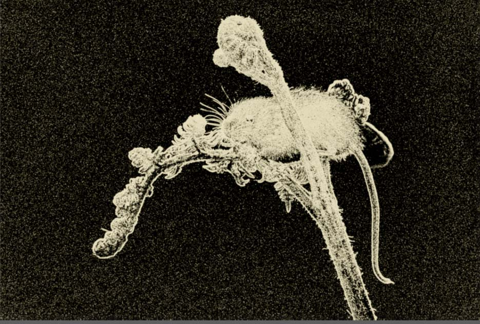
<figcaption>Contrast mask - Capture Sharpening</figcaption>
</figure>

Still in the ‘Raw tab’, go to ‘Demosaicing’ and change the default method ‘Amaze’ to, for example, ‘Amaze + VNG4’ (Thank’s to Ingo). These methods with ‘Double’ demosaicing use a similar contrast mask (before demosaicing). The advantages are: a) less aggressive action on the background (the black areas of the mask) while preserving the main subject, thus reducing the impact of noise; b) a slight reduction in processing time. Of course, this assumes that this mask (not the one you see in (CS), but the one for demosaicing, which isn’t user-accessible) is working and therefore that the image isn’t too noisy.

You can, if you wish, disable the ‘auto’ settings of ‘Contrast threshold’ and ‘Radius’ to adjust them to your liking.

##### Remove background noise

Disable the mask.

View the image at 100% or 200%, then adjust the ‘Postsharpening denoise’ setting, which will take the mask information into account to process the noise. Adjust this denoising to your liking. It’s clear that even with a mask, the denoising action isn’t localized pixel by pixel but rather applied to areas of pixels (here, 64 x 64). Therefore, you will inevitably see denoising in the transition areas. For example, the mouse's whiskers.

Note: In the case of this low-noise image, I haven’t enabled ‘Presharpening denoise,’ which is only useful for making CS usable by performing denoising before CS.

For technical information – the denoising uses wavelets with a vanishing moment of 20 to minimize artifacts. This process takes place in three dimensions (horizontal, vertical, and diagonal). The ‘Noise reduction’ function (Detail tab) uses a vanishing moment of 4 in all three dimensions. By comparison, ‘Contrast by Detail Levels’ (which is not used for noise reduction) uses Haar’s method with a vanishing moment of 2.

<figure>
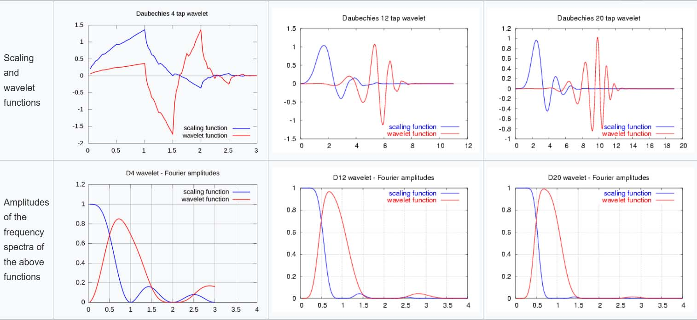
<figcaption>Wavelets - vanishing moments</figcaption>
</figure>

<figure>
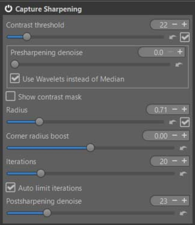
<figcaption>Capture Sharpening</figcaption>
</figure>

The post-sharpening denoise setting is quite arbitrary; it depends partly on your tastes and partly on subsequent adjustments depending on whether you want to keep a very dark or lighter background.

#### Second step: Generalized Hyperbolic Stretch - GHS

I preferred to use Generalized Hyperbolic Stretch (GHS) rather than Michaelis-Menten (MM) as a pre-tone mapper, because it allows (by default) for better preservation of the dark background, and reserving its modification for a later step.

The goal of this step is to adjust the White Point (linear) and Black Point (linear), and at a minimum, to adjust the image contrast.
Go to ‘Selective Editing > Global > Equalization & Pre-Tone Mapping’. Choose Genralized Hyperbolic Stretch.

Click on ‘Auto Black Point & White Point’ and examine the values. You should see BP = 0.0033, meaning the image’s black levels were not optimized (), and WP = 1.0657, also indicating no optimization. Adjusting these values ​​to the range [0, 1] will result in an image with greater contrast and deeper blacks.This reduction in linear Black point, does essentially the same thing as "Raw Black Point," but here it doesn't introduce a color cast. All three RGB channels are treated identically.

The (somewhat arbitrary) settings are ‘Stretch factor (D)’ = 0.488, ‘Local intensity (b)’ = 1.442 and ‘Symmetry point (SP)’ = 0.03113. Of course you can change these settings.

<figure>
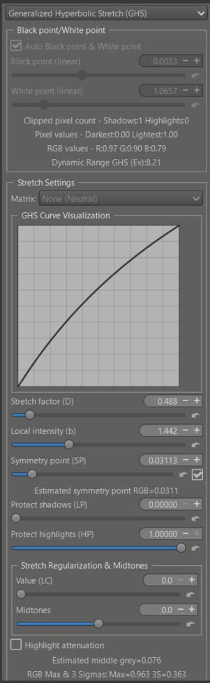
<figcaption>GHS</figcaption>
</figure>

#### Third Step: Activate a second RT-spot in Global mode – Capture Deconvolution

The goal is to restore sharpness to the transition areas of the image between the (noisy) background and the main subject.

Select ‘Add tool to current spot…’ > Sharpening > Capture Deconvolution

The major problem – not specific to this tool but generally due to RawTherapee’s pipeline – is the sensitivity to the zoom level and the preview position. So, you have to make do. Ideally, you would have a screen large enough to see the details in ‘fit to screen’ mode (which is definitely not the case for me). In most cases, choose a reasonable zoom level of 50%, 100%, or 200% to see the area in question (here, the mouse’s nose). Activate ‘Show contrast mask’ with ‘Contrast threshold’ in ‘automatic’ mode. When you are satisfied with the resulting effect, uncheck the ‘automatic’ box; the setting will be retained for the entire process (including Output).

‘Capture Deconvolution’ uses the same algorithm as ‘Capture Sharpening’ (Raw Tab). Some adjustments (to put it mildly) were necessary for it to work further in the process and on non-raw images (TIFF/JPG, etc.).

In ‘fit to screen’ mode, you have the option (not very useful in this example) to increase or decrease sharpening based on the position relative to the center of the image. The area where changes are applied using the main settings is defined by ‘Central protected area %’.

When ‘Capture Sharpening’ (Raw Tab) is enabled, the ‘Capture Radius’ value in ‘automatic’ mode within ‘Capture Deconvolution’ is set to 90% of the ‘Capture Sharpening’ value. Of course, you can disable this and adjust it manually

<figure>
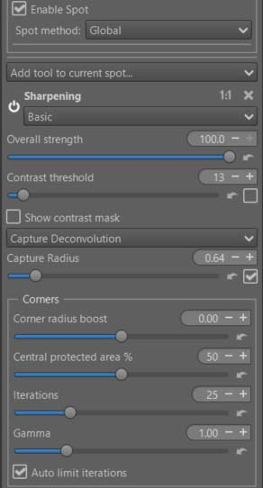
<figcaption>Capture Deconvolution</figcaption>
</figure>

#### Fourth step – Abstract Profile : Adjusting Tones – Increasing Local Contrast

+ Balance the lights in the image.
+ Significantly increase local contrast.
+ Adjust gamma and slope to achieve the desired result and Attenuation threshold. This is where you can change the background, making it darker or lighter by adjusting the 'Slope' setting.
+ Enable ‘Contrast Enhancement’ - The default settings should be suitable in most cases.I increased 'Contrast profile' to 3. This means that 1 basic level of Wavelet decomposition is used (to simplify).
+ The RGBmax indicator should display a value less than 1. If it doesn't, either change the previous AP or GHS settings, or adjust 'Final Gain & Gamut Compression'. You will see the RT process values ​​displayed below the 'Gain (Ev)' and 'Target gamut' settings. To display the data, at least one of the two settings must not be zero or 'None'. I recommend setting 'Target gamut' to sRGB (the same setting you used for Soft Proofing) and in Gamut Compression (Color Tab).
<figure>
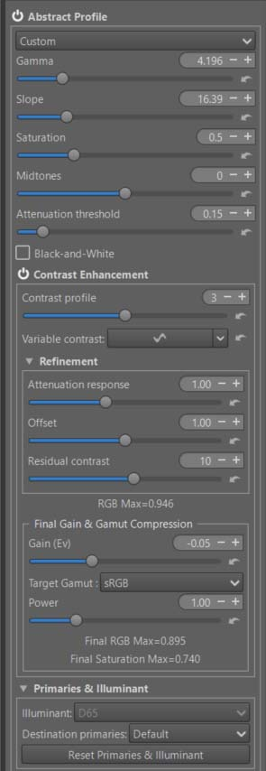
<figcaption>Abstract Profile</figcaption>
</figure>

+ In principle, there’s no point in using the ‘Primaries & Illuminant’ module here.
+ You can easily see the effect of the last controls in 'Final Gain & Gamut Compression', set 'Target Gamut' to 'None' and you will see the out-of-gamut data appear, also observe the histogram.

#### Color Appearance & Lighting
+ Now we'll explore the new 'Red Green Blue' tool, which will allow you to finely control each of the 3 RGB channels.
+ First : enable ‘Color Appearance & Lighting’ and choose ‘Complexity = Advanced’. This gives you more choices among the CIECAM variables. Thus, you have : Lightness (J) and Contrast (J), Brightness (Q) and Contrast (Q), Chroma (C), Saturation (s), Colorfullness (M), hue raotation (h) , and 3 tones curves for Lightness, Brightness, and Color.
+ Note the default 'Scene conditions' settings which you could change if you know exactly the shooting conditions.
+ Note the default 'Viewing conditions' settings which you could change to adapt them to your viewing environment (the room you are in, its ambiance, the 'Absolute luminance' estimate, and Surround…).
+ I chose 'Lightness + Saturation' and slightly increased the overall saturation and contrast (J)

##### Red - Green - Blue

+  You can modify each R, G, B channel to finely retouch colors or simulate films:
    - Rotate each color by degrees.
    - Change the saturation (s) in the sense of a CAM (Color Appearance Model).
    - Change the brightness (Q) with a curve that allows you to adapt the contrast and brightness to each situation.

+ As a reminder, in CIECAM there are a total of 9 variables, 6 of which are accessible to the user in RT: Lightness (J), Brightness (Q), Saturation (s), Chroma (C), Colorfullness (M), and Hue rotation (h). They are interdependent. For example Chroma = saturation * saturation * brightness.

In the case of the ‘Harvest mouse’ I arrived at the settings used in pp3, using ‘Soft proofing’ to control the gamut.

To simplify use, I’ve only included one slider per channel for hue rotation, and one slider per channel for Saturation (s). I could have also included a tone equalizer for the red, green, and blue range; If that proves useful, aside from complicating the interface, it doesn’t pose any problem. Note that the 3 Brightness curves allow you to adjust the brightness and contrast for each color range. Specifically, brightness acts on the perceived chroma via the (s) Saturation function.

Of course, the settings are quite arbitrary, depending on your tastes.

<figure>
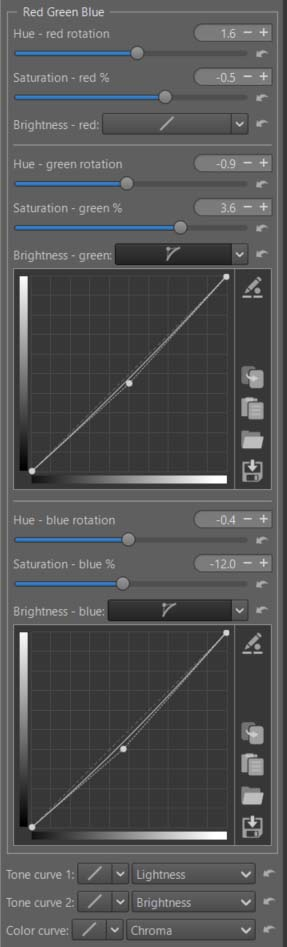
<figcaption>CIECAM Red Green Blue</figcaption>
</figure>

**Back to Abstract profile**

Check that the data displayed in ‘Final Gain & Gamut Compression’ is within limits, correct it if necessary, but be careful with the gamut.In the case of 'Harvest mouse', gamut compression is essential.

####  Image at the end of Game Changer

<figure>
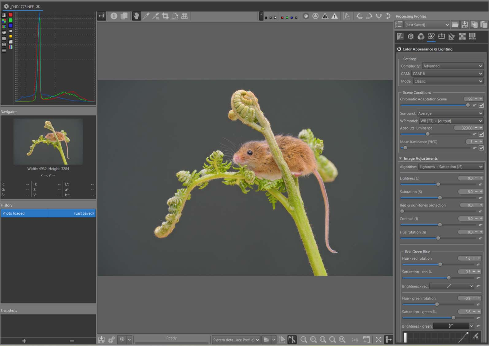
<figcaption>Harvest mouse</figcaption>
</figure>