In this tutorial, we will see how to use Local contrast (Selective Editing > Wavelets) and Clarity & Sharp Mask. This is a way of presenting a more complete alternative to "Contrast Enhancement" in 'Abstract profile'

The image is difficult: beneath its seemingly simple appearance, mastering the color gamut is complex.

I deliberately chose extreme settings to demonstrate the system's limitations. The objective is to achieve very high local contrast values ​​in order to highlight the control of halos and artifacts. The second objective is to introduce - for users who are unaware of it - the concept of Clarity (with wavelets).

 [Some principles](/tutorials/#in-summary-some-principles)

 [Recommendations](/tutorials/#recommendations)

 [Specific tools used](/tutorials/#specific-tools-used)

 [Alternatives](/tutorials/#alternatives)

 Raw file (Creative Common Attribution-share Alike 4.0):
 [14](https://drive.google.com/file/d/1GdqejdnbW1kJFNY6y9sdQDlF2rCEGMCu/view?usp=sharing)
  
  pp3 file: [Pagodas-0 pp3](dsc1629-0.pp3 "dsc1629-0.pp3")

  pp3 file 1: [Pagodas-1 pp3](dsc1629-1.pp3 "dsc1629-1.pp3")

  **Image neutral**

<figure>
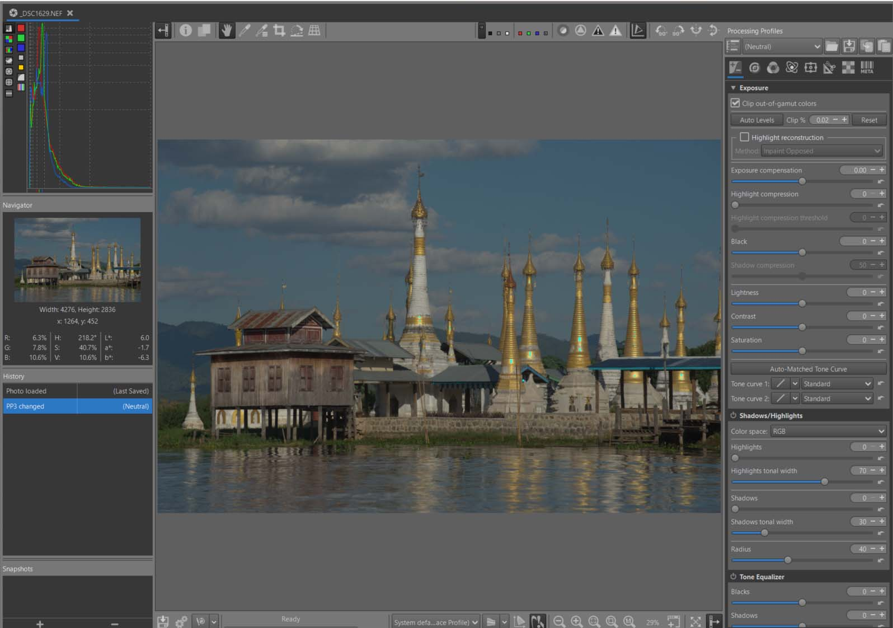
<figcaption>Neutral</figcaption>
</figure>

Look at the out-of-gamut shots in the towers.

## Learning objectives

The user will understand the ‘Game changer’ approach discussed in this tutorial:
  - The importance of Gamut Compression.
  - White Balance optimization - Temperature correlation.
  - The role of ‘GHS’.
  - The place given to 'Selective Editing > Local Contrast & Wavelets'.
  - The role of Abstract profile (without Contrast Enhancement).
  - The use of Color Appearance & Lighting and the possible corrections of the 3 channels R, G, B.

This tutorial will use two processing hypotheses. 
* The first uses the same principles as the previous 'Game changer', but replaces 'Contrast enhancement' with 'SE > Local Contrast & Wavelets' with "Pagodas-0 pp3"
* The second also replaces 'Abstract Profile' and 'Color Appearance & Lighting' with 'Selective Editing > Color Appearance (CAM16 & JzCzHz) with "Pagodas-1 pp3"

## Start of treatment

* Set to Neutral.
* The values found for ‘Maximum achromatic value’ in Gamut Compression (Color Tab), are strongly influenced by the settings chosen for ‘Clip out-of-gamut colors’ and ‘Highlight reconstruction’. In this case (‘Pagodas’), Highlight reconstruction > Color Propagation is not enabled.
* Capture Sharpening (Raw Tab) - Enabled - You’ll notice that “Contrast threshold” isn’t set to zero. You can leave the default settings. The image doesn’t appear to be very noisy, so don’t change anything for the two sliders (Presharpening denoise, Postsharpening denoise);
* White Balance > Automatic & Refinement > Temperature correlation: The illuminant a priori, is of the Daylight type; this automatic setting should be the most suitable.

### Raw Settings

### Demoisaicing and Raw Black Points

**Demoisaicing**

+ Try different methods. After my tests, I found the best results for mastering artifacts in the clouds.
+ AMaZE 
+ False color suppression steps = 5.

**Dehaze**

The 'Dehaze' system designed by Ingo Weirich (thanks to him) suggests in some cases, this can improve the image by optimizing the black points. This can be accompanied by either a reduction in haze or a slight improvement in the overall image contrast.

+ Try the "Dehaze" checkbox; you'll see the sliders move to the right, the histogram expands, especially to the left (the shadow areas), and the image is brighter and more colorful: Red:+2, Green 1:+26, Green 2:+26, Blue:+14.
+ Disabled Dehaze Checkbox 
+ Increase slightly the 2 Green (Green 1 & Green 2) to 28, to reduce artifacts
+ Be **very careful**, these settings are very sensitive and can contribute to making the images unusable.

[Raw Black Points](/raw_black_points/)

<figure>
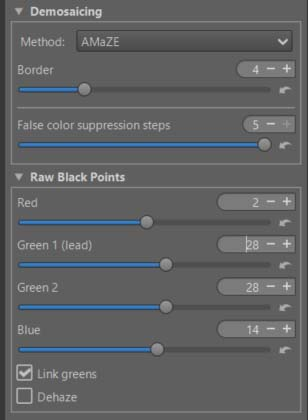
<figcaption>Demosaicing & Raw Black Points</figcaption>
</figure>

Below, you can see the influence of Raw Black Points on the image at the end of the process.
+ Note the difference on the horizontal axis, close to zero.
+ Note that the overall histogram is better filled.
<figure>
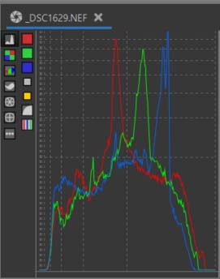
<figcaption>Histogram without Raw Black points</figcaption>
</figure>

<figure>
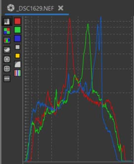
<figcaption>Histogram with Raw Black points</figcaption>
</figure>

### Gamut Compression
<figure>
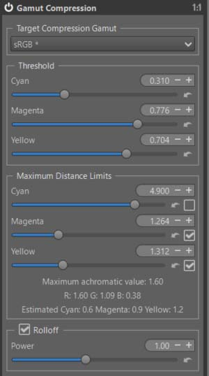
<figcaption>Gamut Compression</figcaption>
</figure>

Check if the histogram changes when you enable or disable it. Of course, choose the same 'Target compression Gamut' as the 'Soft proofing'. If it does change, the automatic settings should be fine. Look at the ‘Power’ incidence (the higher it is, the purer the compressed colors will be). Try slightly adjusting the values ​​of the three 'Threshold' sliders and/or ‘Maximum Distance Limits’. But most importantly, look at the values ​​of the 'Maximum achromatic value' which is near of 1.6. This means these values ​​are beyond the default profile and need to be adjusted. Hence the need for a 'Tone mapper'. As a reminder, we do not convert the data to the Target Compression Gamut (TCG), but we compress it in such a way that the critical data is inside the TCG, while remaining in the Working profile.

Try changing the slider values, for example in the 'Yellows'... it's all about compromise, between gamut control and color purity

**A difficult gamut in the yellows**
<figure>
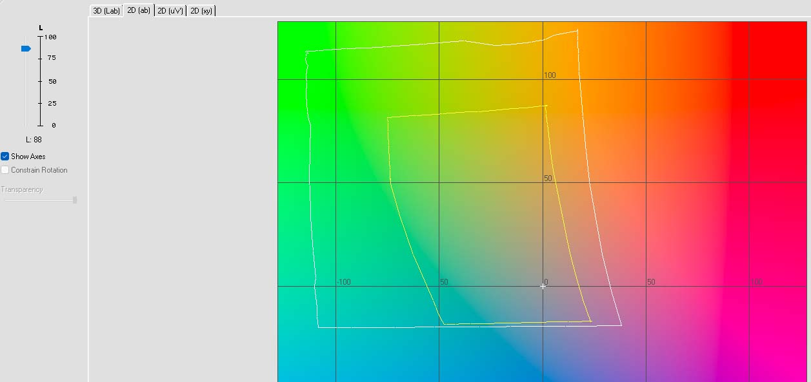
<figcaption>Gamut sRGB & Rec2020 in Yellows</figcaption>
</figure>

Note the narrow gamut for yellows (the dominant colors of the Pagodas). The graph shows Rec2020 in white and sRGB in yellow.

This will have at least two consequences: strong compression in 'Gamut compression' and a likely need to rotate reds and yellows to fit within the sRGB gamut.

## First tutorial with "Pagodas-0 pp3"

### Pre-tone mapper : Generalized Hyperbolic Stretch
<figure>
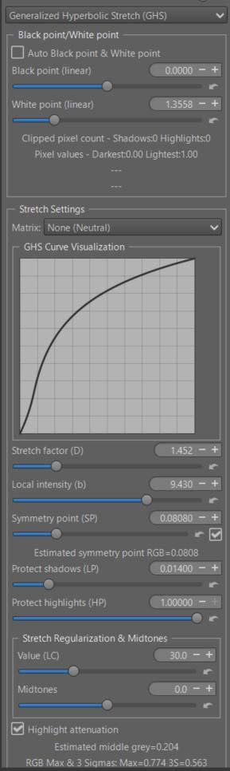
<figcaption>GHS</figcaption>
</figure>

In Global mode.

After Enable 'Auto Black point & White point", I unchecked the box and selected Black point (linear) to minimize out-of-gamuts in shadows.

### Local Contrast & Wavelets

In Global mode.

For further explanation, see the link in 'Selective Editing > Local contrast & Wavelets'

[Local contrast & Clarity](/local_adjustments/#how-to-change-local-contrast--clarity-and-sharp-mask)

<figure>
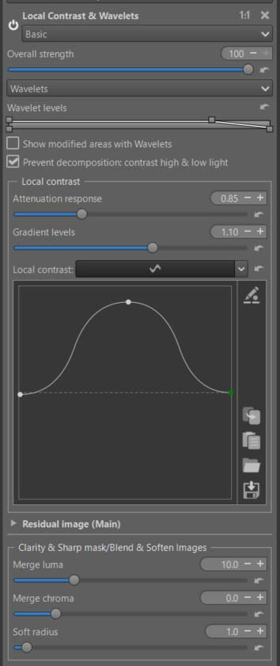
<figcaption>Local Contrast Wavelets - first step</figcaption>
</figure>

**Some remarks**

* Changes the Wavelet levels values; the further the double slider is to the right, the higher the levels will be implemented. Check that the 'preview' size on your system allows for viewing values ​​of 512x512 and 1014x1024. These values ​​will be available in TIF or JPG format.
* Modify the shape of the curve. The essential part is the center. Modifying the left side has little effect, but significantly modifying the right side can lead to artifacts. This has no relation to luminance.
* Look at the effect of 'Attenuation response' and 'Gradient levels' and (in Advanced mode) 'Offset'.
* Also look at the effect of 'Clarity' and the 2 sliders Merge luma & Merge chroma.
* The action takes place across the entire image: the pagodas, but also the buildings, the background, the sky.
* Despite these extreme settings, it seems that halos and artifacts (due to local contrast) are controlled.
* If you wish to implement "Sharp mask" (Clarity & Sharp mask) without making any changes to Local Contrast, you will need to open another Spot with Wavelets levels reduced to Bottom-right at 4.

<figure>
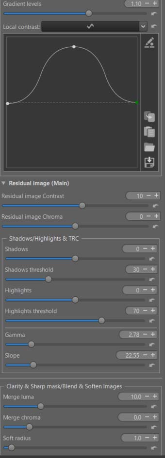
<figcaption>Local Contrast Wavelets - Residual</figcaption>
</figure>

This second screenshot highlights the "Residual image" section. Two settings require your attention:
* Residual image contrast - which will 'balance the overall contrast' with the very strong local contrast
* Gamma and Slope: will brighten the residual image in the shadows and reduce out-of-gamut areas.

**A few views - from TIFF**

Original

<figure>
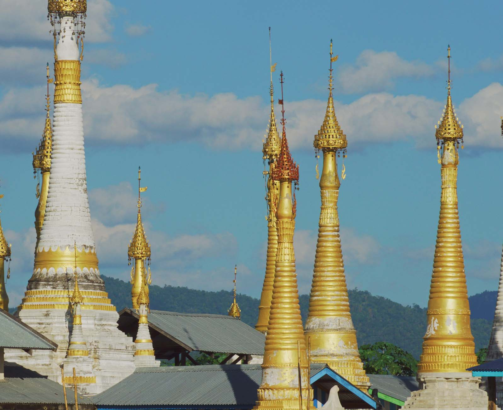
<figcaption>Local Contrast Wavelets - without</figcaption>
</figure>

Local Contrast

<figure>
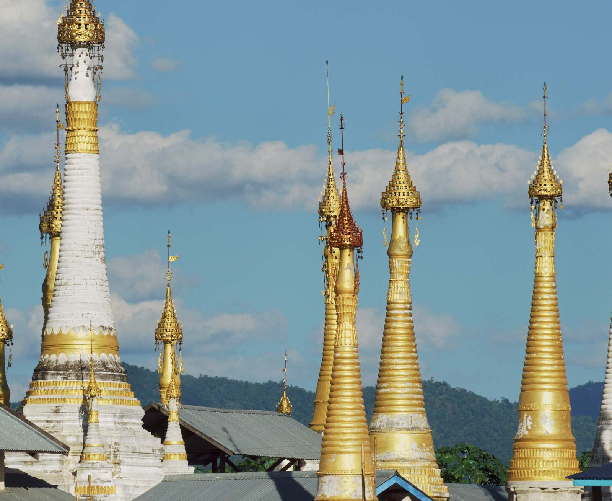
<figcaption>Local Contrast Wavelets</figcaption>
</figure>

Layers - difference
<figure>
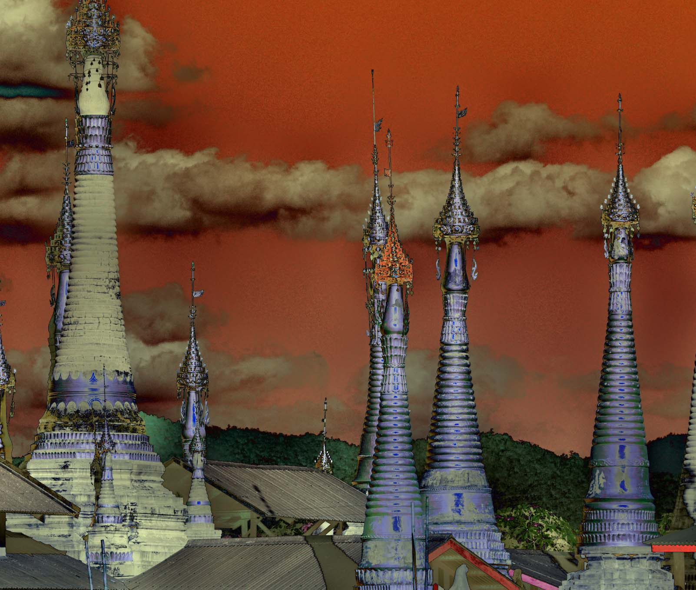
<figcaption>Local Contrast Wavelets - differences</figcaption>
</figure>

A black color indicates that there are no changes. The greater the intensity (luminance) of this difference, the greater the change.

### Abstract Profile : Adjusting Tones

+ Balance the lights in the image.
+ Significantly increase local contrast.
+ Adjust gamma and slope to achieve the desired result and Attenuation threshold. This is where you can change the background, making it darker or lighter by adjusting the 'Slope' setting.
+ The RGBmax indicator should display a value less than 1. If it doesn't, either change the previous AP or GHS settings, or adjust 'Final Gain & Gamut Compression'. You will see the RT process values ​​displayed below the 'Gain (Ev)' and 'Target gamut' settings. To display the data, at least one of the two settings must not be zero or 'None'. I recommend setting 'Target gamut' to sRGB (the same setting you used for Soft Proofing) and in Gamut Compression (Color Tab).
<figure>
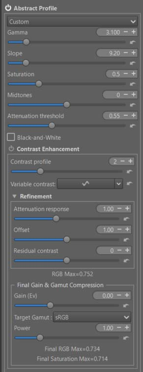
<figcaption>Abstract Profile</figcaption>
</figure>

+ In principle, there’s no point in using the ‘Primaries & Illuminant’ module here.
+ You can easily see the effect of the last controls in 'Final Gain & Gamut Compression', set 'Target Gamut' to 'None' and you will see the out-of-gamut data appear, also observe the histogram.

[TRC Tone Response Curve](/color_management/#trc---tone-response-curve)

### Color Appearance & Lighting
+ No#w we'll explore the new 'Red Green Blue' tool, which will allow you to finely control each of the 3 RGB channels.
+ First : enable ‘Color Appearance & Lighting’ and choose ‘Complexity = Advanced’. This gives you more choices among the CIECAM variables. Thus, you have : Lightness (J) and Contrast (J), Brightness (Q) and Contrast (Q), Chroma (C), Saturation (s), Colorfulness (M), hue raotation (h) , and 3 tones curves for Lightness, Brightness, and Color.
+ Note the default 'Scene conditions' settings which you could change if you know exactly the shooting conditions.
+ Note the default 'Viewing conditions' settings which you could change to adapt them to your viewing environment (the room you are in, its ambiance, the 'Absolute luminance' estimate, and Surround…).
+ I chose 'Lightness + Saturation' and slightly increased the overall saturation and Contrast (J).

[CIECAM](/ciecam02/#color-appearance--lighting-ciecam0216-et-color-appearance-cam16--jzczhz---tutorial)

#### Red - Green - Blue

+  You can modify each R, G, B channel to finely retouch colors or simulate films:
    - Rotate each color by degrees.
    - Change the saturation (s) in the sense of a CAM (Color Appearance Model).
    - Change the brightness (Q) with a curve that allows you to adapt the contrast and brightness to each situation.

+ As a reminder, in CIECAM there are a total of 9 variables, 6 of which are accessible to the user in RT: Lightness (J), Brightness (Q), Saturation (s), Chroma (C), Colorfulness (M), and Hue rotation (h). They are interdependent. For example Chroma = saturation * saturation * brightness.

In the case of the ‘Pagodas’ I arrived at the settings used in pp3. I did not activate the brightness curves because artifacts appeared in the sky at the red and blue transitions.

To simplify use, I’ve only included one slider per channel for hue rotation, and one slider per channel for Saturation (s). I could have also included a tone equalizer for the red, green, and blue range; If that proves useful, aside from complicating the interface, it doesn’t pose any problem. Note that the 3 Brightness curves allow you to adjust the brightness and contrast for each color range. Specifically, brightness acts on the perceived chroma via the (s) Saturation function.

Of course, the settings are quite arbitrary, depending on your tastes.

[Red Green Blue](/ciecam02/#red---green---blue---hue-rotation-h---saturation-s---brightness-curve-q)

<figure>
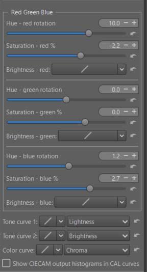
<figcaption>CIECAM Red Green Blue</figcaption>
</figure>

**Threshold Brightness Curves**

 The ‘Threshold Brightness Curves’ aims to limit artifacts due to variations in color differences.

<figure>

<figcaption>red-green-blue Threshold</figcaption>
</figure>

**Back to Abstract Profile**

Return to the Abstract profile, ‘Final Gain & Gamut Compression’ and check the information about gamut control.

## Second tutorial with "Pagodas-1 pp3"

### Pre-tone mapper : Generalized Hyperbolic Stretch
<figure>
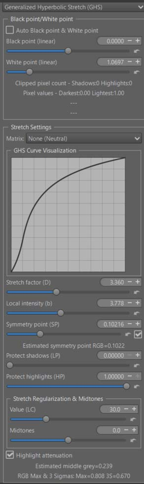
<figcaption>GHS</figcaption>
</figure>

In Global mode.

After Enable 'Auto Black point & White point", I unchecked the box and selected Black point (linear) to minimize out-of-gamuts in shadows.

Note: The higher values ​​of Stretch factor (D) than in the first tutorial

### Local Contrast & Wavelets

In Normal mode.

For further explanation, see the link in 'Selective Editing > Local contrast & Wavelets'

[Local contrast & Clarity](/local_adjustments/#how-to-change-local-contrast--clarity-and-sharp-mask)

<figure>
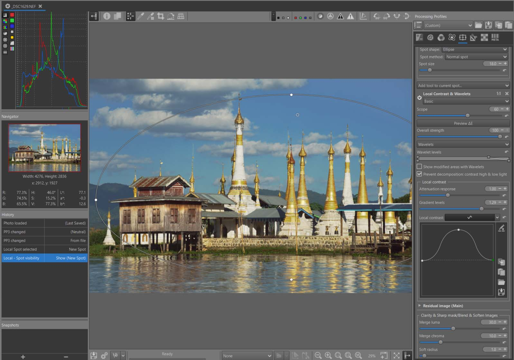
<figcaption>Local Contrast Wavelets - Normal mode</figcaption>
</figure>

**Some remarks**

* Changes the Wavelet levels values; the further the double slider is to the right, the higher the levels will be implemented. Check that the 'preview' size on your system allows for viewing values ​​of 512x512 and 1014x1024. These values ​​will be available in TIF or JPG format.
* Modify the shape of the curve. The essential part is the center. Modifying the left side has little effect, but significantly modifying the right side can lead to artifacts. This has no relation to luminance.
* Look at the effect of 'Attenuation response' and 'Gradient levels'
* Also look at the effect of 'Clarity' and the 2 sliders.
* The action is limited by the shape of the Spot and the deltaE, to favor the 'pagodas' and, to a lesser extent, the Buildings, and to avoid influencing the sky too much.
* Of course, you can change the position of the Spot's center, the Spot's shape, and the Scope value, depending on the desired effect.
* Note the higher values ​​in the settings for both 'Local contrast' and 'Clarity'
* Despite these extreme settings, it seems that halos and artifacts (due to local contrast) are controlled.
* If you wish to implement "Sharp mask" (Clarity & Sharp mask) without making any changes to Local Contrast, you will need to open another Spot with Wavelets levels reduced to Bottom-right at 4.

<figure>
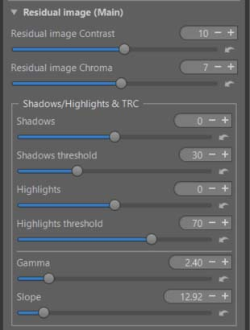
<figcaption>Local Contrast Wavelets - Residual</figcaption>
</figure>

This second screenshot highlights the "Residual image" section. Two settings require your attention:
* Residual image contrast - which will 'balance the overall contrast' with the very strong local contrast
* Residual image chroma.

**A few views - from TIFF**

Original

<figure>
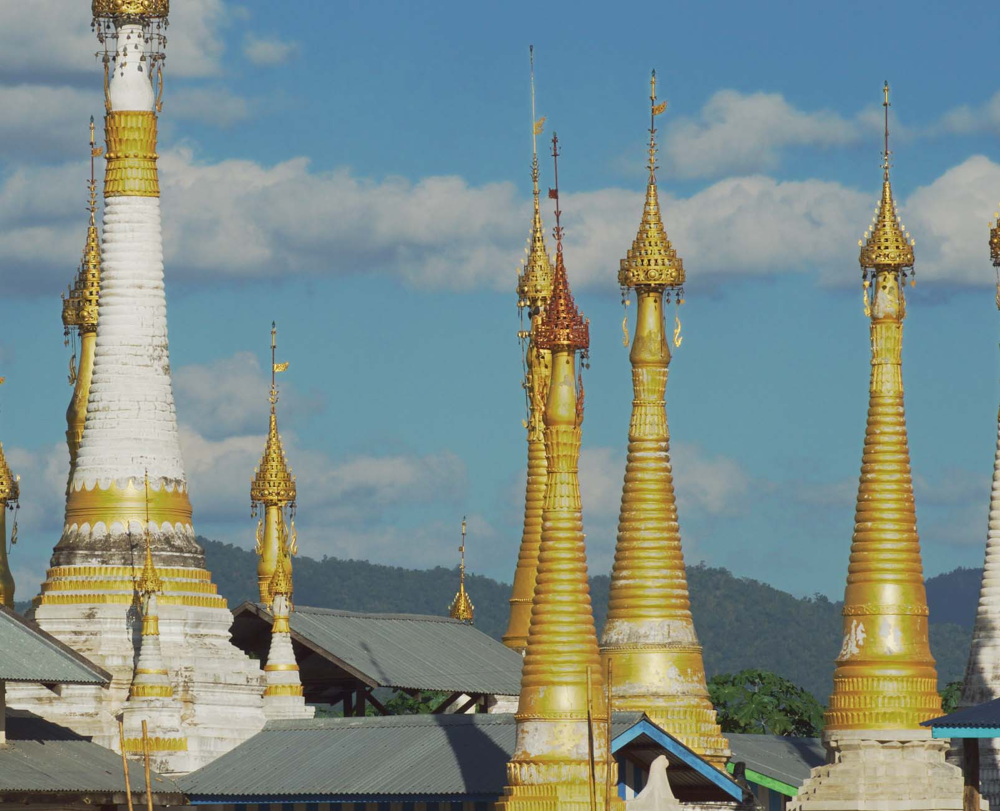
<figcaption>Local Contrast Wavelets - without</figcaption>
</figure>

Local Contrast

<figure>
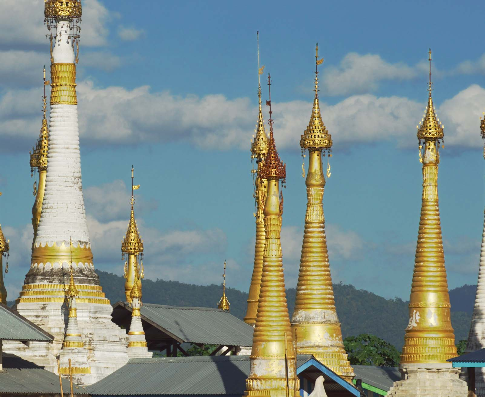
<figcaption>Local Contrast Wavelets</figcaption>
</figure>

Layers - difference
<figure>
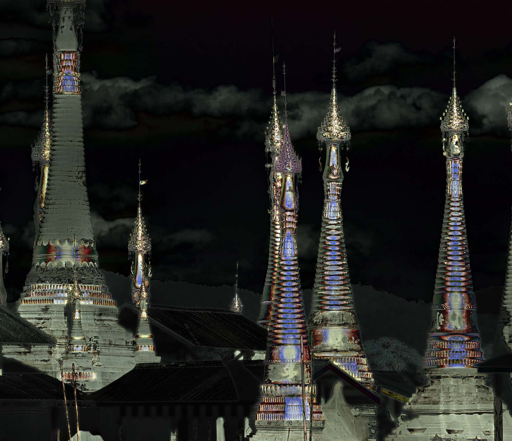
<figcaption>Local Contrast Wavelets - differences</figcaption>
</figure>

A black color indicates that there are no changes. The greater the intensity (luminance) of this difference, the greater the change.

### Color Appearance (CAM16 & JzCzHz) - the Pagodas

**Settings**

<figure>
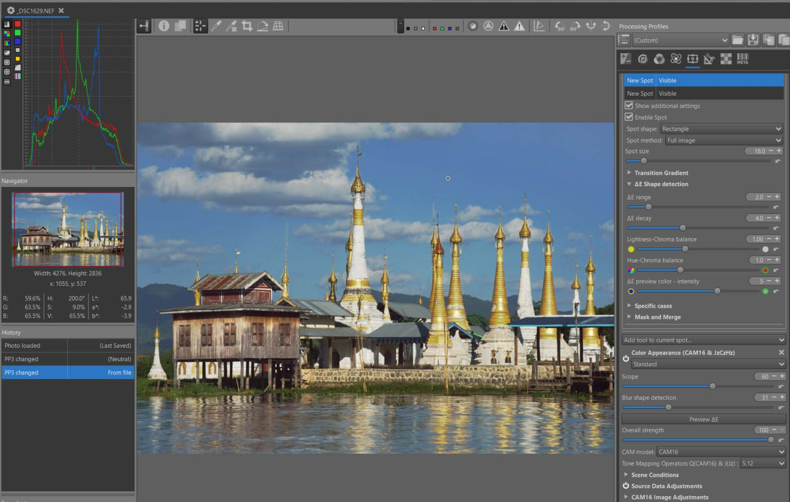
<figcaption>CAM16 - Pagodas</figcaption>
</figure>

Note:
* Full image
* In Settings : ΔE decay set to 4 - to avoid artifacts in sky
* Scope = 60
* Blur shape detection set to 31 - to avoid artifacts and out of gamut.

**Source Data Adjustments**

<figure>
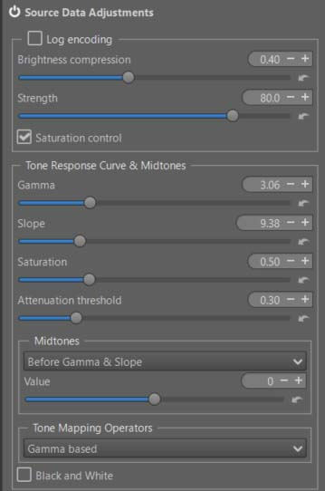
<figcaption>CAM16 - Pagodas - Source Data Adjustments</figcaption>
</figure>

Note:
* Gamma and Slope
* Attenuation threshold - to avoid out of gamut.
* Tone Mapping Operators - Gamma based - to avoid out of gamut.
 
**CAM16 Image Adjustments**

<figure>
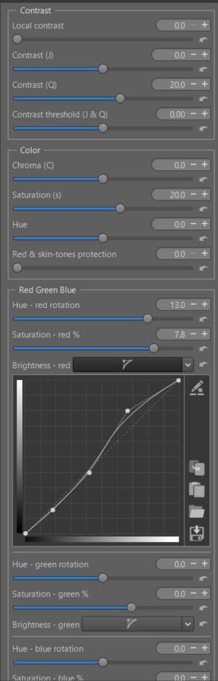
<figcaption>CAM16 - Pagodas - Image adjustments</figcaption>
</figure>

Note:
* Contrast (Q) = 20
* Saturation (s) = 20
* Hue - red rotation set to 13,  to "facilitate" the gamut in the yellows.

**Final Gain & Gamut Compression**

<figure>
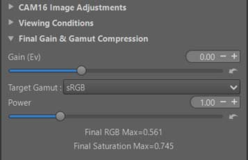
<figcaption>CAM16 - Pagodas - Final Gain & Gamut Compression</figcaption>
</figure>

Try disabling Gamut Compression: Target gamut = none.

### Color Appearance (CAM16 & JzCzHz) - the Sky

**Settings**

<figure>
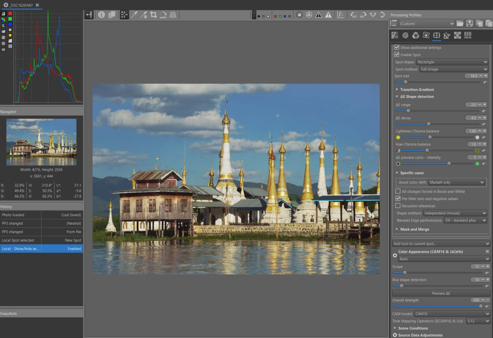
<figcaption>CAM16 - Pagodas Sky</figcaption>
</figure>

Note:
* Full image
* In Settings : ΔE decay set to 4 - to avoid artifacts in sky
* Scope = 12
* Blur shape detection set to 10 - to avoid artifacts and out of gamut.

**Source Data Adjustments**

<figure>
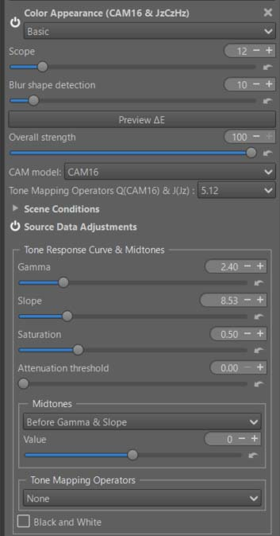
<figcaption>CAM16 - Pagodas - Sky - Source Data Adjustments</figcaption>
</figure>

Note:
* Gamma and Slope

 
**CAM16 Image Adjustments**

<figure>
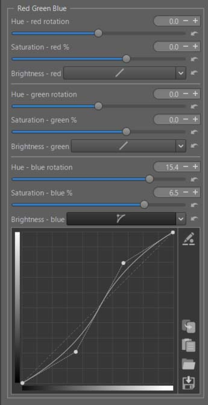
<figcaption>CAM16 - Pagodas - Sky - Image adjustments</figcaption>
</figure>

Note:
* Hue - blue rotation set to 15.4
* Saturation - blue set to 6.5
* Curve brightness

**Threshold Brightness Curves**

 The ‘Threshold Brightness Curves’ aims to limit artifacts due to variations in color differences.

<figure>

<figcaption>red-green-blue Threshold</figcaption>
</figure>

**Final Gain & Gamut Compression**

<figure>
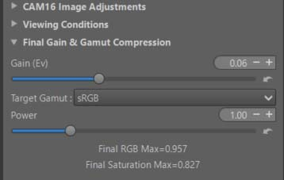
<figcaption>CAM16 - Pagodas - Sky - Final Gain & Gamut Compression</figcaption>
</figure>

## Synthesis - Pagodas

Of course, this image is just one case among many; each image is unique. But overall:
* Unless you need the advanced features of Color Appearance & Lighting (CIECAM).
* I think it's better to use 'Selective Editing > Color Appearance (CAM16 & JzCzHz)' and 'Selective Editing > Local Contrast & Wavelets'
* The system offers more flexibility and allows for better control of out-of-gamut effects and artifacts.
* This choice allows for more differentiated action of Local Contrast, and better color management.

As a reminder, the settings are very pronounced for educational purposes. In reality, lower values ​​are preferable.

