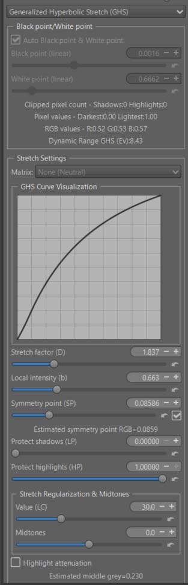
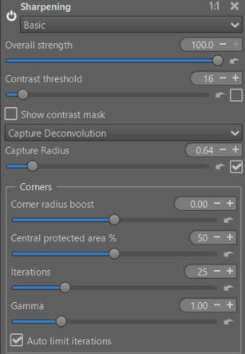
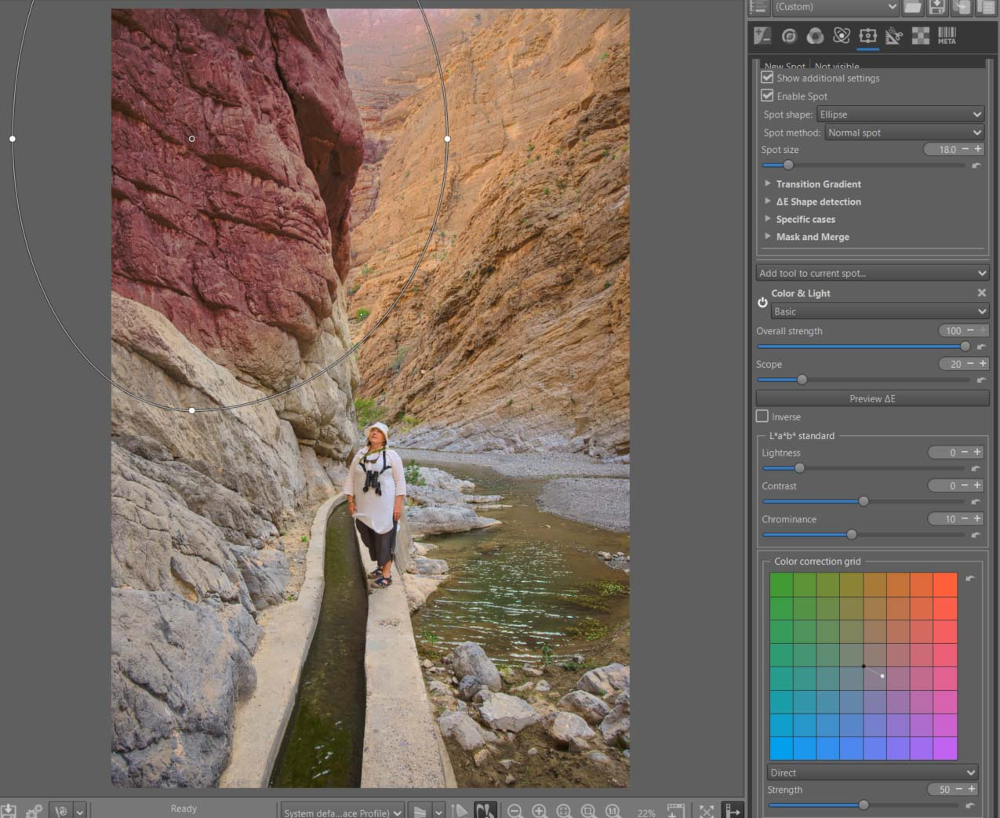
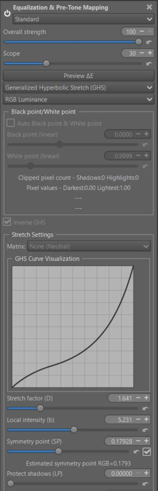
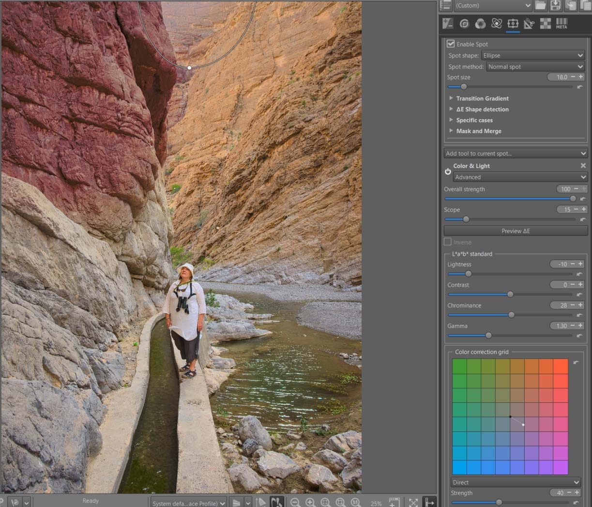
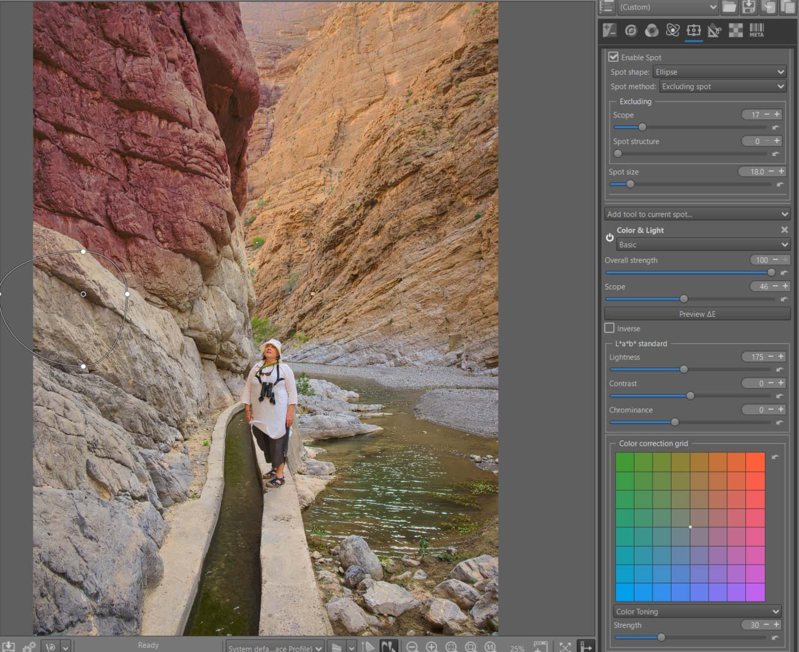
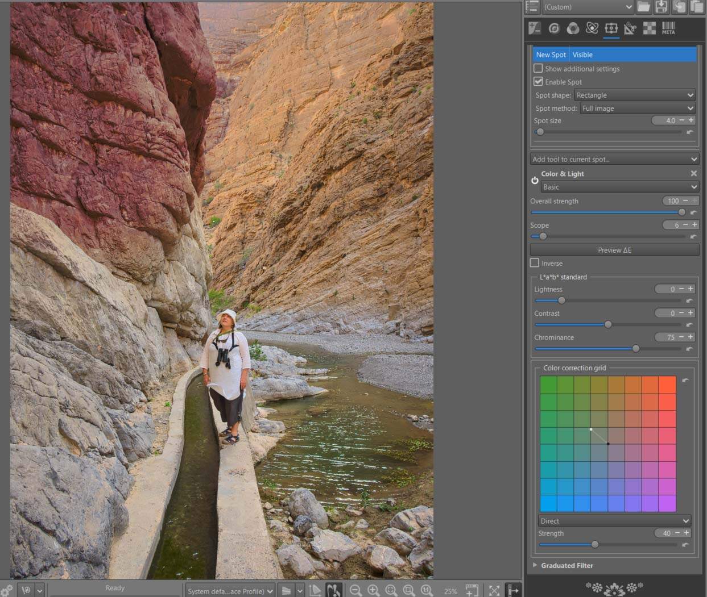
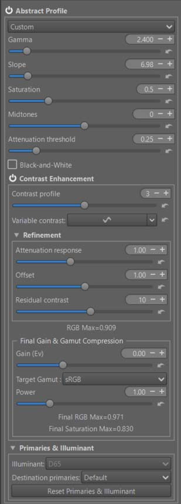
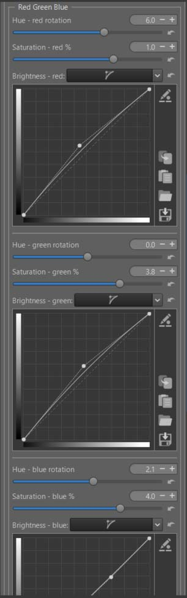
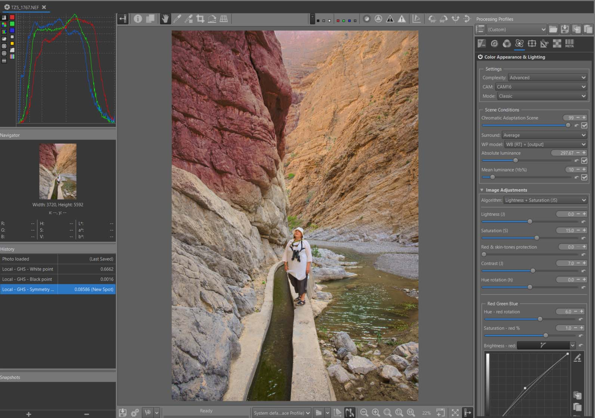

## Introduction

I extracted this tutorial from an ongoing thread, which is referenced with the image link below, in order to preserve this tutorial over time (Thanks to its author).

[Original Raw NEF](https://discuss.pixls.us/t/selective-editing/54199)

- pp3 file: [Red rocks](tz5_1767-ghs.pp3 "tz5_1767-ghs.pp3")

At first, I thought this image was from a Gorge near my home, in the hinterland of Nice in France. It’s less than 100km from where I live. I haven’t been there in a while, but it does somewhat resemble this Middle Eastern landscape. The colors of the rock near Nice are redder. So I tried to recreate this effect (it’s subjective). Here is a link in French, but there are other sites

[Gorges du Cians](https://www.alpesdazur-tourisme.fr/les-essentiels/gorges-du-cians-et-de-daluis-bienvenue-dans-le-colorado-nicois/)

I’m going to show you how to process this image; some of the settings might be excessive. My aim is to teach through example, rather than focusing on the final result itself. The most important thing for any photography enthusiast is that they are happy with the outcome. Of course you can criticize, add treatments, remove some… and say ‘it’s better with XXX’

 [Some principles](/tutorials/introduction/#in-summary-some-principles)

 [Recommendations](/tutorials/introduction/#recommendations)

 [Specific tools used](/tutorials/introduction/#specific-tools-used)

 [Alternatives](/tutorials/introduction/#alternatives)

## First steps
+ Set to Neutral.
+ Activate ‘Highlight reconstruction > Color propagation’, and check the image and histogram to ensure there is no change. Since there appears to be no effect, deactivate ‘Highlight reconstruction’.
+ Go to the ‘Color tab’ and enable 'Gamut compression’. I’ve chosen ‘sRGB’ as the ‘Target Compression Gamut’, which should be suitable for most users with a standard monitor. Again, double-check that there are no changes to the image or histogram, and examine the information line under ‘Maximum achromatic value’. You’ll see three values: R :, G :, and B :, which correspond to the maximum of the three channels (in sRGB). In this case, they are all much lower than 1. This suggests that the image has been underexposed. We’ll see what to do with this information later. Then deactivate ‘Gamut compression’
+ Go to 'Raw tab > Capture Sharpening’, activate it, and check that ‘Contrast threshold’ is not set to zero. If it is, you will need to adjust ‘Presharpening denoise’. Leave the default settings and leave ‘Capture Sharpening’ enabled.
+ Go to ‘Color tab > White Balance’ and choose ‘Automatic & Refinement > Temperature correlation’. This algorithm compares up to 236 colors in the image with over 400 spectral reference colors. Some of these colors are in ‘Beta RGB’, the smallest color space encompassing ‘Pointer’s gamut’ (the reflected colors seen by humans), while others are in the entire visible spectrum (ACES-P0). Try the two settings ‘Medium sampling - near Pointers’s gamut’ and ‘Close to full CIE diagram’. You’ll see a difference in the calculations, which is probably due to the slightly hazy upper area of ​​the image – perhaps corresponding to a break in the sunlight. I chose to keep the first setting. Note that these references are only used for calculations and have no direct relation to the ‘Working Profile’ or ‘Output profiles’. It makes no sense to use it with illuminants other than Daylight and Blackbody:
 [Temperature correlation](/tutorials/#white-balance---temperature-correlation)

## Selective Editing - 5 RT-spots

### First spot : Generalized hyperbolic stretch (GHS)
<figure>

<figcaption>GHS settings</figcaption>
</figure>

+ activate the checkbox 'Auto black point & White point', and also 'Symmetry point (SP)'.
+ you can see the two settings found by the algorithm which show the underexposure of the image. After these settings, the data is in Rec2020 in the interval [0 1]. BP (linear) = 0.0016, WP (linear) = 0.6662.

### First spot : Sharpening

+ To add a bit more vibrancy to this somewhat dull image, although that's not strictly Capture Deconvolution's purpose.
<figure>

<figcaption>Sharpening - Capture deconvolution</figcaption>
</figure>

### Second spot : Color & Light
+ The goal is to make the upper left part of the rock much redder, like in the Cians gorges.
<figure>

<figcaption>Red as Gorges du Cians</figcaption>
</figure>

### Second spot : Inverse GHS
+ The goal is to darken this part to make it even redder.
<figure>

<figcaption>Inverse GHS</figcaption>
</figure>

+ note : the scope value; the shape of 'GHS Curve Visualisation' which works 'in reverse.

### Third spot : Increase the sense of clarity in the upper part of the image

The goal is to increase the sense of clarity in the upper part of the image. To do this, I use 'Color correction grid'

<figure>

<figcaption>Clarity</figcaption>
</figure>

### Fourth spot: retouch the colors below the red part of the rock
+ The goal is to shed light on this dark area.
+ Note : the Excluding Spot.
<figure>

<figcaption>Excluding Spot</figcaption>
</figure>

### Fifth spot: make the little greenery greener
+ for this, I use a full-image Spot.
+ the center of the Spot, whose Spot size I reduced to 4, is located in a small bush above the woman's head, near the red rock (difficult to see).
+ the Scope value is very low in order to pinpoint that color (the small green bushes).
<figure>

<figcaption>Green bushes</figcaption>
</figure>

## Abstract profile
+ Balance the lights in the image.
+ Significantly increase local contrast.
+ Adjust gamma and slope to achieve the desired result and Attenuation threshold.
+ Enable ‘Contrast Enhancement’ - The default settings should be suitable in most cases.
+ The RGBmax indicator should display a value less than 1. If it doesn't, either change the previous AP or GHS settings, or adjust 'Final Gain & Gamut Compression'. You will see the RT process values ​​displayed below the 'Gain (Ev)' and 'Target gamut' settings. To display the data, at least one of the two settings must not be zero or 'None'. I recommend setting 'Target gamut' to sRGB (the same setting you used for Soft Proofing) and in Gamut Compression (Color Tab).
<figure>

<figcaption>Abstract Profile</figcaption>
</figure>

[TRC Tone Response Curve](/color_management/#trc---tone-response-curve)

[Contrast Enhancement](/color_management/#contrast-enhancement)

## Color Appearance & Lighting
+ Now we'll explore the new 'Red Green Blue' tool, which will allow you to finely control each of the 3 RGB channels.
+ First : enable ‘Color Appearance & Lighting’ and choose ‘Complexity = Advanced’. This gives you more choices among the CIECAM variables. Thus, you have : Lightness (J) and Contrast (J), Brightness (Q) and Contrast (Q), Chroma (C), Saturation (s), Colorfulness (M), hue raotation (h) , and 3 tones curves for Lightness, Brightness, and Color.
+ Note the default 'Scene conditions' settings which you could change if you know exactly the shooting conditions.
+ Note the default 'Viewing conditions' settings which you could change to adapt them to your viewing environment (the room you are in, its ambiance, the 'Absolute luminance' estimate, and Surround…).
+ I chose 'Lightness + Saturation' and slightly increased the overall saturation and contrast (J)

[CIECAM](/ciecam02/#color-appearance--lighting-ciecam0216-et-color-appearance-cam16--jzczhz---tutorial)

### Red - Green - Blue

+  You can modify each R, G, B channel to finely retouch colors or simulate films:
    - Rotate each color by degrees.
    - Change the saturation (s) in the sense of a CAM (Color Appearance Model).
    - Change the brightness (Q) with a curve that allows you to adapt the contrast and brightness to each situation.

+ As a reminder, in CIECAM there are a total of 9 variables, 6 of which are accessible to the user in RT: Lightness (J), Brightness (Q), Saturation (s), Chroma (C), Colorfulness (M), and Hue rotation (h). They are interdependent. For example Chroma = saturation * saturation * brightness.

In the case of the ‘Red rocks’ I arrived at the settings used in pp3, using ‘Soft proofing’ to control the gamut.

To simplify use, I’ve only included one slider per channel for hue rotation, and one slider per channel for Saturation (s). I could have also included a tone equalizer for the red, green, and blue range; If that proves useful, aside from complicating the interface, it doesn’t pose any problem. Note that the 3 Brightness curves allow you to adjust the brightness and contrast for each color range. Specifically, brightness acts on the perceived chroma via the (s) Saturation function.

Of course, the settings are quite arbitrary, depending on your tastes.

<figure>

<figcaption>CIECAM Red Green Blue</figcaption>
</figure>

**Threshold Brightness Curves**

 The ‘Threshold Brightness Curves’ aims to limit artifacts due to variations in color differences.

<figure>

<figcaption>red-green-blue Threshold</figcaption>
</figure>

[Red Green Blue](/ciecam02/#red---green---blue---hue-rotation-h---saturation-s---brightness-curve-q)

**Back to Abstract profile**

Check that the data displayed in ‘Final Gain & Gamut Compression’ is within limits, correct it if necessary, but be careful with the gamut.

##  Image at the end of Game Changer

<figure>

<figcaption>Les Gorges du Cians</figcaption>
</figure>

