In this tutorial, we will explore how to avoid or remove artifacts. Then I
will propose a single tool that is effective for brightening shadows,
controlling highlights, and creating dramatic effects. 

This image is a real challenge (thanks to its author): usually we struggle
with highlights, but here there are both highlights and, above all, very
(very) dark shadows, with values close to, or even at, zero.

Beyond the aesthetic aspect of the result, there is above all a technical
challenge in terms of methods. 

I deliberately chose extreme settings to show that even with a 'degraded'
starting image it is possible to obtain a more than acceptable result; for
example the "Contrast Enhancement" values are huge.

## Image selection

This image was shared by [Thumper](https://discuss.pixls.us/u/thumper) on
the [pixls.us](https://discuss.pixls.us/u/thumper)
[forum](https://discuss.pixls.us/t/show-your-best-shadow-highlight-techniques/55731). 
Thumper generously licensed his work under the [Creative Commons,
By-Attribution,
Share-Alike](https://creativecommons.org/licenses/by-sa/4.0/) license.

I also include two RawTherapee `pp3` sidecar files that we will use below:

- pp3 file 1: [First example with Color Propagation](1q8a5461.cr3-jd-std.pp3 "first-cp.pp3")
- pp3 file 2: [Second example with Color Propagation and blur](1q8a5461.cr3-jd-blur.pp3 "second-cp-blur.pp3")

## Image : neutral
Here is a screenshot of the image in `neutral` mode with `Lockable Color
Pickers`. You can immediately see that the photographer has underexposed
the overall frame to avoid overexposing the sunset sky. Despite this
choice, potential artifacts are already appearing in the area of the sky
near the power pole. See also the histogram in 'linear' mode.



Things to note:

+ The Raw histogram is not 'abnormal', but there are very few values
  outside the shadows. The blue channel is dominant.
+ The Metadata: the camera used is a recent 24x36 camera - Canon EOS R6
  with a good quality 50mm f/1.8 lens, open to 2.8. ISO = 100. Shooting in
  'auto' mode.
+ The data is in the 'black' part of the image. There are two groups (peaks
  on the histogram): values with R=0.4%, G=0.4%, and B=0.4%, and others
  with R=0%, B=0%, and G=0%. In Lab mode, there are values with L=0, a=1,
  and b=-4 (which is theoretically impossible).
+ As soon as we want to edit something, we see (with the help of the
  histogram, the soft proofing, and of course, the examination of the
  image), artifacts appearing:
  - In the deep shadows, numerous 'green dots' appear (make sure you have
    turned on  `Soft-proofing` and
    
    `Highlight pixels with out of gamut colors` on the bottom of the editor
    panel to see this).
  - The area near sunset is dotted with artifacts of several types.
  <!-- TWS: What type of artifacts? Can we show a close-up example? -->
  - The transition zones in the sky, between the reddish clouds and the
    clear blue sky, show very poor transitions. 
+ If the author has access to [Dark Frame](/dark-frame) or [Flat
  field](/flat-field) reference images they could be used to correct some
  of these problems. For this exercise we will assume they aren't available.

## Learning objective

The user will understand the ‘Game changer’ approach discussed in this tutorial:
+ The role of `Raw` Tab tools, in particular to combat artifacts.
+ The importance of `Color Propagation`, including in (very) deep shadows.
+ The importance of Gamut Compression.
+ White Balance optimization - Temperature correlation.
+ The role of `Graduated Filter`.
+ The importance and settings of `Abstract Profile` - with a reasoned use of
  primaries, and the use of very high local contrast to enhance the
  dramatic effect (Note that the halos are barely visible, even with these
  unusual settings).
+ The combined use of `Selective Editing` > `Generalized Hyperbolic Stretch`
  (GHS) & `Michaelis-Menten` (MM) and 2 `Excluding Spots`.
+ The use of `Color Appearance & Lighting` and the possible corrections of
  the 3 channels R, G, B.

I will present two possible processing methods using two pp3 files. I will
describe the first; the reader can discover the second for themselves. The
essential difference lies in the `Color Propagation` and `Raw Black Points`
settings.

I've separated the tools as they appear in the interface, but it would be
more accurate to refer to them as Raw processes. From my perspective, tools
like `Color Propagation`, which is activated immediately after assigning
the `Working Profile`, and `White balance Temperature correlation`, which
is activated immediately after demosaicing, fall under the `Raw` category.

Do not attempt to reduce noise, whether using in `Capture Sharpening`,
`Presharpening denoise`, `Post-sharpening denoise`, or `Noise reduction`
(Detail tab); you will only degrade the image. The only option, if desired,
is to add an additional RT-Spot to the sky (or part of the sky) using
`Selective Editing` > `Blur/Grain & Denoise` > `Denoise`.

## Raw tools

Find these tools under the  raw tab on the
toolbar. 

### Demosaicing

+ The choice of `Amaze+VNG4` allows for good detail rendering of structures
  and a possible reduction of artifacts in flat areas.
+ False color suppresion steps: setting it to 4 slightly reduces artifacts





More on [demosaicing](/demosaicing/)

### Raw Black Points

<!-- Do we need to include the Dehaze system in this discussion? It doesn't work -->
<!-- well for this image, and from the name ("dehaze") I wouldn't expect it to. -->

The `Dehaze` system designed by Ingo Weirich (thanks to him) suggests here,
due to the difference between the values R=0, G=0, B=0 and the very low
values R=0.4%, G=0.4%, B=0.4%, that it's a haze problem. I think that's not
the case -- we're dealing with shadow detail lost due to the image being
underexposed, the same way we lose highlight detail when an image is
overexposed.

<!-- The following two points are phrased as if these changes will be visible at -->
<!-- this early stage of the processing. I found that confusing, as the -->
<!-- differences are very subtle. It's not clear why Blue = 5 is better than -->
<!-- Blue = +2 -->

+ First, try the "Dehaze" checkbox; you'll see the sliders move to the
  right, the histogram expands, especially to the left (the shadow areas),
  and the image is brighter and more colorful: Red:+1, Green 1:+7, Green
  2:+7, Blue:+2.
+ Second, increase the settings (by unchecking the 'Dehaze' box) : Red:+3,
  Green 1:+14, Green 2:+8, Blue:+5. You will again notice a more vivid
  image, a better utilized histogram, and a reduction in artifacts.

More on [Raw Black Points](/raw_black_points/)



Below, you can see the influence of Raw Black Points on the image at the
end of the process (i.e., after all the processing steps below have been completed). 
+ Note the difference on the horizontal axis, close to zero.
+ Note that the overall histogram is better filled.

<figure>
    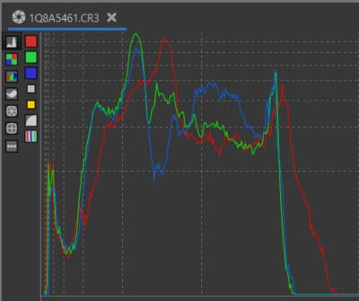
    <figcaption>Histogram without Raw Black points</figcaption>
</figure>

<figure>
    
    <figcaption>Histogram with Raw Black points</figcaption>
</figure>

+ Be **very careful**, these settings are very sensitive and can contribute
  to making the images unusable. 

### Chromatic Aberration Correction
+ We can reduce some minor artifacts caused by Chromatic Aberration by
  manually adjusting the red and blue channels. (Note that we're using the
  `Chromatic Aberration Correction` tool in the `Raw` tab here, not the
  tool with the same name in the `Transform` tab.)
 
<figure> 
    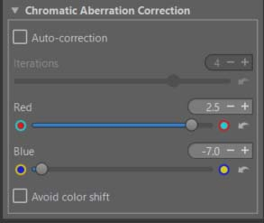
    <figcaption>Chromatic Aberration Correction</figcaption>
</figure>

More on [Chromatic Aberration](/chromatic_aberration/).

### Preprocess White Balance
I chose "Camera" which seems to produce a better result. During the Raw
pre-processing, when nothing is determined, it's necessary to choose a
temperature to quantify the data. This is either the 'Camera' value present
in the Exif, or a rough calculation done with 'Automatic RGB Grey'.

<figure>
    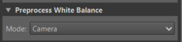
    <figcaption>Preprocess WB</figcaption>
</figure>

### Capture Sharpening

+ Activating Capture Sharpening works without any problems. The contrast
  threshold is not set to zero. It will recover details lost due to
  in-camera blurring.

<figure>
    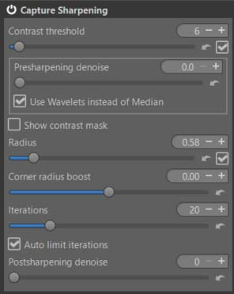
    <figcaption>Capture Sharpening</figcaption>
</figure>

More on [Capture Sharpening](/capture_sharpening/)

### Color Propagation

+ Observing the reaction of the modules mentioned in the recommendations,
  the contribution of "Color Propagation" is small on the 'numbers', but
  not negligible. On the other hand, and this is its initial role, it
  allows the recovery of 'lost' data in highlight, but also in very deep
  shadow.
+ If you try another tool in 'Highlight reconstruction', such as 'Inpaint
  opposed' you will see that it has no effect on very deep shadow.
+ The first example is without the 'Blur' slider in 'Color Propagation'
  being activated. This slider allows you to adjust the transitions between
  'recovered' (and therefore lost) areas and healthy areas. This also led
  to a change in the 'Raw Black Points' setting.
  - [Recommendations](/tutorials/introduction/#recommendations)

#### White Balance - Temperature correlation

To fully utilize the capabilities of `White Balance Auto temperature correlation`, you can activate the corresponding checkbox in `Preferences` > `Color Management`
<figure>
    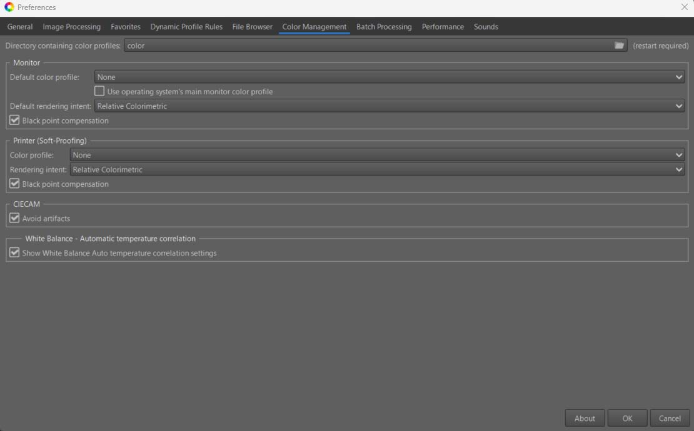
    <figcaption>Preferences - Color Management</figcaption>
</figure>

+ Once this choice is made, you can select `Close to full CIE diagram`,
  because clearly with this sky we are beyond the reflected colors and the
  default selection `Medium sampling - near Pointers's Gamut`.
+ You can also check `Remove 2 pass algorithms` which seems to give a
  slightly more 'dramatic' result (but that's a matter of perspective).
+ You could also, but it doesn't seem necessary here, use `Green
  refinement` which can in some cases compensate for the algorithm's
  shortcomings.

<figure>
    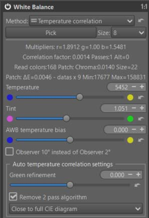
    <figcaption>White Balance - Temperature correlation</figcaption>
</figure>

+ The automatic calculation always performs two passes: the first with the
  base results, and a second to try to get closer to D50, thus avoiding
  color adaptation (which can be done in `Automatic Symmetric` mode using
  Color Appearance & Lighting). The choice is up to the user. Among the
  criteria is the `Correlation factor`; the smaller it is, the better. The
  other criterion is the `Size`, which is the number of colors found to be
  significant for comparison with the reference spectral colors
  (approximately 400). The larger the `Size`, the better. Note that it may
  be affected by chromatic noise.

[Temperature correlation](/white_balance/#the-temperature-correlation-algorithm)

#### Gamut Compression

As a reminder, this algorithm does not perform a "conversion" but
compresses the data to the output profile (in linear mode, without gamma).
It will ensure, at _a minima_, that the data will be within the gamut.
Hence the importance of examining the histogram in mode `gamma-corrected`
**`output profile`**

<figure>
    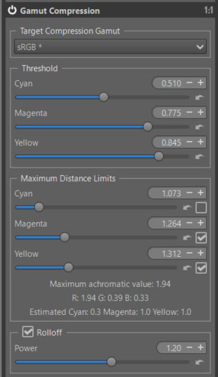
    <figcaption>Gamut Compression</figcaption>
</figure>

+ I made a few small changes to the default settings, but you can try
  modifying all 3 `Threshold` values as well as `Rolloff & Power`. 

[Gamut Compression](/gamut_compression/)

#### Selective Editing - Five RT-Spots

##### The first - Equalization & Pre-Tone Mapping - Michaelis-Menten (MM)

<figure>
    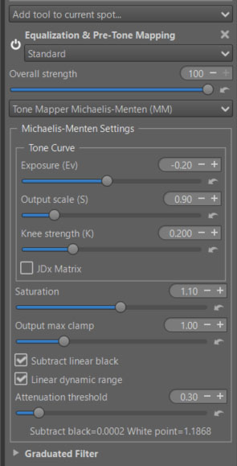
    <figcaption>Michaelis-Menten Global mode</figcaption>
</figure>

+ I used this module (MM) rather than (GHS), not because it's simpler, but
  because, unlike GHS, it doesn't rely on an algorithm to calculate 'Linear
  White Point', and especially 'Linear Black point' in this case. When I
  designed GHS, I assumed that a reduced value of 0.001 was negligible;
  however, it isn't here, in this very specific image, and necessitates a
  manual correction (in negative) of the Black point. 
+ Note the preferred use of the two 'hyperbolic' parameters - Output scale
  (S) and Knee strength (K). Exposure (Ev) is considered only as an
  adjustment. 
+ Note the use of checkboxes (uncheck them all first). Start with `Subtract
  linear black`; you'll see the histogram compress towards the left, even
  with the work done beforehand in the Raw section. Then activate `Linear
  dynamic range`; the histogram will be compressed by roughly 1.18 (see the
  values displayed below). The asymptote for highlights will be better
  defined, and contrast and saturation will increase. 
+ The other settings - which are also important - are part of the chain of
  mastering gamut and artifacts. 

[Michaelis-Menten](/local_adjustments/#michaelis-menten---mm---origin)

##### The second - Equalization & Pre-Tone Mapping - Generalized Hyperbolic Stretch (GHS)

<figure>
    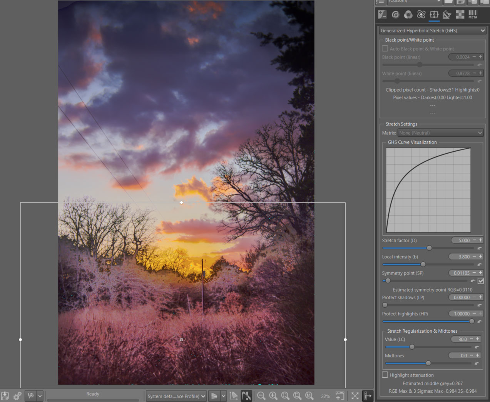
    <figcaption>GHS lightens the shadows</figcaption>
</figure>

+ Choose a Normal RT-Spot 'Rectangle', with a small Scope value, so as not
  to interfere with the sky. Of course, DeltaE and transitions apply; the
  limits of the RT-spot are of little importance. 
+ Due to RT issues with the Preview, set the image to 'fit to screen', and
  enable `Auto Black point & White point`. Then disable it. 
+ Activate `Auto Symmetry point (SP)`.
+ Adjust `Stretch factor (D)` and `Local intensity (b)` to achieve the
  desired effect. 

[Generalized Hyperbolic Stretch](/local_adjustments/#generalized-hyperbolic-strech---ghs---origin)

##### The third - Color & Light - Excluding Spot

<figure>
    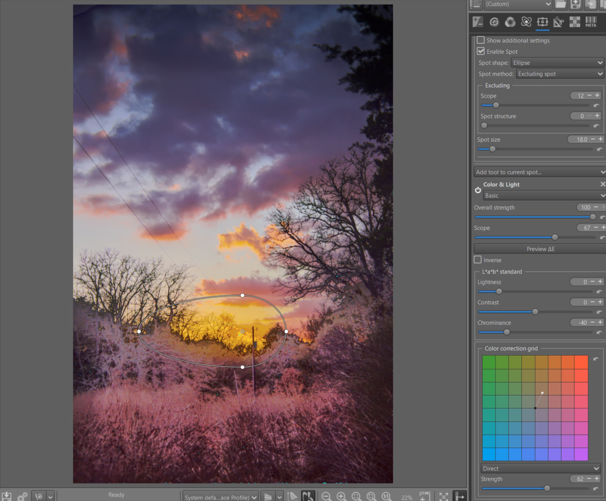
    <figcaption>Excluding spot - remove artefacts - change color</figcaption>
</figure>

+ This Spot Exclusion will undo all changes and allow you to add more. It
  will remove (at least partially) some of the artifacts and amplify the
  sky color to make it more dramatic. 
+ Note the use of 'Color correction grid'.

[Four Types of RT-spot](/local_adjustments/#the-four-types-of-rt-spot)

##### The fourth - to reduce artifacts

<figure>
    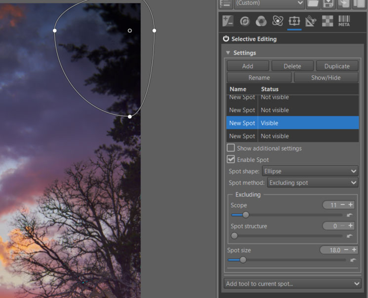
    <figcaption>Excluding spot - remove artefacts</figcaption>
</figure>

##### The fifth - Equalization & Pre-Tone Mapping - Standard - (GHS) increases the dramatic aspect of the sky

<figure>
    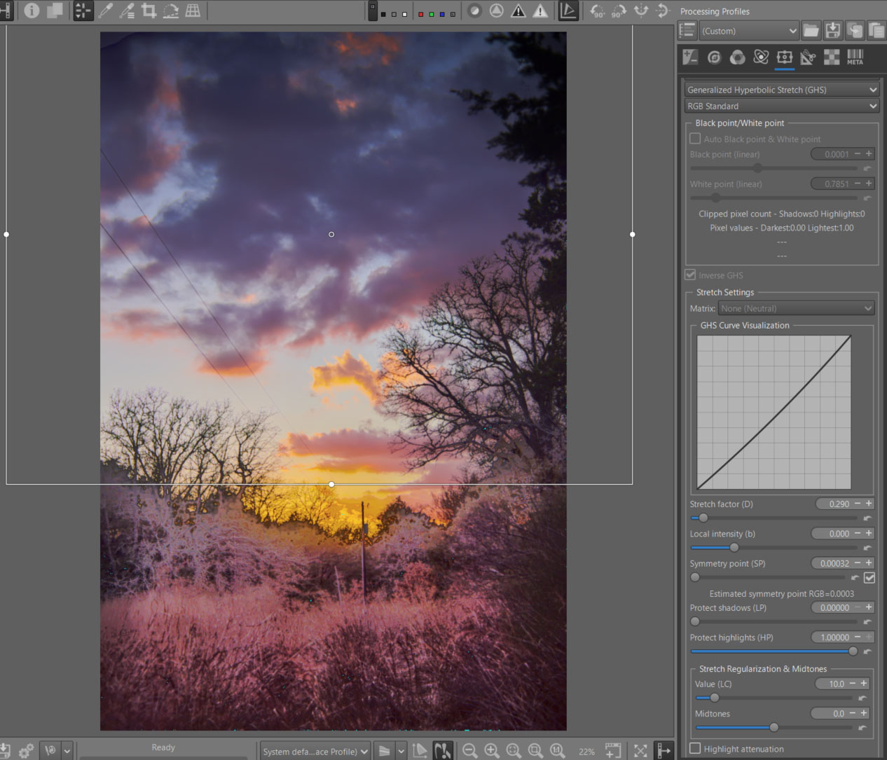
    <figcaption>GHS - Inverse mode - increases the dramatic aspect of the sky</figcaption>
</figure>

+ To enhance the dramatic effect of the sky, I used GHS's `Inverse` mode,
  which allows it to either reverse the image or reduce contrast and
  highlights. That's what was done here. 
+ Note the need to switch the complexity mode to 'Standard' to have the
  'Inverse' mode available. 
+ Activate `Auto Symmetry point (SP)`.
+ Adjust `Stretch factor (D)` and `Local intensity (b)` to achieve the desired effect.

#### Graduated Filter

<figure>
    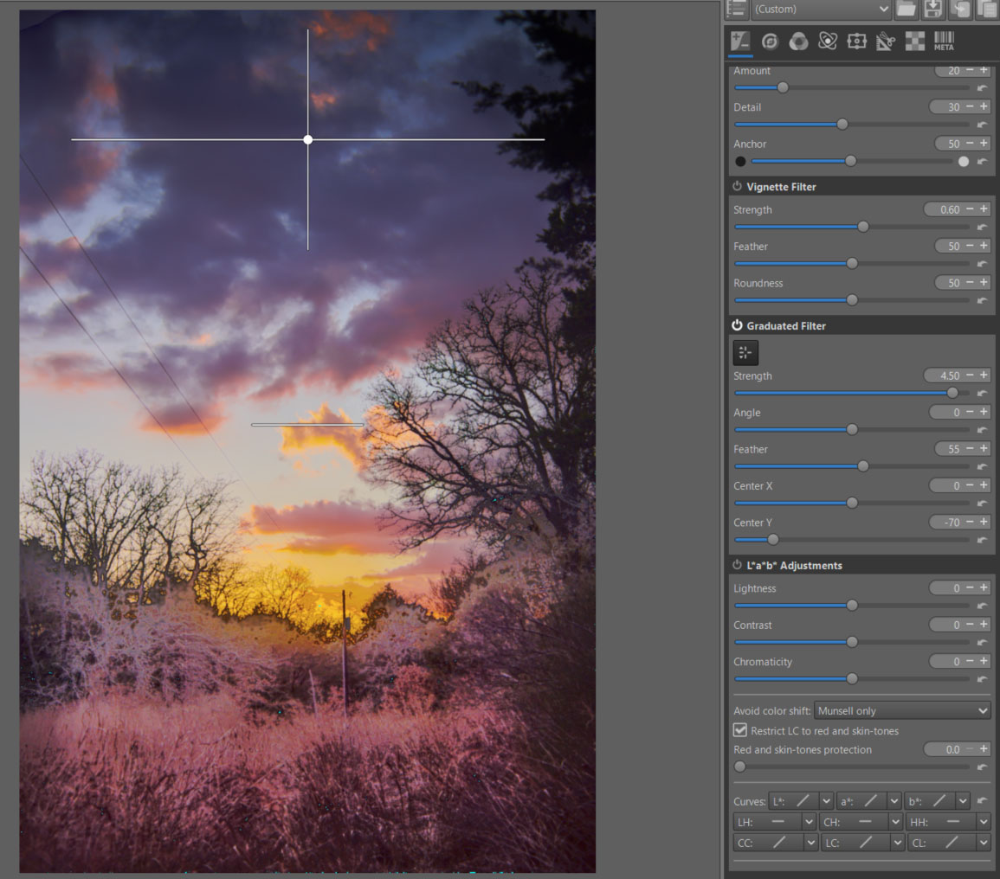
    <figcaption>Graduated Filter - increases the dramatic aspect of the sky</figcaption>
</figure>

+ Nothing new here, I'm using a tool that's been around in RT for a long
  time. I could have used the same tool found in Selective Editing
  associated with each tool, but except for 'fit to screen', it's sensitive
  to the Preview's dimensions. 
+ I positioned it to increase the contrast (more dramatic effect) between
  the clouds and the rest of the image. 

[Graduated Filter](/graduated_filter/)

#### Abstract Profile

I'll proceed in two steps. First, adjust the tones and check for any
potential excesses in the histogram and gamut. Second, have some fun with
the `Primaries & Illuminants` module.

##### TRC Adjust the tones - Contrast Enhancement

<figure>
    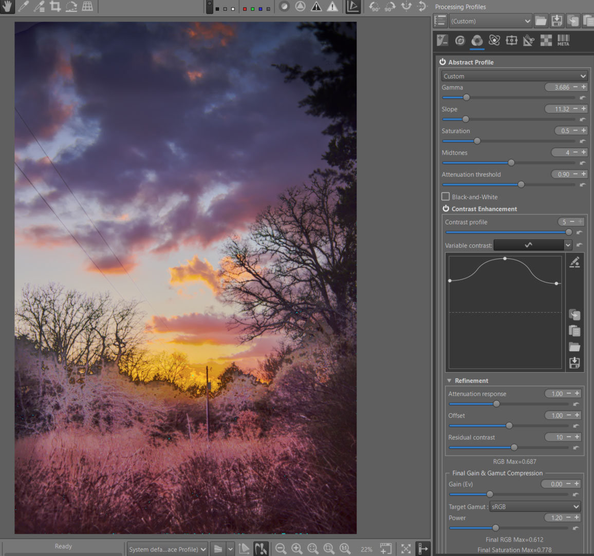
    <figcaption>Abstract Profiles - TRC and Contrast Enhancement</figcaption>
</figure>

+ Note the gamma and slope settings (which is a seamless function) that
  connect a straight line with a slope value of 'Slope' to a parabolic
  curve with a 'Gamma' value. You are manipulating the balance of shadows
  and highlights. 
+ The other settings are fairly intuitive. Note the importance of
  `Attenuation threshold` which acts asymptotically on highlights. 
+ For Contrast Enhancement, note the very high value of both Contrast
  profile (5), which leads to modifying the contrast from 2x2 pixels groups
  up to 1024x1024 (if the size of your Preview allows it), and the curve
  which is almost at its maximum. The system uses only wavelets, and only
  for signal processing. 'Normally' as it is designed, it should not (or
  very little) generate artifacts. The goal here is to make the whole image
  more dramatic (it is certain that for a portrait, or traditional images,
  the basic settings are sufficient). Note that the halos are barely
  visible, even with these unusual settings. 

[TRC Tone Response Curve](/color_management/#trc---tone-response-curve)

[Contrast Enhancement](/color_management/#contrast-enhancement)

###### RGB Max - informations

Provides information on out-of-limit RGB values. Values greater than 1
clearly indicate that we are out of gamut whereas for values less than 1,
we cannot say whether the image is within gamut or not because it depends,
for example, on the luminance. This check is performed at the end of the
Abstract Profile and takes into account all parameters. The ‘Attenuation
threshold’ slider can be used to limit the RGB values.

Changes made to `Color Appearance and Lighting`, `Final Gain and Gamut
Compression` are not taken into account.

###### Final RGB Max & Final Saturation Max - informations

Provides information on out-of-limit RGB values and RGB saturation. Values
greater than 1 for ‘Final RGB Max’ and ‘Final Saturation Max’ clearly
indicate that we are out of gamut whereas for values less than 1, we cannot
say whether the image is within gamut or not because it depends, for
example, on the luminance. This check is performed at the end of the
processing pipeline and takes into account all parameters. Changes made in
Color Appearance & Lighting and in Final Gain & Gamut Compression are taken
into account.

Adjusting the Gain (Ev) and Gamut Compression (Target Gamut and Power)
settings will allow you to see the impact of these adjustments. You should
also observe the histogram, which takes into account the output profile
therefore the gamma. This data, which is directly related to the RGB values
and Saturation and is in the Working Profile, is in linear mode.

The data is only displayed if Target Gamut is enabled, or if Gain (Ev) is
not equal to 0.

##### Primaries & Illuminants

The objective here is twofold:
+ Accentuate the dramatic aspect of the image by strongly increasing the
  colors in the reds and yellows.
+ To show that primaries can also be used in RT (this was initially one of
  the goals of Abstract profile, to allow color effects).

<figure>
    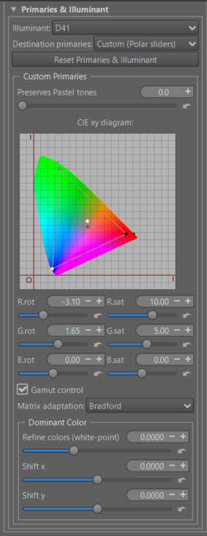
    <figcaption>Abstract Profiles - Primaries & Illuminants</figcaption>
</figure>

+ Note that I used polar coordinates to make this modification of the
  primaries. I could have done it directly with the CIExy diagram, or in
  linear mode.
+ Note that if instead of increasing the saturation, I had reduced it, we
  would have gone outside the CIExy diagram, hence the generation of
  imaginary colors.
+ Note that I've changed the 'White point' of the internal ICC profile to
  D41. When you change it, you change the dominant color. The primary
  rotation is done from this 'new' White point.
+ Note that just because a color is in the CIExy diagram does not mean it
  is in the gamut (there is a 3rd dimension 'Y' - equivalent to luminance).
  But any color that is outside the diagram is necessarily imaginary.

[Primaries](/color_management/#use-of-data-from-the-cie-xy-diagram-in-abstract-profiles)

#### Color Appearance & Lighting

I would like to remind you that this concept is one of the most advanced
methods for color management. It is a Color Appearance Model, based on the
work of researchers from around the world; its first version (in the form
of an Excel spreadsheet) dates back to 1997. Its current name is CIECAM16
(published in 2020).
[CIECAM](/ciecam02/#color-appearance--lighting-ciecam0216-et-color-appearance-cam16--jzczhz---tutorial)

+ It takes into account (I'm simplifying drastically):
  - The concepts of 'scene' (source) and 'viewing' (display).
  - The separation into 3 processes, with image processing in the middle.
  - The shooting conditions (e.g., Absolute luminance), viewing conditions
    (the image does not look the same in a dark or bright environment...).
  - Numerous physiological aspects such as simultaneous contrast, etc.

In this tutorial, I will present it briefly in 2 parts: 
+ The main settings.
+ Those dedicated to modifying each R, G, B channel to finely retouch
  colors or simulate films. 

##### CIECAM - main settings

<figure>
    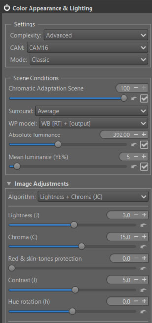
    <figcaption>CIECAM Scene & Image Adjustments</figcaption>
</figure>

+ I chose not to adjust the automatic settings (Chromatic Adaptation Scene,
  Absolute luminance, Mean Luminance (Yb%), Surround).
+ I chose 'Lightness + Chroma' and modified the values as shown in the attached image.

<figure>
    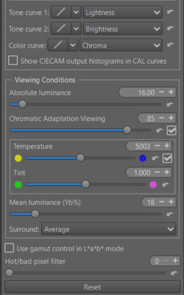
    <figcaption>CIECAM Curves & Viewing Conditions</figcaption>
</figure>

+ I chose not to adjust the automatic settings (Chromatic Adaptation
  Viewing, Absolute luminance, Mean Luminance (Yb%), Surround). But this is
  where you can (must) adapt the image you see to the Viewing conditions
  (yours).
+ Just try changing 'Surround' from 'Average' to 'Dim'.

##### CIECAM - Red Green Blue

+  You can modify each R, G, B channel to finely retouch colors or simulate films:
    - Rotate each color by degrees.
    - Change the saturation (s) in the sense of a CAM (Color Appearance Model).
    - Change the brightness (Q) with a curve that allows you to adapt the
      contrast and brightness to each situation.

+ As a reminder, in CIECAM there are a total of 9 variables, 6 of which are
  accessible to the user in RT: Lightness (J), Brightness (Q), Saturation
  (s), Chroma (C), Colorfulness (M), and Hue rotation (h). They are
  interdependent. For example Chroma = saturation * saturation *
  brightness.

<figure>
    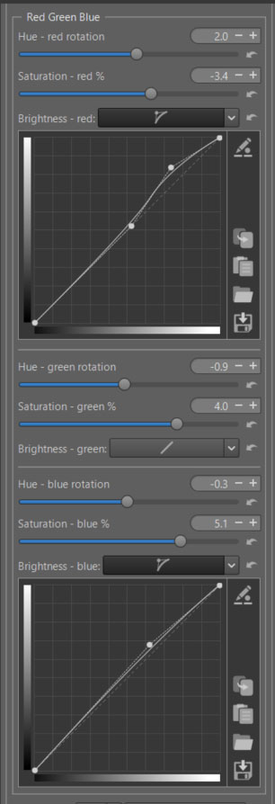
    <figcaption>CIECAM Red Green Blue</figcaption>
</figure>

**Threshold Brightness Curves**

 The ‘Threshold Brightness Curves’ aims to limit artifacts due to
 variations in color differences. 

<figure>
    
    <figcaption>red-green-blue Threshold</figcaption>
</figure>

+ For this challenging image, I made a point of moderating the settings to avoid artifacts.

[Red Green Blue](/ciecam02/#red---green---blue---hue-rotation-h---saturation-s---brightness-curve-q)

#### Appearance of the result at the end of treatment

+ Of course, nothing is perfect, and there remain small artifacts only visible during softproofing.
+ I wanted to make the image as dramatic as possible, perhaps even going too far. But let's remember the objectives; this is first and foremost an educational approach.

<figure>
    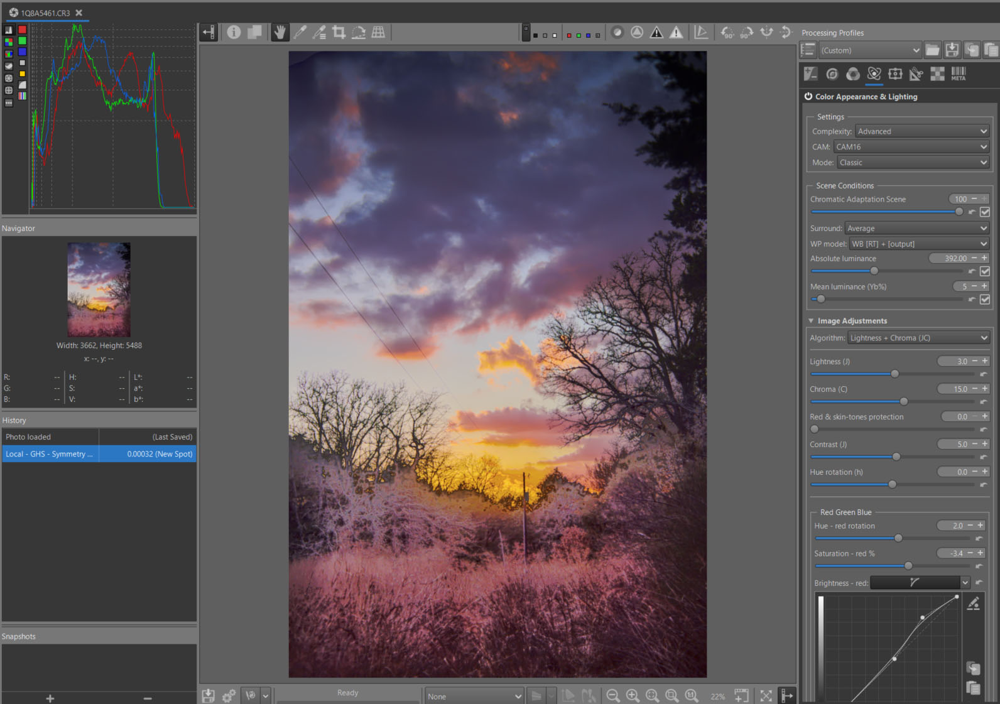
    <figcaption>Game Changer - Final Image</figcaption>
</figure>
